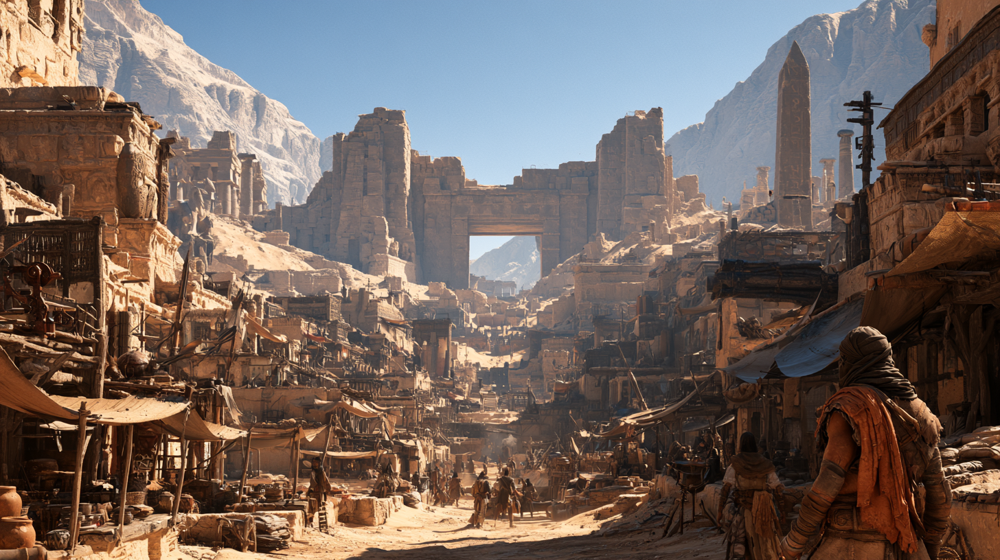

# Qereth

> *"Before there were roads, there was Qereth."*
> — kervan muhafızlarının sözü. Qerethliler bunu övünmek için değil,
> **tartışmayı bitirmek** için söyler.

**Yukarı:** [Karsovia — Şehirler](../README.md) · [Karsovia kıtası](../../README.md) ·
**Çevresi:** [Tavreth](../../regions/tavreth.md) çölü ·
**Harita:** [dünya haritası](../../../../../07-maps/ager/world-ager-aeltharys.jpg)

## Bu klasör

| Dosya | Ne var içinde |
|---|---|
| **README.md** *(buradasın)* | Kasabanın kendisi — ilk izlenim, semtler, yönetim, ekonomi, söylentiler |
| [history.md](history.md) | **Katmanlar** — Qereth I'den aşağı; Kapı'nın yaşı; kasabanın kronolojisi |
| [places.md](places.md) | the Gate · the Cold Mouth · the Third Cellar · the Broken King · Sealed Stair |
| [the-veils.md](the-veils.md) | **Çöldeki büyü huzmeleri** — görünüşleri, kuralları, Veil-glass, d8 tablosu |
| [people.md](people.md) | 7 NPC — su meclisi, kazıcılar, kervan simsarı, kaçamayan akademisyen |
| [05-secrets-dm-only.md](05-secrets-dm-only.md) | ⚠️ Kapı gerçekte ne, Perdeler neden düzenli, Warden'ın 40 yıllık sırrı |

---

## Kimlik Kartı

| | |
|---|---|
| **Tip** | Kâğıt üstünde şehir, gerçekte **sert bir sınır kasabası** |
| **Nüfus** | ~2.800 yerleşik + mevsime göre 200–900 kervancı |
| **Nerede** | Karsovia kıtasının kuzeydoğu içi; [Tavreth](../../regions/tavreth.md) çölünün kenarı, **the Standing Dead** ağaç kuşağının ardında |
| **Oturduğu yer** | Kayalık bir yarığın içi. Üç yanı **dik kaya duvar**, dördüncü yanı — Kapı'nın ardı — **düz kum** |
| **Yönetim** | **the Well Council** — su, kervan, muhafız, kazıcı ve tapınak: beş sandalye |
| **Kâğıt üstünde** | Karsovia Krallığı'nın bir Warden'ı var. <!-- Warden meselesi: 05-secrets-dm-only.md --> |
| **Baskın halk** | İnsan (çoğunluk), half-orc, dwarf kazıcı aileleri, az sayıda tiefling ve goliath |
| **Ekonomi** | Su · kervan geçiş ücreti · muhafız kiralama · **kazı** (salvage) · **Veil-glass** |
| **Savunma** | Sur yok. Çatı hattı var. Herkes silahlı; 40 kişilik daimî "Rope Guard" |
| **Ünlü olduğu şey** | Kapı. Ve kimsenin bilmediği bir sebeple **çok, çok eski** olması |
| **Tehlike seviyesi** | Kasaba içi: düşük. Çöl: **yüksek**. Altlar: DM'in seçimine göre ölümcül |

> **[AÇIK SORU] — Harita ile brifing arasındaki tek gerilim.**
> Dünya haritası Qereth'in çevresinde **ölü ağaçlar** gösteriyor; brifing ise
> **çöl** diyor. Bu dosya ikisini şöyle bağdaştırıyor: **Tavreth büyüyor.**
> Kum kasabadan dışarı doğru genişliyor, ilerlediği yerdeki ormanı öldürüyor ve
> arkasında ayakta kurumuş bir ağaç kuşağı — **the Standing Dead** — bırakıyor.
> Yani haritadaki ölü ağaçlar çölün *sınırı*, kasabanın çevresi değil.
> Alternatif okuma: çöl küçük bir havza, ölü ağaçlar onu kuşatıyor.
> Karar DM'de → [tavreth.md](../../regions/tavreth.md)

---

## İlk İzlenim

<!-- Masada yüksek sesle okunacak. -->

> Qereth'e yukarıdan bakamazsın. Kasaba, kayanın içine açılmış geniş bir yarığın
> dibindedir: iki yanında güneşin vurduğu sarı-beyaz kaya duvarlar yükselir, dipte
> tek bir ana yol vardır ve o yol **Kapı'ya** gider.
>
> Evler alçak. Sokaklar iki katır genişliğinde. Binaların arasına gerilmiş
> bez tenteler gün boyu rüzgârda şişip iner ve bütün kasaba hafifçe **nefes alıyormuş**
> gibi ses çıkarır. Duvarlarda ahşap, kerpiç, moloz taş ve nereden söküldüğü belli
> olmayan eski metal parçaları yan yana durur. Çatılarda oturan insanlar vardır ve
> hiçbiri sana bakmaz. Kervan muhafızları gölgede uyur, silahları kucaklarında.
> Burada silahlı insan görmek dikkat çekmez; **silahsız** insan görmek dikkat çeker.
>
> Sonra yolun bittiği yere, yarığın ağzına gelirsin.
>
> Orada, hiçbir surun parçası olmayan, yüz fit (30 m) yüksekliğinde, alt üçte biri
> kuma gömülmüş bir **taş kapı** durur. Menteşesi yoktur. Kanadı yoktur. İki yanındaki
> yığınlar sur değil, **Kapı'ya yaslanıp sonra çökmüş bin yıllık binaların kalıntısıdır**.
> Sadece kapı vardır ve o kadar büyüktür ki altından geçen kervanlar oyuncak gibi kalır.
> Açıklığından bakınca öbür tarafı görürsün: kum, ve kumun ötesinde titreyen bir ufuk.
>
> Ve aklına şu soru gelir: *bu kasaba neden böyle bir kapıya sahip?*
>
> Cevap şudur: değil. **Kapı Qereth için yapılmadı. Bugünkü Qereth onun etrafında kuruldu.**

### İkinci gün fark edilenler

- Bir tavernanın bodrum duvarı fazla düzgündür — çünkü aslında **dört bin yıllık bir
  sarayın dış cephesidir**, üstüne raf çakılmıştır.
- Bir ailenin avlusundaki sütun, artık var olmayan bir tapınağın parçasıdır. Üstüne
  çamaşır asılır.
- Meydanda çocuklar parçalanmış bir taş adamın omzuna oturup zar atar. O adam bir
  kraldı. Adını kimse bilmiyor. Çocuklar ona **"Kral"** der, başka bir şey demez.

Halk için bunlar o kadar sıradandır ki üzerine düşünülmez. Bir yabancı sütunu
göstererek "bu ne?" diye sorarsa alacağı cevap genellikle *"sütun"*dur.

- Kasabanın üstünde, kaya duvarın yarısına kadar tırmanan **bir dikilitaş** durur.
  Yüzeyi baştan aşağı oyulmuştur ve oymalar Kapı'nın ayaklarındaki bantla **aynı
  dildedir**. Kimse okuyamaz. Dikilitaşın dibi bugün ip bükücülerin atölyesidir.
- Sokaklar hiçbir yerde düz gitmez. Bunun sebebi tepeler değil, **altlarındaki
  duvarlardır** → [history.md](history.md)

### Kapı'nın ardına geçince

Yarık biter ve **çöl başlar.** Ufka kadar dümdüz. **Ve çöl boş değildir.**

Uzaklarda, kumun içinden gökyüzüne doğru yükselen ince büyü huzmeleri görünür.
Lazer gibi sert çizgiler değil — sıcak havadaki serapların büyülü hali gibi.
Işık bükülür, ufuk titrer. Bir yerde kumun üzerinden **turkuaz bir perde** yükselir,
birkaç dakika sonra kaybolur. Başka bir yerde soluk mor bir sütun yüzlerce metre
göğe çıkar. Bazıları o kadar uzaktadır ki sadece havadaki renk değişiminden anlaşılır.

Güneşin açısı tutarsa bütün çölün üstünde devasa bir **arcane aurora** varmış gibi görünür.

Qerethliler bunlara alışmıştır. Bir yabancı ilk kez görüp donakalırken, yanından geçen
yerli **kafasını bile çevirmez**.

→ Tam anlatım ve kurallar: [the-veils.md](the-veils.md)

---

## Semtler

Qereth "mahalle" kelimesini kullanmaz; **"nere"** der. ("Nerelisin?" — *"Halkalıyım."*)

| Semt | Karakter | Not |
|---|---|---|
| **Gatefoot** / Kapıdibi | Kervan alanı, pazar, ip yığınları, hayvan kokusu | Kapı'nın gölgesi gün boyu bir saat gibi dolaşır; randevular **gölgeyle** verilir |
| **the Rings** / Halkalar | Konut. Dar, dönerek daralan sokaklar | Sokaklar eğridir çünkü **altlarındaki eski duvarları takip ederler** |
| **Coldmouth** / Soğuk Ağız | Kuyu, su meclisi, kayıt odası | Kasabanın gerçek merkezi. Kapı turistlerin, kuyu Qerethlilerin merkezi |
| **the Unders** / Altlar | Bodrumlar, mahzenler, birbirine açılan eski katlar | Resmî semt değil ama herkes öyle sayar → [history.md](history.md) |

---

## Önemli Mekânlar

| Mekân | Tip | Kim işletiyor |
|---|---|---|
| **the Gate** / Kapı | Anıt — 100 ft, yarısı gömülü, menteşesiz | Kimse. Bakımını Shaundakul rahibi yapar |
| **the Cold Mouth** | Kuyu, 300 ft şaft | the Well Council — [Seren Ovkhal](people.md#seren-ovkhal) |
| **the Third Cellar** | Taverna (üç kat aşağı iner) | [Duhat Vrenn](people.md#duhat-vrenn) |
| **the Broken King** | Meydandaki parçalanmış heykel | Çocuklar |
| **the Windbox** | Shaundakul mabedi, Kapıdibi | [Brother Halam](people.md#brother-halam) |
| **the Rope Yard** | Kervan tezgâhı, muhafız kiralama | [Duhat Vrenn](people.md#duhat-vrenn) |
| **the Sealed Stair** | Örülmüş merdiven — aşağı gider | Meclis kararıyla kapalı, 1461 DR |

→ Detaylar: [places.md](places.md)

---

## Yönetim ve Güç

### Resmî

**the Well Council** — beş sandalye, her biri kasabanın hayatta kalmasının bir
parçasını temsil eder:

| Sandalye | Kim | Neyi kontrol eder |
|---|---|---|
| **Water** | [Seren Ovkhal](people.md#seren-ovkhal) | Kuyu, günlük ölçü, kervan su fiyatı |
| **Rope** (kervan) | [Duhat Vrenn](people.md#duhat-vrenn) | Geçiş ücreti, muhafız sözleşmeleri |
| **Guard** | [Marshal Teyva Nur](people.md#teyva-nur) | 40 kişilik Rope Guard, çatı hattı |
| **Dig** (kazı) | [Ashiv Qerre](people.md#ashiv-qerre) | Altlar'a giriş izni, buluntu payı |
| **Gate** (tapınak) | [Brother Halam](people.md#brother-halam) | Kayıtlar, cenaze, kervan takvimi |

Meclis **oy vermez, sırayla konuşur**; son konuşan itiraz edilmezse karar olur.
Bu yavaş bir sistemdir ve Qerethliler bundan gurur duyar: *"Acele eden kasabalar
kumun altında."*

Kâğıt üstünde kasaba Karsovia Krallığı'na bağlıdır ve bir **Warden** tarafından
yönetilir. Kraliyet mührü hâlâ kullanılıyor, vergi hâlâ ödeniyor, Warden'ın odası
hâlâ kilitli.

### Gayriresmî

> **[DM ONLY]** Warden meselesi, mührü kimin kullandığı, kazıcıların meclise
> söylemediği ve Perdelerin gerçek düzeni: [05-secrets-dm-only.md](05-secrets-dm-only.md)

---

## Ekonomi

Qereth üretmez. Qereth **geçirir, satar ve kazar**.

| Kalem | Nasıl işler | Fiyat notu |
|---|---|---|
| **Su** | Günlük "ölçü" (measure) = 1 galon. Yerliye ücretsiz, kervana pahalı | Kervan suyu: **2 sp / ölçü**; kuraklıkta 1 gp'ye çıkar |
| **Geçiş** | Kervan başına Rope ücreti | **5 gp** + hayvan başına 1 sp |
| **Muhafız** | Çöl geçişi için kiralık kılıç | **1 gp/gün**, Perde mevsiminde **3 gp/gün** |
| **Kazı** | Altlar'dan çıkan taş, metal, cam, kayıt | Meclis payı **beşte bir**; kayıtsız satış yasak (ve yaygın) |
| **Veil-glass** | Perde değmiş kumdan oluşan cam | Ham: 10 gp/lb. İşlenmiş büyücü camı: **50–200 gp** → [the-veils.md](the-veils.md#veil-glass) |

Yerel deyiş: *"Qereth'te iki şey bedavadır: su ve tarih. İkisini de dışarıdan
gelen öder."*

---

## Din

| Tanrı | Tapınak | Rahip |
|---|---|---|
| **Shaundakul** — Rider of the Winds; yollar, rüzgâr, portallar | **the Windbox**, Kapıdibi | [Brother Halam](people.md#brother-halam) |
| **Waukeen** | Rope Yard'da bir tezgâh köşesi, tapınak değil | Yok — tüccarlar kendi sunusunu yapar |
| **Selûne** | Tapınak yok; **[Charaxis](../../../../../04-charaxis/README.md)** ufukta göründüğü gecelerde çatılarda ayin | Gönüllü yaşlılar |
| **⬜ İsimsiz sunak** | Qereth IV katmanında; hiçbir bilinen tanrıya ait değil | Yok. Kazıcılar üstünü örtüp geçer |

> Shaundakul'un burada bu kadar güçlü olmasının açık sebebi kervanlar. Örtük sebebi
> şu: **Shaundakul portalların da tanrısıdır** ve Qereth'te kimsenin yüksek sesle
> sormadığı soru budur. → [05-secrets-dm-only.md](05-secrets-dm-only.md)

---

## Sorunlar ve Söylentiler

| Söylenti | Doğru mu? |
|---|---|
| *"Kapı'nın altından geçerken bir şey söylersen, aşağıda biri duyuyor."* | > **[DM ONLY]** Kısmen. Kapı'nın ayaklarındaki oyuk bant sesi Qereth III'e taşır. Aşağıda **duyan bir şey var mı**, DM'in seçimi. |
| *"Perdeler eskiden bu kadar sık değildi."* | > **[DM ONLY]** **Doğru.** 1494'ten (kuyruklu yıldızlar) beri sıklık belirgin arttı. Kimse istatistik tutmuyor — [Sanavar Kest](people.md#sanavar-kest) hariç. |
| *"Sealed Stair'i meclis kapatmadı, aşağıdakiler kapattı."* | > **[DM ONLY]** Hayır — meclis kapattı. Ama **neden** kapattığını beş kişiden üçü artık hatırlamıyor; tutanak eksik. |
| *"Warden yıllardır kimseyi kabul etmiyor çünkü hasta."* | > **[DM ONLY]** Warden **ölü.** Kırk yıldır. |
| *"Kazıcılar en aşağıda mimari olmayan bir şey buldu."* | > **[DM ONLY]** DM'in seçimine bağlı; üç seçenek dosyada. |
| *"Savaşta Qereth'e hiç asker gelmedi."* | Doğru — ve Qerethliler bunu bir başarı sayar, ihmal değil. |

---

## Şu Anki Durum (1495 DR)

- [Mürai savaşı](../../../../../06-campaigns/new-campaign/01-premise.md#mürai-savaşı)
  (1492–1495) Qereth'e **asker olarak** uğramadı; **kervan olarak** uğradı.
  Kral muhafızların iyi olanlarını topladı, kötü olanları geri geldi.
- Savaş sonrası batıdan gelen dağınık insan sayısı arttı: firariler, evsiz kalmış
  Ravonialılar, iş arayan paralı askerler. Kasaba büyümüyor — **devri artıyor**.
- **Perde sıklığı yükseliyor** (1494 kuyruklu yıldızlarından beri). Kervanlar rota
  değiştirmeye başladı, bu da Rope gelirini düşürüyor. Meclisin gerçek krizi bu.
- Kuyu seviyesi iki yıldır **her ölçümde biraz daha aşağıda**.

---

## Kampanya Kancaları

> **[HOOK] — Ölçü.** Kuyu düşüyor. Meclis suyu kısarsa kervanlar Qereth'i atlar,
> kasaba biter; kısmazsa kuyu biter, kasaba yine biter. Meclis dışarıdan birine
> **aşağıya inip kuyunun beslendiği sarnıcı görme** işini vermek istiyor —
> çünkü kendi kazıcılarına artık güvenmiyorlar.

> **[HOOK] — Cam avcıları.** Bir Perde'nin kuma değdiği yerde Veil-glass oluşur ve
> **yaklaşık altı saat** boyunca sıcaktır. Yani zengin olmanın yolu, taze inen bir
> Perde'ye doğru koşmaktır. Bunu yapan üç ekipten ikisi geri döndü.

> **[HOOK] — Aurelium'un mektubu.** [Aurelium](../../../ravonia/cities/ravonia/districts/aurelium-north.md)
> arşivinden bir talep geldi: Qereth'in katmanlarının sayılması ve **en alttakinin
> tarihlenmesi** isteniyor. Ücret cömert. Talebi imzalayan kişinin adı yok, mühür yok —
> sadece bir numara var.

> **[HOOK] — Kapı uyanırsa.** Kapı bin yıldır sadece taş. Parti bir şey yaparsa,
> ya da bir Perde tam Kapı'nın üstüne inerse — **taş kanatsız kapı bir şey yapar.**
> Ne yaptığı DM'e ait: [05-secrets-dm-only.md](05-secrets-dm-only.md)

> **[HOOK] — Kral'ın adı.** Meydandaki parçalanmış heykelin adını bulan kişi,
> Qereth'in kaç katman olduğunu da bulur. Adı bir tek yerde yazıyor: heykelin
> **kaidesinde**, ve kaide çocukların oturduğu yerin altında, kumun içinde.

---

## Haritalar

- ⬜ `07-maps/city/qereth.png` — henüz yok
- Dünya haritası: [`07-maps/ager/world-ager-aeltharys.jpg`](../../../../../07-maps/ager/world-ager-aeltharys.jpg)
