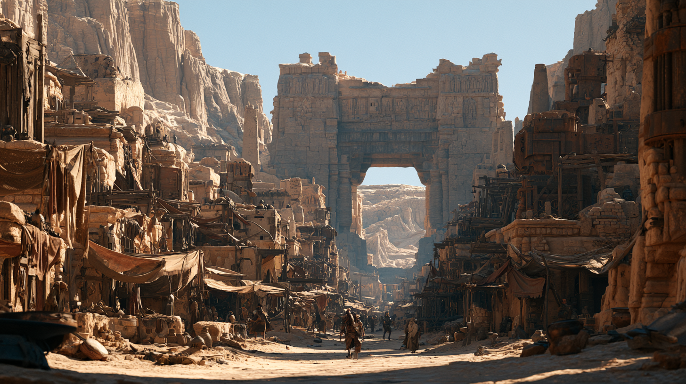

# Qereth — Mekânlar

**Yukarı:** [Qereth](README.md) · [Katmanlar](history.md) · [the Veils](the-veils.md)

---

## the Gate — Kapı

Yarığın ağzında duran, yüz fit (30 m) yüksekliğinde, alt üçte biri kuma gömülü
tek parça taş kapı. Kanadı yok, menteşesi yok, bağlı olduğu duvar yok.

| Ne | Detay |
|---|---|
| **Açıklık** | Geçilen boşluk ~35 fit genişliğinde. Dört kervan yan yana geçer |
| **Oyuk bant** | Ayaklarda, insan boyu hizasında. Kesintisiz. Hiçbir bilinen dile uymuyor |
| **Isısı** | Gece yarısı bile **ılık.** Kimse bunu tuhaf bulmuyor; "taş güneş tutuyor" deniyor |
| **Gelenek** | Altından geçen sol eliyle ayağa dokunur. Sebebini bilen yok |
| **Bakımı** | [Brother Halam](people.md#brother-halam) haftada bir dibindeki kumu süpürür. Kum ertesi gün geri gelir |

**Masada:**

> Investigation **DC 13** — oyuk bandın **aşınmadığı** fark edilir. Etrafındaki her
> şey kum rüzgârıyla yenmiş; bant keskin.
> Arcana **DC 16** — taşta *aktif* bir büyü **yok**. Ama boşluk gibi bir şey var:
> detect magic bandın üstünde **hiçbir okuma vermez** — çevredeki fon büyüsü bile
> orada kesilir.
> *(Devamı: [05-secrets-dm-only.md](05-secrets-dm-only.md#the-gate))*

---

## the Cold Mouth — Soğuk Ağız

Kasabanın gerçek merkezi. Kayanın dibine açılmış, taş bilezikli, 300 fit derinliğinde
bir kuyu şaftı. Ağzından yaz ortasında bile soğuk hava çıkar — adı buradan gelir.

- Şaftın 210 fitinde duvar değişir: kerpiç biter, **kesme taş** başlar. Orası
  [Qereth V](history.md#katmanlar)'in sarnıç tavanıdır. Kuyu aslında bir kuyu değil,
  **dört bin yıllık bir su deposuna açılmış delik**.
- Su, ölçüyle dağıtılır. Ölçü defteri kuyunun yanındaki taş odada tutulur ve
  **1102 DR'den beri kesintisiz** yazılır. Qereth'in en değerli nesnesi bu defterdir;
  Kapı bile ikinci sırada.
- Kuyunun başında daima biri vardır. Gece nöbeti çocuklara verilir; bu bir ceza değil,
  **onur**dur.

> **[HOOK]** Seviye iki yıldır düşüyor. Aşağı inip sarnıcı görmek gerekiyor.
> İnmenin tek yolu ip ve karanlık; sarnıçta hava var mı, kimse bilmiyor.

---

## the Third Cellar — Üçüncü Bodrum

Kasabanın tavernası. Adı, girişten sonra **üç kat aşağı** inmesinden gelir; her kat
bir katmandır.

| Kat | Ne | Duvarı aslında ne |
|---|---|---|
| **Giriş** | Bar, ocak, kalabalık | Kerpiç — sıradan |
| **Bir alt** | Masalar, kumar | Qereth II tahıl çukurlarının ağzı; yuvarlak oyuklar hâlâ duvarda |
| **İki alt** | Kervan pazarlıkları, sessiz köşeler | **Qereth V saray cephesi.** Kesme taş, oyma friz. Üstüne raf çakılmış, üstünde turşu kavanozu duruyor |

İşletmecisi [Duhat Vrenn](people.md#duhat-vrenn). En aşağı kata inmek isteyen
yabancıdan **1 sp "taş parası"** alır ve bunu utanmadan yapar.

> Frizde bir kadın figürü var; başı kırılmış, elinde bir kap tutuyor. Duhat oraya
> her akşam bir bardak su koyar. *"Alışkanlık,"* der. Babası da koyarmış.

---

## the Broken King — Kral

Meydandaki parçalanmış taş adam. Sağlam kalanı: gövde, tek omuz, sağ elin bileği.
Yüzü yok. Yaklaşık on beş fit boyunda olmalıydı; şimdi oturma yüksekliğinde.

Çocuklar omzuna oturup zar atar. Heykele **"Kral"** derler ve başka bir şey demezler.
Yetişkinler de aynı adı kullanır — çünkü çocukken onlar da orada zar atıyordu.

> **[HOOK]** Kaidesi kumun altında ve kaidede **yazı var**. Kazmak için meydanın
> ortasını sökmek gerekir; meydanın ortasını sökmek için meclisin izni gerekir;
> meclis izin vermez çünkü *"çocuklar nerede oynayacak?"*
>
> Kaideyi okuyan kişi Kral'ın hangi katmana ait olduğunu öğrenir. Ve o katman,
> Sanavar'ın sayımını **bir fazlaya** çıkarır.

---

## the Windbox — Rüzgâr Kutusu

Shaundakul mabedi. Kapıdibi'nde, Kapı'nın gölgesinin öğlen düştüğü noktada duran
tek odalı taş yapı. Dört duvarında da pencere var, hiçbirinde cam yok — bu yüzden
içi sürekli rüzgârlıdır ve adı buradan gelir.

- İçeride sunak yok. Yerde, taşa oyulmuş bir **yol haritası** var: Qereth'ten çıkan
  yedi rota, ikisi artık hiçbir yere gitmiyor.
- Rahibi [Brother Halam](people.md#brother-halam). Kervan takvimini, cenazeleri ve
  kasabanın kayıtlarını o tutar.
- Shaundakul'un burada iki sıfatı kullanılır: *Rider of the Winds* — ve kimsenin
  yüksek sesle söylemediği *the Opener of Ways*.

---

## the Rope Yard — İp Alanı

Kapıdibi'nde, kervanların indiği açık alan. İp yığınları, su fıçıları, hayvan ağılı,
gölgelik direkleri. Muhafız kiralamanın tek meşru yeri.

| İş | Ücret |
|---|---|
| Çöl geçişi muhafızlığı | 1 gp/gün — Perde mevsiminde **3 gp/gün** |
| Kervan kılavuzluğu (rota bilen) | 5 gp + su |
| Kayıp kervan araması | Pazarlık. Genelde kimse almaz |

Duvarda tahta bir levha asılıdır: dönmeyen kervanların adları. **Silinmez, üstü
çizilmez, sadece eklenir.** Levha üç kez uzatılmış.

---

## the Sealed Stair — Örülü Merdiven

Halkalar'ın kuzey ucunda, iki evin arasında, aşağı inen bir merdivenin ilk dört
basamağı görünür. Beşinciden sonrası **taşla örülmüştür.** Örgü 1461 DR tarihli;
harç o yılın kayıtlarındaki harçla aynı.

Merdiven [Qereth VI](history.md#katmanlar)'ya gidiyor.

Meclis tutanağında karar var, **gerekçe yok.** Sayfa yırtılmamış — gerekçe kısmı
başından beri **boş bırakılmış**.

> **[DM ONLY]** → [05-secrets-dm-only.md](05-secrets-dm-only.md#the-sealed-stair)

---

## the Obelisk — Dikilitaş

Kaya duvarın yarısına kadar yükselen, baştan aşağı oyulmuş tek parça taş sütun.
Oymalar **Kapı'nın bandıyla aynı dilde.** Kimse okuyamaz.

Dibi bugün ip bükücülerin atölyesi. Halatlar dikilitaşa dolanarak gerilir; nesillerdir
böyle yapılıyor ve taşın alt on fitinde **ipin açtığı derin oluklar** var.
Yani Qereth'in en eski yazıtlarından biri, kasabanın kendisi tarafından siliniyor.

> **[HOOK]** Sanavar bunu fark etti ve ip bükücülerden başka yere geçmelerini istedi.
> İp bükücüler yüz yıldır oradalar. Meclis konuyu **üç kez** ertelemeye karar verdi.

---

## Kum Altındakiler — hızlı tablo (d8)

Bir bodrum, avlu veya duvar betimlemek gerektiğinde:

| d8 | Sıradan görünen şey | Aslında ne |
|---|---|---|
| 1 | Bodrumun düzgün arka duvarı | Bir saray cephesi; frizin yarısı sıva altında |
| 2 | Avludaki sütun | Tapınak sütunu; üstünde çamaşır ipi |
| 3 | Ahırın taş zemini | Mozaik. Hayvanlar üstünü kapatıyor |
| 4 | Fırının tabanı | Kesme granit blok — yöre taşı değil |
| 5 | Sokağın ortasındaki oluk | Qereth III kanal sisteminin devamı; hâlâ çalışıyor |
| 6 | Duvara gömülü metal halka | Bilinmeyen alaşım. Paslanmamış |
| 7 | Merdiven altındaki niş | Bir mezar nişi. İçi boş — **hep boş mu, bilinmiyor** |
| 8 | Kuyu ağzındaki oyma | Kapı'nın bandıyla **aynı dil.** Ev sahibi bunu bilmiyor |
