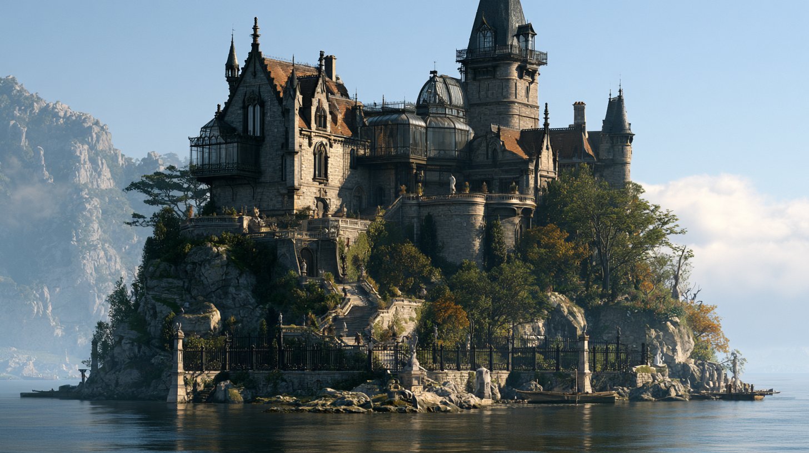

# Mordavia Keep

> *Kimse gitmedi. Kimse ölmedi. Kimse kalkıp masadan ayrılmadı.*
> **Seksen yedi yıldır balo devam ediyor.**

**Yukarı:** [Karsovia — Mekânlar](../README.md) · [Karsovia kıtası](../../README.md) ·
**Aile:** [House Uskevren](history.md) · **Ulaşım:** [Zarkhul](../../villages/zarkhul.md)'dan tekneyle ·
**Harita:** [dünya haritası](../../../../../07-maps/ager/world-ager-aeltharys.jpg)

## Bu klasör

| Dosya | Ne var içinde |
|---|---|
| **README.md** *(buradasın)* | Ada, varış, atmosfer, **Evin Kuralları**, gecenin beş perdesi, hook'lar |
| [history.md](history.md) | **House Uskevren** — FR'den uyarlanmış aile; enkazcılık, rezalet, servet, ve 1408 gecesi |
| [places.md](places.md) | Adanın ve kalenin odaları; misafir evleri; **eski fener kulübesi** |
| [the-household.md](the-household.md) | **Ölüler** — 12 isimli ruh, aralarındaki hizipler, üst kat/alt kat ayrımı |
| [mystery.md](mystery.md) | **Murder mystery'nin işletme kılavuzu**: ipuçları, çelişen ifadeler, saatler |
| [05-secrets-dm-only.md](05-secrets-dm-only.md) | ⚠️ **Laneti kim koydu**, neden, nasıl kırılır, statblock ve dört final |

---

## Kimlik Kartı

| | |
|---|---|
| **Tip** | Kale + malikâne. Bir savunma yapısı değil — **bir aile evi**, para gösterisi olarak yapılmış |
| **Nerede** | [Mordavia Körfezi](#körfez-ve-ada)'nin ortasında, doğal oluşmuş kayalık bir ada. Kıtanın ortasındaki iç deniz |
| **Ulaşım** | **Sadece deniz.** [Zarkhul](../../villages/zarkhul.md)'dan 4 saat kürek/yelken. Başka yolu yok |
| **Adada ne var** | Kale · dört **misafir evi** · iskele · aile mezarlığı. **Başka hiçbir şey** |
| **Kim yaşıyor** | Kimse. **Kim duruyor:** 41 ölü |
| **Sahibi** | **House Uskevren** — Karsovia'nın en zengin ailesiydi. Soy 1408'de bitti |
| **Lanet tarihi** | **Nightal 1408 DR.** Bir gecede, ilk gongdan şafağa kadar |
| **Tehlike** | Ölümcül — ama **kavga tehlikesi değil.** Burada insanı öldüren şey nezakettir |
| **Denizde** | Körfezin **deniz yılanı** haritada Mordavia'nın hemen yanında çizili. Tesadüf değil → [05-secrets-dm-only.md](05-secrets-dm-only.md) |

> **[AÇIK SORU]** Haritadaki büyük körfez isimsizdi; bu dosya ona **Mordavia Körfezi**
> adını veriyor — ada ve kale zaten öyle anılıyor. Bir ailenin adının koca bir denize
> yapışması, ailenin ne kadar zengin olduğunun en iyi ölçüsü. DM onayı bekliyor.

---

## Körfez ve Ada

Karsovia kıtasının ortasında, karadan çevrili büyük bir iç deniz var. Sakin,
derin, gri. Kıyıları balıkçı köyü; ortası **boş** — çünkü ortada Mordavia var
ve kimse Mordavia'nın yanından geçmek istemiyor.

Ada doğal bir oluşum: sudan dik çıkan tek bir kaya kütlesi. Yapay değil, taşınmamış,
kimse tarafından yükseltilmemiş. Kayanın etrafında, su seviyesinin hemen altında,
**tarak gibi sivri bir kayalık halkası** var. Gündüz görülür. Gece görülmez.

**Bu kayalık halkası, bütün hikâyenin sebebidir.** → [history.md](history.md)

Kayanın tepesinde kale duruyor: sivri kuleler, kurşun çatılar, demir korkuluklar,
ve yamaca oturtulmuş camlı bir **kış bahçesi** (conservatory) — kubbesi hâlâ sağlam,
içindeki bitkiler seksen yedi yıldır ölmüyor.

Kaleden denize doğru geniş bir **taş merdiven** iner. Merdivenin iki yanında heykeller
var; hepsi denize bakıyor, hiçbiri kaleye dönük değil. Merdiven iskelede biter.
İskelede iki kayık bağlı durur. İpler yeni.

---

## Varış

<!-- Masada yüksek sesle okunacak. -->

> Zarkhul'daki kayıkçı seni adanın yüz kulaç berisinde bırakır. Daha yakına gelmez.
> Parasını önden ister ve almadığı takdirde küreklere bile dokunmaz. Ne zaman
> döneceğini sorarsan sana bakar ve *"Ben dönmem. Sen dönersen, karadan görürüz,"* der.
>
> Kayıkla yanaştığın son yüz kulaçta suyun rengi değişir: gri maviden, dibi görünen
> bir yeşile. Altında, elini uzatsan değecek kadar yakında, **sivri kayalar** vardır.
> Bir orman gibi dizilmişlerdir. Aralarında bir şeyler durur — ahşap, halat, bir
> geminin omurgası, bir başkasının direği. Bir tanesinin üstünde hâlâ bir çıpa asılı.
>
> İskeleye çıkarsın. İpler yeni. Fenerler yanıyor.
>
> Merdivenin başında bir adam durmaktadır. Uzun, zayıf, siyah giyimli, kusursuz
> traşlı. Elleri arkasında. Sen daha konuşmadan hafifçe eğilir ve şöyle der:
>
> > *"Hoş geldiniz. Beklendiğinizi söyleyemem — ama bu evde bu bir sorun teşkil etmez.
> > Odalarınız hazırlanacak. Akşam yemeği sekizde. Lütfen geç kalmayın; Leydi
> > gecikmeyi affeder, ama unutmaz."*
>
> Adamın ayakları taşa değmiyor. Bunu ancak üçüncü cümlesinde fark edersin.

Adam **Erevis Cale**'dir. Bu evin başuşağıdır ve seksen yedi yıldır görevinin başındadır.

---

## Buranın havası

Mordavia bir harabe değildir. **Bakımlıdır.**

- Cam kırık değil. Halı temiz. Gümüşler parlatılmış. Şamdanlar yanıyor.
- Yemek masası **kurulu**: kırk bir kişilik. Yemekler sıcak. Hiçbiri yenmiyor.
- Salonlarda müzik var. Kim çaldığını görürsün — piyanonun başında biri oturuyor.
- Ölülerin hepsi **çok şık.** Balo kıyafeti, siyah frak, kadife, dantel, jet taşından
  yas takıları, eldiven. Hiçbiri paçavra değil. Hiçbiri çürümüş değil.
  Bu evde hiç kimse korkutmak için görünmez — **görünmek için görünürler.**
- Ve birbirleriyle konuşurlar. Sofrada laf atarlar, koridorda küsüşürler, salonda
  dedikodu yaparlar. Kırk bir kişilik bir ev halkı, seksen yedi yıldır aynı akşamı
  yaşıyor ve **birbirinden sıkılmış.**

> **Tonu tutturmak için tek kural:** burada korku, ölülerin ürkütücü olmasından
> gelmez. **Ölülerin senden daha terbiyeli olmasından** gelir.

Bazı ruhlar iyidir: sana yardım eder, uyarır, ipucu verir, seni saklar.
Bazıları kötü niyetlidir: yalan söyler, seni yanlış odaya yollar, saatini çalar,
ve doğru anda kapıyı arkandan kapatır. **Kıyafetlerinden ayırt edemezsin.**
Bu tasarımın kendisidir.

---

## Evin Kuralları

Ölüler bu kuralları koymadı; **1408'de de aynı kurallar vardı.** Fark şu ki artık
kuralı çiğneyeni ev cezalandırıyor.

| # | Kural | Çiğnersen |
|---|---|---|
| **1** | **Akşam yemeğine giyinilir.** Yol kıyafetiyle sofraya oturulmaz | Ev seni misafir saymayı bırakır: bütün ruhlar sana **hizmetkâr** gibi davranır — ve alt kat kurallarına tabi olursun (bkz. [the-household.md](the-household.md)) |
| **2** | **Takdim edilmeden konuşulmaz.** Bir ruhla konuşmak için başka bir ruhun seni ona takdim etmesi gerekir | Takdimsiz soru sorulan ruh cevap vermez — ve **hakaret sayar.** Üç hakaret: düşmanlık |
| **3** | **Yemek reddedilmez.** Önüne konan tabak geri çevrilmez | Reddeden kişiye ev bir daha **hiçbir şey ikram etmez** — su dâhil |
| **4** | **Yemek yenmez.** Tabaktakiler seksen yedi yıllıktır | Yiyen kişi bir sonraki şafağa kadar **ölülerden biri gibi görünür**; canlı arkadaşları onu tanır, ruhlar tanımaz |
| **5** | **Gece yarısından sonra üst kata çıkılmaz** | → Beşinci perde. Aşağıda bak |
| **6** | **Adadan gece ayrılınmaz** | Körfezde bekleyen şey buna izin vermiyor → [05-secrets-dm-only.md](05-secrets-dm-only.md) |

> **Misafir evleri istisnadır.** Ev, misafir evlerinin eşiğini geçmez. Ne iyi ruhlar
> ne kötüler. Orası partinin **kamp alanıdır**: uzun dinlenme burada yapılır.
> Bunun sebebini kimse söylemez → [places.md](places.md#misafir-evleri)

---

## Gecenin Beş Perdesi

Mordavia'da gece **tekrar eder.** Ev her akşam aynı beş perdeyi oynar; ruhlar
perdelere bağlıdır ve kimi ruh sadece belirli bir perdede konuşulabilir hâldedir.

Parti perdeler arasında serbestçe hareket eder, **hatırlar ve ilerler** — ölüler
ise her şafakta biraz geri sarar. Bu, murder mystery'nin motorudur.

| Perde | Saat | Evde ne oluyor | Parti ne yapabilir |
|---|---|---|---|
| **I — Giyinme** | 19:00–20:00 | Ev hazırlanıyor. Hizmetkârlar koşuşturuyor, üst kat sessiz | **Alt kat** erişimi en iyi burada. Hizmetkâr ruhları bu saatte konuşkan |
| **II — Akşam Yemeği** | 20:00–22:00 | Kırk bir kişi sofrada. Sohbet, iğneleme, kadeh | **Bütün aile tek odada.** Takdim burada alınır. Çelişkiler burada duyulur |
| **III — Balo** | 22:00–24:00 | Salonda müzik, dans, kış bahçesinde fısıltılar | Ruhları **tek tek** yakalamanın tek saati. Herkes dağılmış |
| **IV — Saat** | 24:00 | Bir çığlık. Bütün ev bir an durur. Sonra devam eder | **Her gece aynı çığlık, aynı saniye.** Nereden geldiğini bulmak ana ipucu |
| **V — Gri** | 00:00–şafak | Müzik biter. Işıklar iner. Kötü niyetli ruhlar bu saatte serbest | **Tehlikeli.** Ama bazı gerçekler sadece bu saatte söyleniyor |

Şafakta ev sıfırlanır: sofra yeniden kurulur, mumlar yeniden yanar, Cale yeniden
iskeleye iner. **Ruhlar partiyi tanımaya devam eder** — ama sana anlattıkları şeyi
anlattıklarını hatırlamazlar. Bir ruhtan aynı bilgiyi iki kez almak mümkündür;
**aynı ruhu iki kez sıkıştırmak mümkün değildir.**

---

## Laneti kırmak

Kısa hâli, oyunculara söylenebilir hâliyle:

> Bu evde herkes öldü. Ama birinin ölmesi **diğerlerinden farklıydı** — biri ölürken
> bir şey istedi ve isteği kabul edildi. O kişinin ruhu hâlâ bu evde, hâlâ giyinik,
> hâlâ sofrada. Laneti kırmak için önce **hangisi olduğunu bulacaksın**, sonra da
> onunla yüzleşeceksin.

Bulmanın yolu dövüş değil, **soruşturma**: ölülerin ifadeleri, çelişkileri, evin
kayıtları ve adanın altındaki enkaz.

- **Nasıl işletilir:** [mystery.md](mystery.md) — 11 ipucu, ifade tablosu, çelişkiler
- **Cevap ve final:** [05-secrets-dm-only.md](05-secrets-dm-only.md) ⚠️

> **Önemli:** Lanet, ruhu "yatıştırarak" kırılmaz. Doğru isim söylendiğinde
> karşındaki şey **kavga eder** — ve ev taraf tutar. Hangi ruhun hangi tarafta
> olduğu, parti onlarla nasıl konuştuğuna bağlıdır. Bu yüzden soruşturma sadece
> bilgi toplamak değil, **müttefik toplamaktır.**

---

## Karsovia bunu nasıl biliyor

- Ada resmen **Karsovia Krallığı'nın** malı; Uskevren soyu bittiğinde taç el koydu.
- Taç adayı üç kez satmayı denedi. Üç alıcı da imzadan önce vazgeçti.
- Zarkhul köyü seksen yedi yıldır adadan uzak durarak yaşıyor: kayıkçılar oraya
  gitmez, ağlar o suya atılmaz, çocuklara adı bile söylenmez.
- **Ama Uskevren serveti hiç bulunamadı.** Bu, adaya gitmeye devam eden insanların
  tek sebebi. → [history.md](history.md)

---

## Kampanya Kancaları

> **[HOOK] — Vasiyet.** Karsovia'da bir noter, seksen yedi yıllık bir zarf açtı:
> Uskevren servetinin yerini gösteren belge adada, evin içinde. Zarfı açtıran kişi
> mirasçı olduğunu iddia ediyor. Belki de gerçekten öyle → [05-secrets-dm-only.md](05-secrets-dm-only.md)

> **[HOOK] — Davet.** Partiden birine, adı ve unvanıyla, elle yazılmış bir **davetiye**
> ulaşır. Mürekkep taze. Kâğıt seksen yedi yıllık. Davet, o akşamki yemeğe.
> Kimse posta getirmedi.

> **[HOOK] — Kayıkçı dönmedi.** Zarkhul'dan bir balıkçı çocuğu iddiaya girip adaya
> gitti. Kayığı iskelede bağlı duruyor. İpler yeni.

> **[HOOK] — Rahip.** [Kelemvor](../../../../../02-lore/pantheon/faerunian/kelemvor.md)
> tapınağından bir doomguide adaya gitmek için parti arıyor: kırk bir ruh yargıya
> çıkmadı ve bu, tanrısı için bir **hesap hatası**. Kelemvor'un rahibi bunu bir
> hayalet hikâyesi olarak değil, **bir borç** olarak anlatır.

> **[HOOK] — 1495 bağlantısı.** Tanrılar susalı bir yıl oldu
> ([New Campaign](../../../../../06-campaigns/new-campaign/00-overview.md)).
> Mordavia'nın laneti bir tanrının kabul ettiği bir duaya dayanıyor. **Duayı kabul
> eden hâlâ dinliyor mu?** Bu soru, adadaki her şeyi kampanyanın ana hattına bağlar.

---

## Haritalar

- ⬜ `07-maps/battle/mordavia-keep-*.png` — kat planları henüz çizilmedi
- Oda listesi ve kat mantığı: [places.md](places.md)
