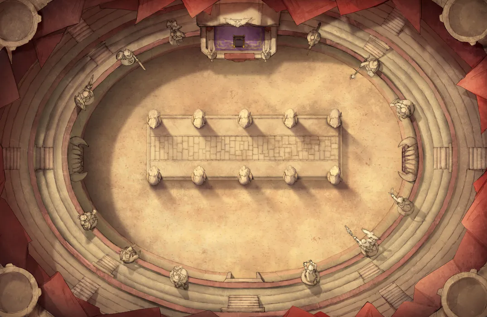
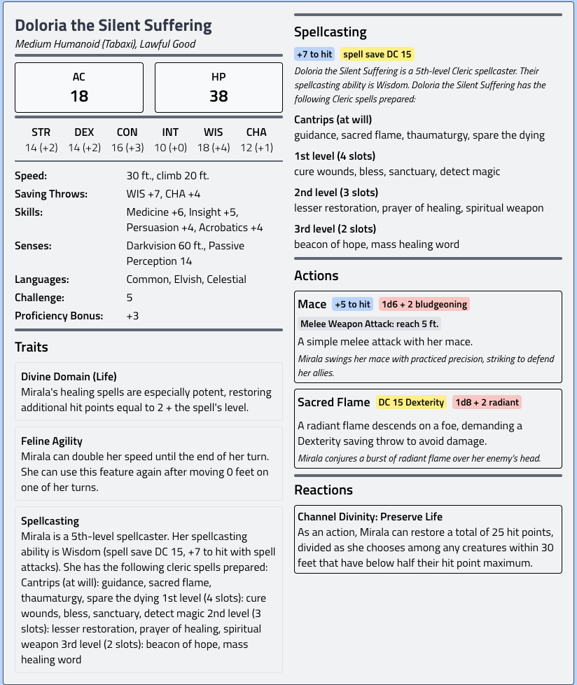
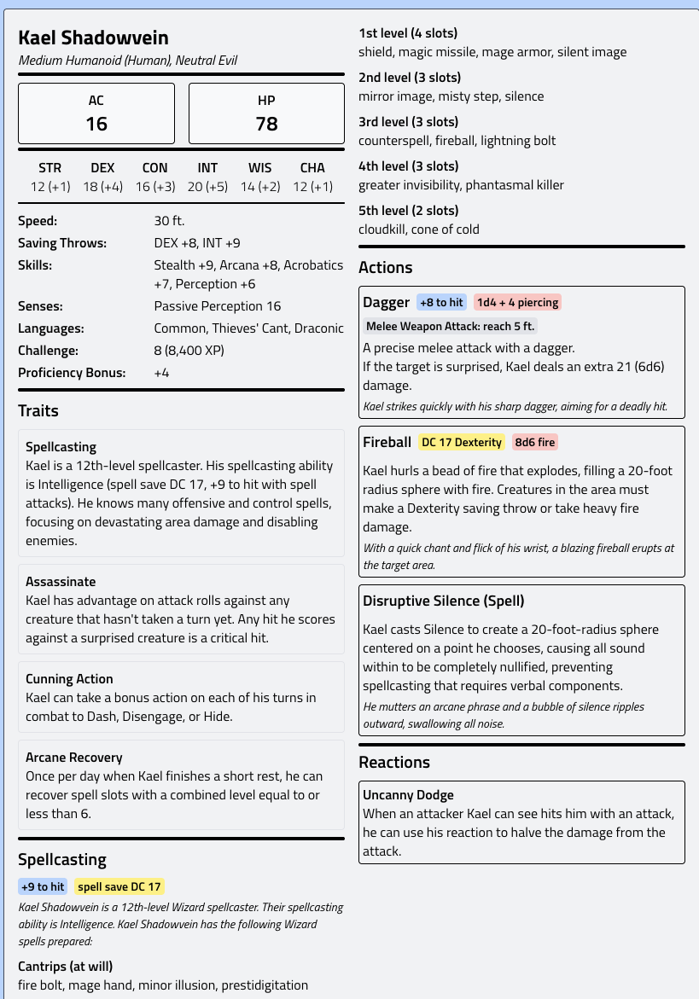
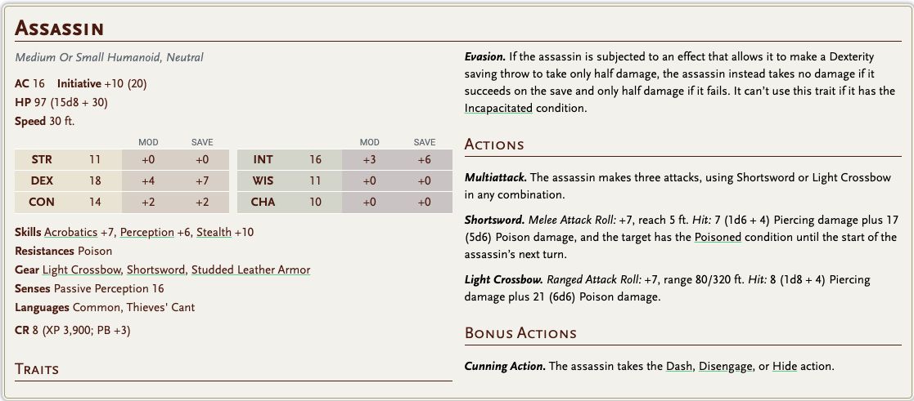
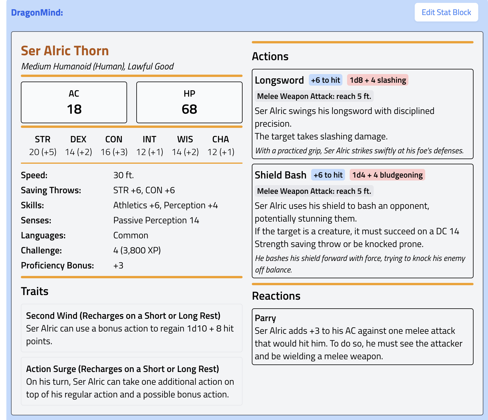
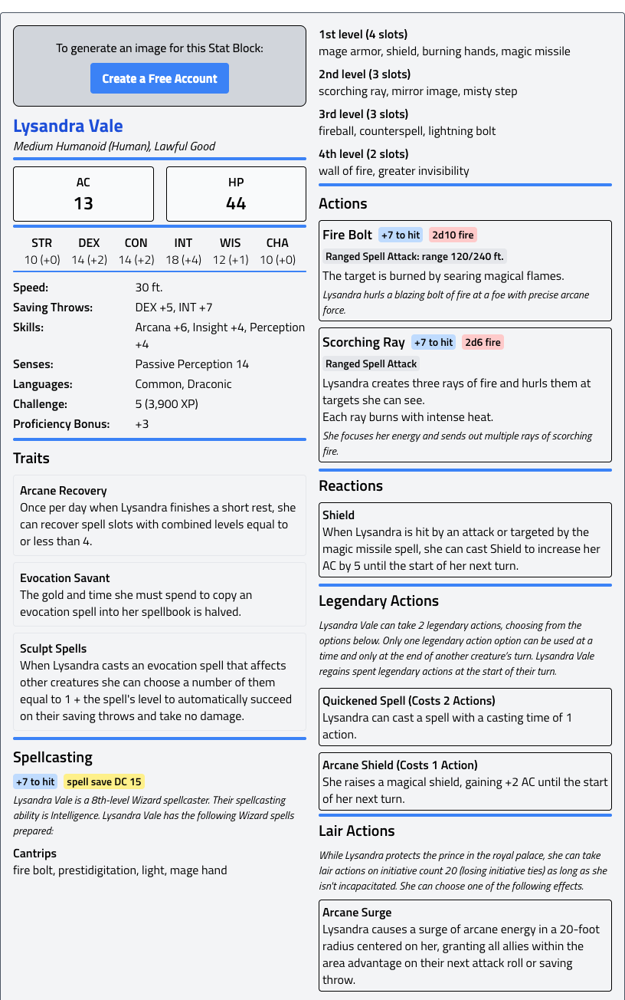
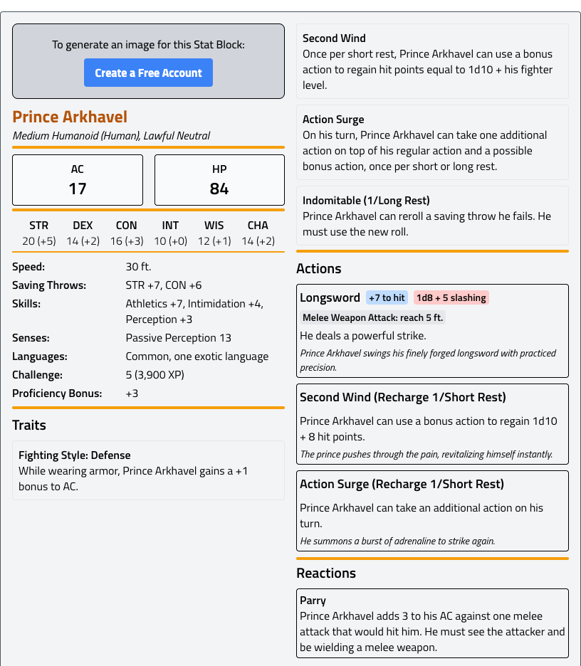

# AMBER SQUARE FESTİVAL ALANI

Şehrin merkezine yakın büyük bir meydan.

Meydanın çevresinde:

- geçici tribünler
- yemek tezgahları
- bayraklar
- müzik platformları

Havada sürekli:

- baharat kokusu
- kızarmış et
- bira

Her sokaktan insan gelir.

Ama kalabalıkta aynı zamanda:

- soylular
- ajanlar
- lonca adamları
- paralı askerler

karışmıştır.

---

# FESTİVAL DEKORU

Amber Square'in adı meydanın ortasındaki **dev amber sütundan** gelir.

Sütun yaklaşık 20 metre yüksekliğinde.

İçinde donmuş gibi görünen:

- böcekler
- küçük hayvanlar
- eski taş parçaları

vardır.

Festival için meydan süslenmiştir:

- kırmızı ve altın flamalar
- askeri sancaklar
- lonca armaları

Ama dikkatli bakanlar askeri flamaların biraz **fazla baskın olduğunu** fark eder.

---

# ARENA

Amber Square'in ortasına geçici ama devasa bir arena kurulmuştur.

Çapı yaklaşık:

**80 metre**

Arena:

- kum zemin
- kalın demir çitler
- büyü bariyerleri

ile çevrilidir.

Çitlerin üzerinde:

- arbaletçiler
- muhafızlar

bulunur.

Yukarıda büyücüler durur.

Onların görevi:

- yaratıkların kaçmasını engellemek
- kontrol büyülerini sürdürmek

# RAKİP TAKIMLAR

---

# 1. TAKIM

## KARSOVIA PRENSİ VE EKİBİ

Bu turnuva aslında **prensin propaganda sahnesidir.**

### Prens

**Prens Arkhavel Karsov**

- genç
- karizmatik
- halk tarafından seviliyor

Ama aynı zamanda:

- kendini kanıtlamak zorunda
- savaşta deneyimi az

---

### Ekibi

1. **Prens Arkhavel**
    - fighter
2. **Ser Alric Thorn**
    - veteran knight
    - prensin koruyucusu
3. **Lysandra Vale**
    - evocation wizard

Bu ekip çok koordinelidir.

---

# 2. TAKIM

## GITHYANKI SAVAŞÇILARI

Turnuvaya diplomatik misafir olarak katılmışlardır.

Ama aslında:

- güçlerini göstermek
- diğer savaşçıları ölçmek

için buradalar.

### Lider

**Vraxil the Red Blade**

- uzun
- ince
- gözleri sarı

Kullandığı silah:

- gith greatsword

---

### Ekibi

1. Vraxil
2. gith psionic warrior
3. gith archer

Bu ekip çok hızlı ve koordinelidir.

Arena savaşlarını **çok agresif** oynarlar.

---

# 3. TAKIM

## KARSOVIA ÇÖL SAVAŞÇILARI

Güney çöllerinden gelmişlerdir.

Arena onlar için yeni değildir.

---

### Lider

**Sahra Khan**

- uzun
- güneş yanığı ten
- çift kılıç kullanır

---

### Ekibi

1. Sahra Khan – dual blade fighter
2. dev kalkanlı bodyguard
3. kum büyücüsü (sand mage)

---

# TRİBÜNLERDEKİ ATMOSFER

Turnuva sırasında:

- kumar oynanır
- loncalar bahis yapar
- politik sohbetler yapılır

Zhentarim adamları da tribünlerde vardır.

Ve herkes aynı şeyi merak eder:

NPC

Doloria the Silent Suffering

[Turnuva](../../../../../../06-campaigns/chains-of-the-burning-compact/encounters/turnuva.md)

assasins

1. **Ser Alric Thorn**

1. **Lysandra Vale**

1. **Prens Arkhavel**

Mizora

