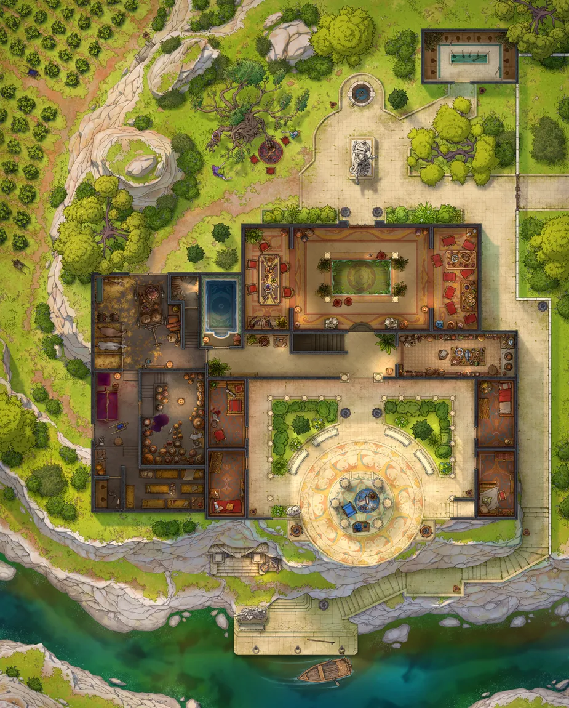
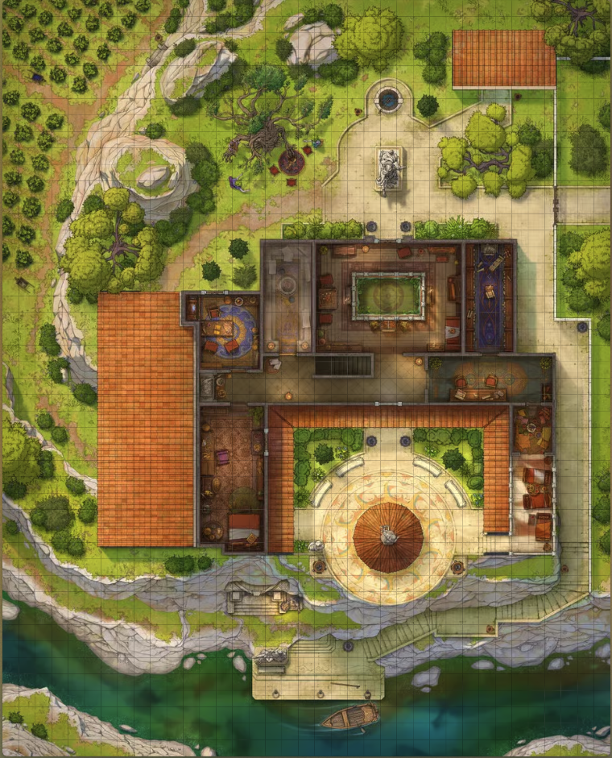
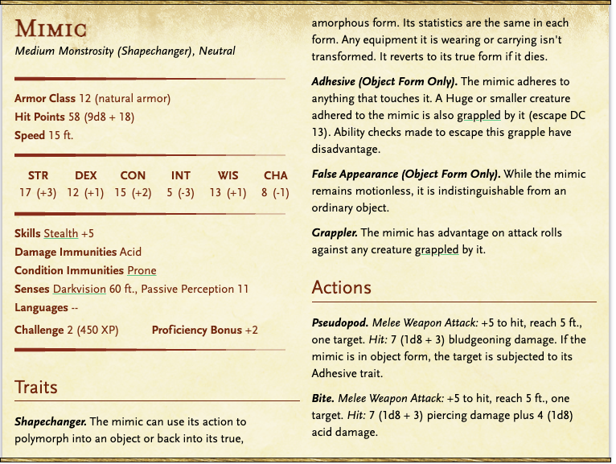
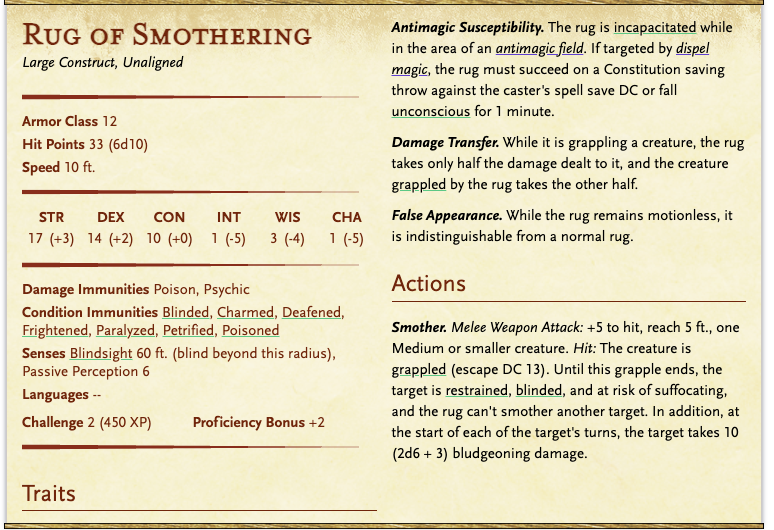
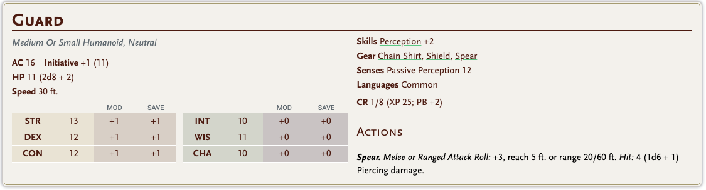
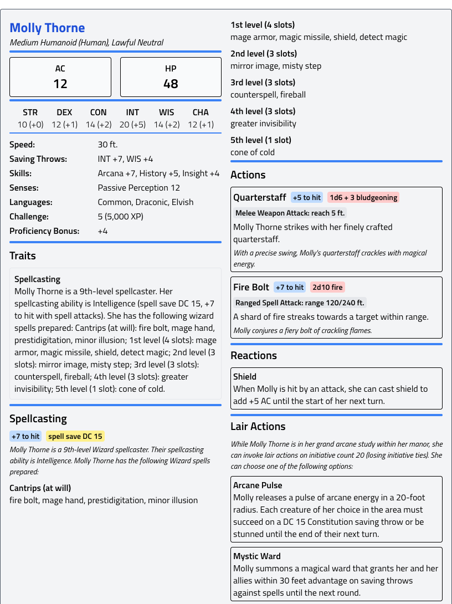
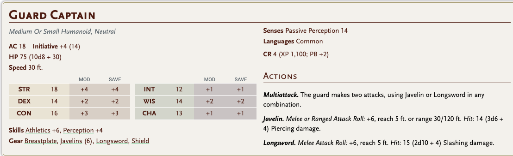

# Molly Thorne köşkü

1 guard captain ön tarafta

2 guard bahçede

üst kat halı rug of smothering 

merdiven çıkışı chest mimic

üst kat sol oda mas*ter bedroom, gün içinde elizabeth thorne orada uyanık

 loot var, 120 gold. 

çalışma odasında Scroll of Poison Spray, Scroll of Fly 

kilitli sandık var, içinde infernal bir scroll, molly thorne’un önemli bir insan olabilmek için bir varisten vazgeçtiği bir sözleşme.

