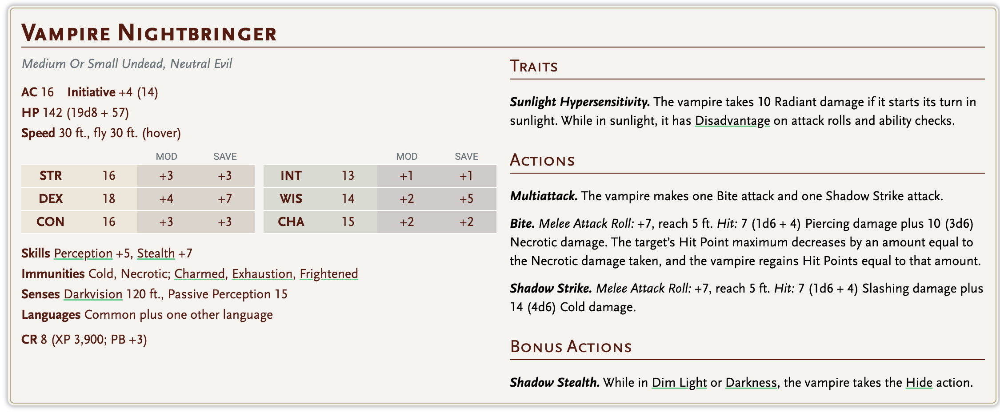
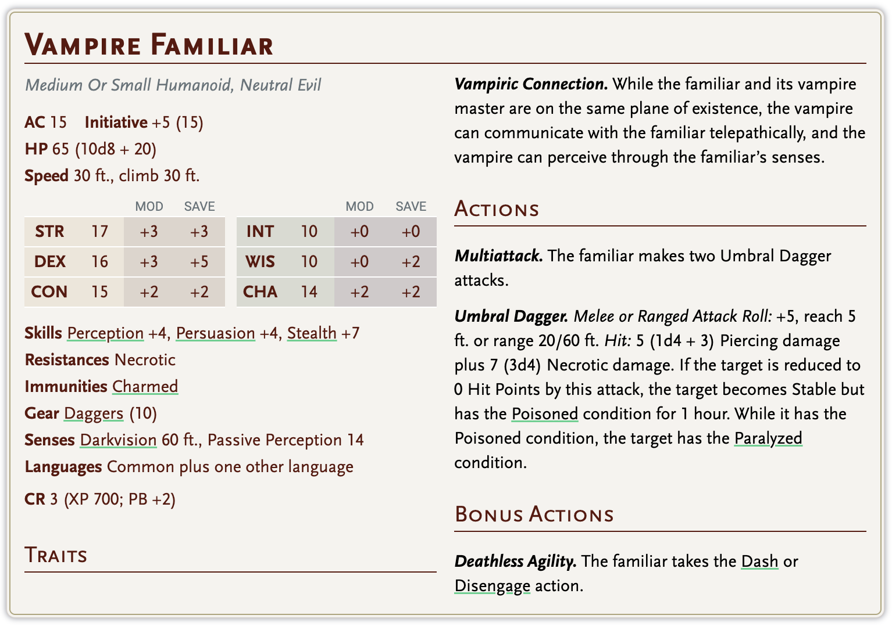
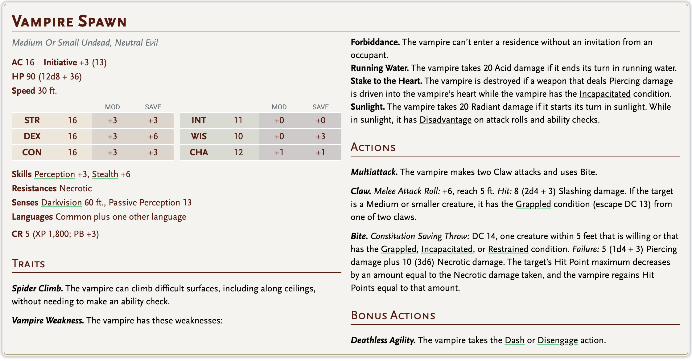
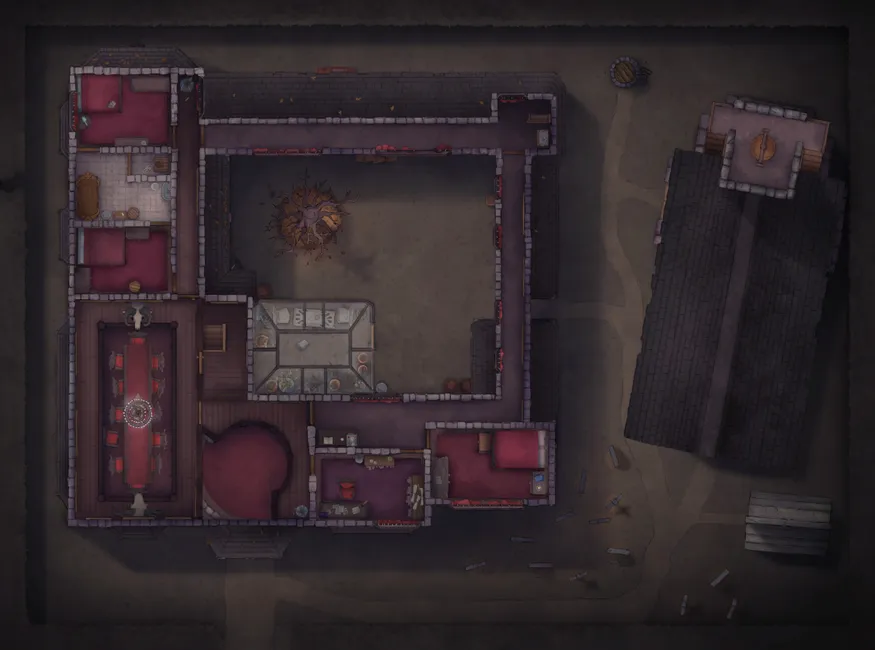
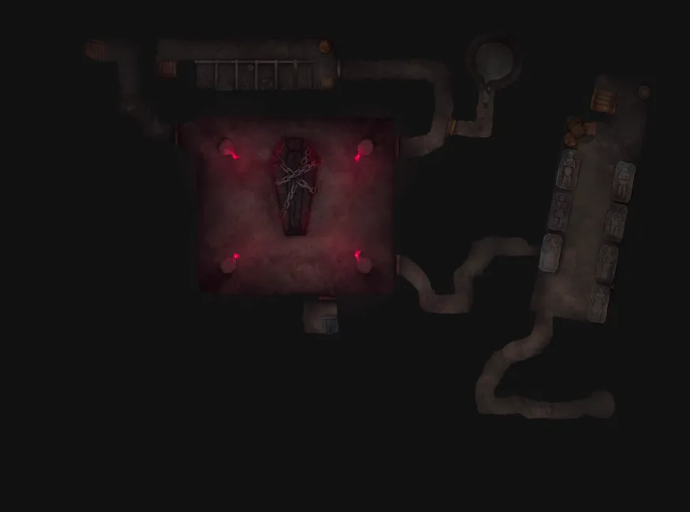
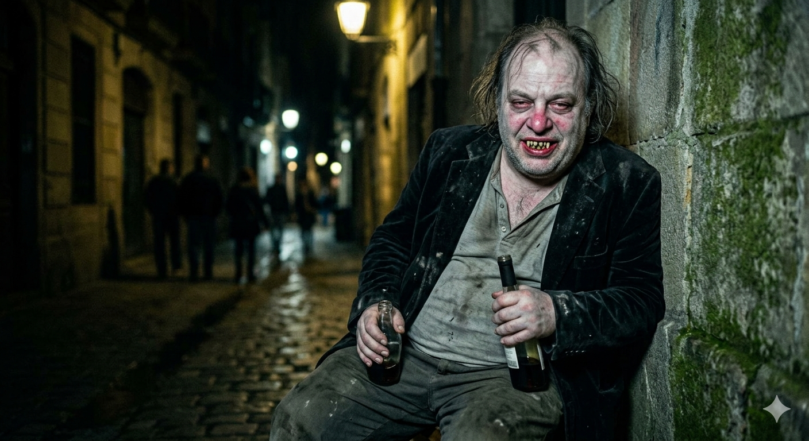

# Ravonia Drunkard

# Ravonia'nın Doğu Limanı

## 🏙️ Genel Hava

Ravonia'nın doğu yakasına adım attığınızda ilk hissettikleriniz burnu tırmalayan o iç içe geçmiş kokuşmuş karışımdır — tuzlu deniz havası, çürümüş balık, fıçılardaki bira sızıntısı ve aşağıdaki kanalizasyon ızgaralarından yükselen sıcak küf. Kaldırım taşları sürekli ıslaktır; ya yağmurdan, ya da rıhtımdan taşınan sudandır bu. Sabahları limanın ahşap iskeleleri uzun gölgeler döker, hamallar yük sandıklarını omuzlarında taşır, balıkçılar ağlarını onarır, donanma subayları kıyı meyhanelerini denetler gibi görünüp aslında içki içer.

Sokaklar dardır. Binalar birbirine yaslanır gibi durur, aralarından ancak bir adam geçebilir. Pencerelerden halat ve çamaşır ipler gerilmiş, altından geçerken birisinin döküp attığı bir şeyin üstünüze gelmemesini dilersiniz.

---

## 🍺 Han: Kırık Çıpa

### Görünüm

Rıhtımdan iki sokak içeride, eski bir depo binasından dönüştürülmüş iki katlı bir yapıdır. Dışarıdan bakınca sağlamlığından şüphe duyarsınız — taşları kararmış, ahşap kirişler çürümeye yüz tutmuş, asılan tabelası bir defalık fırtınada uçup gitmiş, yerine bir çıpanın kırık yarısı çivilenmiş. Adı buradan gelir. Kapı aslında çift kanatlıdır, depo günlerinden kalan; birisinin menteşesi çalışmadığından hep tek kanat açılır.

İçerisi dışarısından daha büyük hissettirir. Tavan yüksektir, eski depo kirişleri hâlâ durmaktadır; bunlara zaman içinde fenerlerin yanı sıra kürek, halat, eski bir yelken parçası, birinin bırakıp gitmediği korsan bayrağı asılmıştır. Masalar farklı boyda ve farklı ağaçtan yapılmıştır — hiçbiri birbirine uymaz, sanki her birinin ayrı bir hikâyesi vardır. Ocak büyüktür, her zaman yanar, üstünde bir kazan bitmez tükenmez çorba kaynatır.

Üst kattaki odalar altı tanedir. Kapıların kilitleri güvenilmezdir, bunu herkes bilir; zaten burada sırrı olan insan pek az eşyayla seyahat eder.

### Koku & Ses

İçeri girdiğinizde: bira, tahta yaş duman, balık çorbası ve biraz da deniz ipi kokusu. Köşede biri her zaman bir şeyler mırıldanır ya da homurdanır. Geceleri bir müzisyen gelir — yaşlı bir adamdır, ismi sorulmaz, dümbelek çalar, kimse dinlemez ama kimse de susturulmasını istemez.

---

## 👤 Hancı: Morda Vessk

Morda, elli küsur yaşında iri yarı bir kadındır. Boylu poslu değil, tam aksine kısa ve geniştir — "bir fıçı kadar sağlam" denir kendisine, pek de yanlış sayılmaz. Sol kolunda dirsekten bileğe uzanan uzun bir dövme var; eski bir donanma galeonunun silueti bu, ama artık solmuş ve biraz bozulmuş. Saçları her zaman acelece toplanmış bir topuzdadır, sürekli birkaç tel yüzüne düşer, umursamaz.

Morda eski bir denizcidir. Donanmada on dört yıl hizmet etmiş, sonra bir operasyonda sağ elinin işaret parmağını kaybetmiş — resmi kayıtlarda "hizmet yaralanması" yazar, kendisi "aptallık" der. Emeklilik parasıyla bu hanı almış; "mezarda yatmaktan iyidir" demiş o gün, bugün hâlâ aynı şeyi düşünüyor mu bilinmez.

### Karakteri

Morda'ya laf anlatmaya çalışmak zordur. Sizi dinliyor gibi yapar, gözleri zaten tezgahın karşı ucundaki fıçıyı sayar. Ama bir de bakarsınız, tam ihtiyacınız olan şeyi söylemiştir — kısa, net, gereksiz söz yok. Yabancılara karşı soğuk değil, sadece ilgisizdir; ta ki bir şey dikkatini çekene kadar.

Korsanlara ve donanmaya eşit mesafede durur. Tezgahının başında ikisi yan yana oturabilir, birbirlerinin boğazına sarılmadıkları sürece Morda'nın umurunda değildir. Ama kavga çıkarsa, ilk şişeyi kendisi fırlatır.

Hanın gizli bir kuralı vardır: Morda'nın tezgahına oturup "ne tavsiye edersin" dersen, önüne bir kâse çorba ve bir bardak bira koyar, parasını almaz. Bunu neden yaptığını soran olursa "bir keresinde birisi bana aynısını yaptı" der, devam etmez.

### Bildikleri

Morda on dört yıl denizde geçirmiştir. Kıyı şeridini, hava değişimlerini, hangi geminin hangi kaptanın emrinde ne iş çevirdiğini bir bakışta anlar. Şehrin dedikodusunu bilir ama satmaz — yalnızca bazen, doğru soruya doğru zamanda, tek cümleyle yanıt verir.

---

## 👥 Kırık Çıpa'nın Diğer Yüzleri

**Pell** — Bulaşıkçı çocuk, on iki yaşında, meraklı gözlü. Her konuşulanı duyar ama tekrarlamaz; çünkü ne duyduğunun değerini bilir. Bir gün birisi ona doğru soruyu soracak ve Pell o gün için hazırdır.

**Donanma Çavuşu Aldric Sorn** — Her akşam aynı köşe masaya oturur, aynı birayı içer, kimseyle konuşmaz. Aslında görev dışında buraya gelir — limanı takip etmekte değil, sadece gürültüden uzaklaşmaktadır. Yorgun bir adamdır.

**Tüy Sakal** *(gerçek adını kimse bilmez)* — Orta yaşlı, kır sakallı, her zaman tüylü bir şapka takar. Masasında daima kâğıt ve mürekkep. Haritacı olduğunu söyler. Yalan söylüyor olabilir.

han

max

nada

aysif

ea basr

2 familiar, odalarda geziyorlar

vampir atakan emcük

vampir

han

ea basr

nada

max

aysif

Loot: 60 gold, 2 greater healing potions,

 **Mace of Disruption**

**Potion of Heroism**

