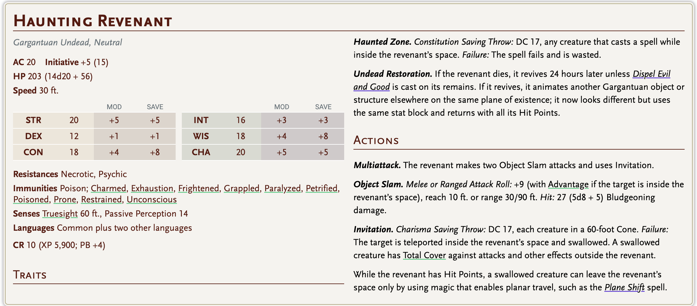
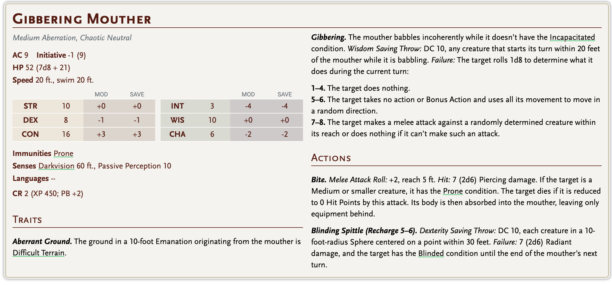
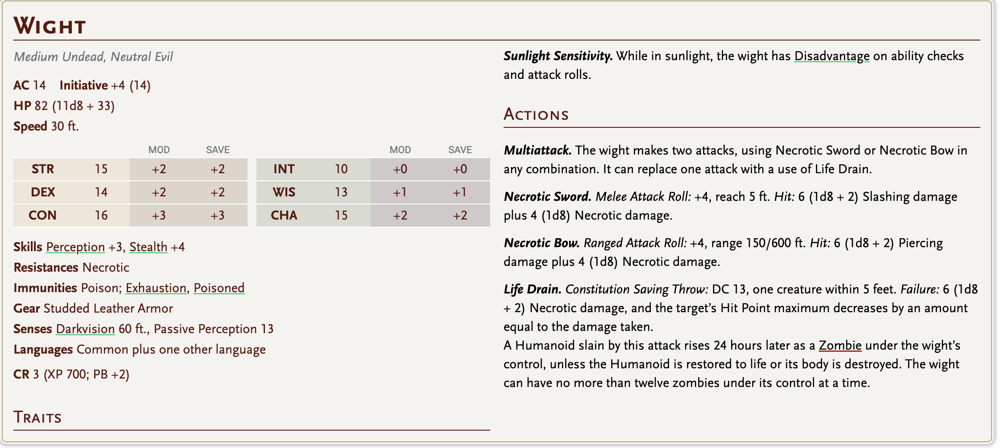

# Underground

han

ea basr - 18

ev - 17 - 128

aysif

max

## Eski Şehir: Vhaelureth, Boğulmuş Oyuk

Spellplague'den önce asıl şehrin adı **Vhaelureth** (VAY-lu-reth) idi — kanalları, cam ustaları ve fısıltı kadar sessiz kütüphaneleriyle ünlü, zengin bir tüccar-magokrasisi. 1385 DR'de Spellplague vurduğunda, mavi ateş Vhaelureth'i sadece yakmakla kalmadı — onu *bozdu*. Şehrin altındaki zemin büküldü, yapılar devasa bir obruğun içine çöktü, kanallarının suları doğal olmayan bir şekilde içeri akıp sonra geri çekildi ve harabe şehri yaklaşık bir mil çapında, birkaç yüz metre derinliğinde devasa bir boş odada asılı bıraktı. Bir asır boyunca tortu ve moloz üstünü kapattı, ve sonunda Hallowreach bunun üzerine, altta ne yattığından habersiz (ya da habersizmiş gibi yaparak) inşa edildi.

## Yasak İbadet: Ghaunadaur, Pusuda Yatan

İşte bu yeri gerçekten lanetli kılan kanca. Son on yıllarında, Vhaelureth'in hüküm süren tüccar aileleri gizlice bir **Ghaunadaur** kültünü destekliyordu — **Pusuda Yatan**, **Kadim Göz** ya da sadece **Kadim Olan** olarak da bilinir. Ghaunadaur gerçek bir Unutulmuş Diyarlar tanrısıdır: oozeların, salyaların, dışlanmışların ve aberasyonların kaotik kötü tanrısı; en derin yerlerde sapkın drowlar, aboleth'ler ve deliler tarafından tapılır. Modern panteonun çoğundan önce gelir ve genellikle "normal" bir tanrı değil, **kadim kötüler** (elder evils) arasında sayılır. Bilginler fısıldar ki Ghaunadaur bir tanrı değil de *duayı kabul etmeyi öğrenmiş daha eski bir şeyin bir parçası*dır.

Tüccar-rahipler Ghaunadaur'un onlara şehrin kuyuları ve çeşmelerinden fısıldadığına inanıyordu. Merkez meydanın altında gizli bir **tapınak-çukuru** inşa ettiler; burada mahkumları, rakipleri ve sonunda kendi zayıflayan yaşlılarını kutsal salya havuzuna besliyorlardı. Spellplague geldiğinde, bazıları Ghaunadaur'un dualarına *fazla harfiyen yanıt verdiğini* söyler — şehrin altındaki zemin sıvılaştı ve kültün oozeları her yere yayıldı. Salya tapanları için mükemmel bir ceza.

Bu, senin **Büyük Kadim warlock**'una güzelce bağlanıyor. Ghaunadaur tam olarak bir GOO patronunun akraba — ya da rakip — olarak tanıyacağı türden yabancı, yarı deli, tanrı öncesi bir varlıktır. Warlock'unun patronu fısıldayabilir: *"Burada eski bir kuzen uyuyor. Onu uyandırma — ben emretmedikçe."*

## Kaçakçılık Yolu

**Edric Halmoor**, Hallowreach'teki en güvenilir kaçakçılık hattını işletiyor; [Zhentarim](../../../../../../06-campaigns/chains-of-the-burning-compact/factions-in-play/zhentarim-ravonia.md) için yasa dışı mallar taşıyor: Thay'dan zehirler, büyülenmiş kaçak mallar, uyuşturucular, çalıntı sanat eserleri, ara sıra "nefes alan bir paket." Rotasının adı **Oyuk Yol**, ve tam yolu sadece en güvendiği adamları bilir.

Giriş, Halat-yolu Mahallesi'ndeki terkedilmiş bir tabakhanenin bodrumunda gizli — asılı derilerin arkasındaki sahte bir duvar, sonra bir halat merdiven elli ayaklık bir kuyudan aşağı, çökmüş bir kanalizasyon hattına inip sonunda eski şehre açılıyor. Edric şehir muhafızlarını susturuyor, dört dönüşümlü güvenli yol kullanıyor ve değişen güvenli yolları ezberleyen **Brekka** adlı yarı-orc bir rehber çalıştırıyor. Geçen ay "onu takip eden şeye" üç adam kaybetti — bu da bizi revenant'a getiriyor.

## Revenant: Rahibe Ysmae Calloran

Revenant, bir zamanlar **Eilistraee**'nin (ay ışığı ve kurtuluşun drow tanrıçası — Ghaunadaur'un uygun bir düşmanı) bir rahibesi olan **Rahibe Ysmae Calloran**. Ysmae, Vhaelureth'in Ghaunadaur kültüne son yılında sızmış, onu ifşa edip yok etmeyi umuyordu. Yakalandı, işkence gördü ve canlı canlı salya havuzuna atıldı. Bedeni eridi, ama *yemini* erimedi.

Spellplague geldiğinde, erimiş özü eski şehrin sularına dağıldı ve öfkesi onu bağlı tuttu. Şimdi Oyuk Yol'da yürüyor (revenant stat bloğunu kullan ama şöyle anlat: uzun boylu, paramparça gümüş cübbeli, derisi salyanın hiç tam çıkmadığı yerlerden soluk mavi damarlarla mermer gibi, kalçasında gümüş kılıç, gözleri hafifçe ay ışığı sızdıran bir kadın). *Akılsızca* düşman değil — kültün geri dönüşüne yardım ettiğine inandıklarını avlıyor ve belirli kaçak mallar taşıyan kaçakçılar (özellikle alkimik ya da aberasyon kökenli herhangi bir şey) duyularını tetikliyor. Edric'in adamları ölüyor çünkü kargosunun bir kısmı şehrin başka bir yerinde gizli bir kültist hücresi için salya-bulaşık reaktifler içeriyor — Edric'in kendisinin bile tam bilmediği bir şey.

**Kanca potansiyeli:** Parti onun hayaletliğini çözebilir — geri kalan kült varlığını yok ederek, kutsal sembolünü tapınak-çukurundan kurtararak ya da ölümünün intikamını alarak. Korkutucu bir karşılaşma ama aynı zamanda olası isteksiz bir müttefik.

## Yol

Edric'in rehberi Brekka eski şehrin içinden dört yol biliyor. Her birinin artı ve eksileri var — partine uygun olanı seç ya da seçmelerine izin ver.

**1. Kanal Yolu.** En hızlı yol, Vhaelureth'in eski kanallarının kurumuş yataklarında. Açık görüş hatları, kaygan zemin ve revenant burayı en çok devriye gezer çünkü kanallar tapınak-çukuruna bağlanır. Tehlike: revenant, boğulmuş ölüler, düşen moloz.

## sağ yol, revenant, sol yol, cam ustası geçidi.

**2. Cam Ustasının Geçidi.** Spellplague'nin sıcaklığının binlerce cam eseri bükülmüş heykellere eriterek kaynaştırdığı harabe zanaatkâr mahallesinden. Güzel ve ölümcül — zemin jilet gibi keskin cam kırıklarıyla kaplı, ve **gibbering mouther**'lar (mavi ateşe yakalanmış eski cam ustaları) kaynaşmış stüdyolarda pusuda bekliyor. Tehlike: arazi hasarı, mouther'lar, orada olmayan şeyleri yansıtan çarpık camdan halüsinasyonlar.

**3. Vaiz Merdiveni.** Bir zamanlar Oghma tapınağına çıkan uzun, spiral bir taş merdiven. Çoğunlukla sağlam, ama eski Ghaunadaur tapınağının bir koridorunun *tam altından* geçiyor — ve warlock'unun patronu burada fısıldayacak. Tehlike: psişik etkiler, bir veya iki grey ooze, fısıldayan koridor (aşağıda detaylı).

**4. Kemik İnleri.** Eski şehrin üzerine kurulduğu Vhaelureth öncesi bir mezarlıktan çökmüş mezarlar arasından geçen bir yan yol. Dar, ışıksız, ıslak taş ve daha eski şeylerin kokusunu alıyor. Tehlike: iskeletler, bir iki **grick**, ara sıra **shadow**'lar — ama revenant buraya asla gelmez çünkü kemikler onun yemininden daha eski güçler için kutsaldır.

5

ea basr

han

aysif

max

4

## Atmosfer ve Tasvir — Eski Şehir Nasıl Hissettirmeli

Parti ilk aşağı indiğinde, onlara dikey bir hayret anı ver. Şöyle bir şey oku ya da aktar:

**Serpiştirilecek duyusal detaylar:**

- **Işık:** Spellplague kalıntısının taşta kalp atışı ritmiyle yavaşça nabız gibi atan soluk mavi fosforlu damarlar bıraktığı yerler dışında zifiri karanlık. Meşaleler normal yanar ama gölgeleri ışığın yarım saniye gerisinden geliyormuş gibi görünür.
- **Ses:** Damlayan su, uzaktan öğütme sesleri (şehir bir asır sonra hâlâ "yerleşiyor"), uzak bir odada hareket eden bir şeyin ara sıra ıslak *şırp*ı. Ayak sesleriniz tuhaf bir şekilde yankılanır — bazen atılan adımdan daha fazla yankı geri döner.
- **Koku:** Nemli taş, eski küf, ve Ghaunadaur oozelerinin hafif tatlı çürük meyve kokusu. Tapınak bölgelerinde, hiç kurumamış kan gibi metalik bir tat.
- **Dokunuş:** Duvarlar soğuk ve hafif *yapışkan*, sanki her şeyi ince bir film kaplıyormuş gibi. Elinizi silmek hafif yanardöner bir parlaklık bırakıyor.
- **Yanlış şeyler:** Mükemmel korunmuş bir çocuk ayakkabısı. Hâlâ dördüne hazırlanmış bir yemek masası, gümüşleri kararmış. Boyalı gözleri partiyi takip ediyor gibi görünen gülümseyen bir tüccarın duvar resmi. Hâlâ tavana doğru damlayan, yerçekimine meydan okuyan bir çeşme — bir Spellplague kalıntısı.

## Burada Gizlenen Yaratıklar

Partinin seviyesine göre karıştır ve eşleştir. Katmanlı bir liste öneriyorum:

**Düşük tehdit (atmosfer):** Dev sıçanlar, böcek sürüleri, tavanlardan damlayan **grey ooze**'lar, çökmüş evlerdeki **shadow**'lar, inlerdeki **grick**'ler, çukur su birikintilerinden kalkan eski kültist iskeletleri.

**Orta tehdit (kurgulanmış sahneler):** Cam Ustasının Geçidi'ndeki **gibbering mouther**'lar, bir koridoru tıkayan **ochre jelly**, eski kült rahipleri olan iki **wight**, kaçakçı feneri taklidi yapan bir **will-o'-wisp**, bir Vhaelureth hazine sandığı gibi kılık değiştirmiş bir **mimic**.

**Yüksek tehdit / boss malzemesi:** **Revenant Ysmae**, Ghaunadaur'un küçük bir tecellisi olarak tapılan bir **black pudding**, bir zamanlar yasaklı kitapları okumaya çalışan bir Vhaelureth akademisyeni olan bir **nothic**, ve — son oda için — bir asırlık kurbanla şişmiş bir **gibbering abomination** ya da **otyugh-rahip**, hatta su yeterince derinse bir **chuul**.

**Benzersiz karşılaşma fikri:** **Koro.** Su basmış bir meydanda, bir düzine insansı şekil diz boyu durgun suda, aynı yöne bakarak, hareketsiz duruyor. Yaklaşılırsa hepsi aynı anda döner — bunlar Ghaunadaur'a sonsuz duada kilitli kültistlerin **husk**'ları (zombi veya specter olarak yeniden yorumlanmış). Parti sudaki görünmez bir çizgiyi geçmedikçe saldırmazlar. Son derece ürkütücü, isteğe bağlı savaş.

## Eski Şehir Harabeleri — Görsel Dönüm Noktaları

Oyunculara hatırlayabilecekleri ve yön bulabilecekleri dönüm noktaları ver:

- **Eğik Kule:** Şimdi kırk beş derece eğimli yüksek bir saat kulesi, saati Spellplague'nin vurduğu tam ana donmuş. Kimse bakmadığında kollar bazen kendi başlarına hareket ediyor.
- **Boğulmuş Pazar:** Sürekli bilek hizasında tuzlu suda kalan bir meydan, tezgâhlar hâlâ dikili, masalarda hâlâ dağılmış madeni paralar. Bir madeni para almak *sorun değil.* İkinci bir madeni para almak, bir şeyin fark ettiği andır.
- **Kaynaşmış Kütüphane:** Vhaelureth kütüphanesi, kitapları tek bir kağıt-taş kütlesine erimiş. Burada bir **nothic** yaşıyor ve kitapları *hatırlıyor*.
- **Kadim Göz'ün Çukur-Tapınağı:** Son konum. Zemine oyulmuş devasa bir taş göz, göz bebeği ne su ne de salya olan, ikisinin arasında bir şey olan durgun, siyah bir sıvı havuzuna açılıyor. Tavandan paslı zincirler sarkıyor. Duvarlar doğrudan bakıldığında canı yakan spirallerle oyulmuş.
- **Bronz Kubbe:** Devrilmiş bir Oghma tapınağı, kapıları çatlak açık, hâlâ (muhtemelen) kurtarılabilir kitaplar taşıyor — meraklı bir parti için güzel bir ödül.

## Fısıldayan Koridor ve Warlock'unun Sınavı

Bu, Büyük Kadim warlock'un için gösteri parçası. Nasıl yönetirdim:

*"Buradaki eski kuzeni hissediyor musun? Ayaklarının altında rüya görüyor. Senin tanrıların konuşmayı öğrenmeden önce- rüya görüyordu. Beni hâlâ hatırlayıp hatırlamadığını bilmek isterim. Git. Aşağı. Siyah suya dokun. Gerçek adımı ona fısılda. Ne cevap verdiğini söyle bana."*

Patron daha fazla açıklama yapmaz. Warlock'un üç seçeneği var ve her birinin ağırlığını *hissettirmelisin*.

**Seçenek 1: İtaat.** Warlock sıvışır (ya da partiyi getirir), çukur-tapınağa gider, siyah suya dokunur ve patronun gerçek adını söyler. Bu, **Kadim Göz'ün Sınavı**'nı (aşağıda) tetikler.

**Seçenek 2: Reddetme.** Patron susar — *soğuk* bir sessizlik. Henüz büyü başarısızlığı yok, ama warlock belirli özelliklerle bağlantısını kaybeder (belki Telepati ya da Awakened Mind) sonraki bir görevi tamamlayana kadar. Net ama oyunu mahvetmeyen bir sonuç.

**Seçenek 3: Pazarlık.** Rolünü oyna. Patron bir alternatifi kabul edebilir — geri getirilen bir çukur-taşı parçası, Ysmae'nin gümüş kanından bir damla, Kaynaşmış Kütüphane'den bir sayfa. Çoğu masa için en eğlenceli seçenek.

## Kadim Göz'ün Sınavı

Warlock siyah suya dokunursa, oda *değişir.* Orada bulunan herkes paylaşılan bir vizyona çekilir — yavaş yavaş yuvarlanan gözlerden bir gökyüzünün altında obsidyen sütunlardan bir salon. Ghaunadaur'un varlığı tam olarak orada değil (tanrılara şükür), ama ilgisinin bir parçası orada. Sınavın üç aşaması var:

**Aşama 1 — Açlığın Sınavı.** Parti, sevdikleri her yiyeceğin yüklü olduğu uzun bir ziyafet masasının önünde durur. Öğütülmüş taş gibi bir ses onlara der ki: *"Yiyin. Her şey yer. Her şey yenir. Reddetmek yalan söylemektir."* Yiyecek vizyonda gerçektir. Yemek küçük bir nimet verir (geçici HP, ilham) ama warlock sonra 1 seviye yorgunluk alır — bir şeyi *beslemişlerdir*. Reddetmek daha zordur: direnmek için DC 15 Bilgelik (Wisdom) tasarrufu, başarısızlık istemsizce bir ısırık alındığı anlamına gelir. Bu, partinin Ghaunadaur'un felsefesinin anlamsız tüketim olduğunu anlayıp anlamadığını sınar.

**Aşama 2 — Çözülme Sınavı.** Sütunlar *erimeye* başlar ve partinin kendi bedenleri kenarlarda bulanıklaşmaya başlar. Her biri tek bir belirleyici anıya tutunmak zorunda — bir isim, bir yüz, bir yemin — ve kendilerini bütün tutmak için DC 15 Karizma  başarılı olmalılar. Başarısızlık, küçük ama kalıcı bir şeyi kaybetmek anlamına gelir: sevdikleri birinin yüzünün anısı, ilk evcil hayvanlarının adı, annelerinin yemeğinin tadı. (Saf rol yapma kaybı, mekanik ceza yok — ama oturmasına izin ver.) Warlock avantajla rol yapar çünkü patronu *izliyor* ve kabının bir rakip tarafından çözülmesine izin vermez.

**Aşama 3 — Fısıltının Sınavı.** Ghaunadaur'un parçası doğrudan warlock'a konuşur: *"Efendin farklı bir maske takıyor, ama biz deri altında akrabayız. Bu tohumu taşı. Efendin emrettiğinde ek — ya da tasmasından bıktığında."* Warlock'un elinde küçük, nabız gibi atan siyah bir inci belirir. Gerçektir. Vizyon bittikten sonra orada kalır.

**İnci ne yapar:** Bu senin DM olarak seçimin. Şunu öneririm: GOO patronunun kampanyada daha sonra "etkinleştirebileceği" uykuda bir nesne olsun — tek kullanımlık bir kaçış, tek kullanımlık felaket niteliğinde bir ooze çağırma ya da oturumlar boyunca warlock'a yavaşça fısıldayan lanetli bir eşya. Uzun vadeli gerilim için harika: warlock bir hediye mi, bir silah mı, yoksa bir tuzak mı taşıyor?

Sınav bittiğinde, parti çukur-tapınağa geri döner. Anlar geçmiştir, ama herkes sarsılmıştır. Revenant Ysmae burada eski-tanrı enerjisinin yükselişine çekilerek belirebilir ve bu, onunla doruk karşılaşma için dramatik bir yerdir — saldırabilir ya da warlock'un *direndiğini* fark ederse (direndiyse) ve istemeden bir ittifak önerebilir.

## Daha Sonra Çekilecek Olay İplikleri

- **Edric Halmoor** kargosunun yukarıda Hallowreach'te hayatta kalan bir kült hücresini beslediğini bilmiyor. Hücre lideri kim? Bir asilzade mi? Bir rahip mi? Kendi yardımcısı Brekka mı?
- [Zhentarim](../../../../../../06-campaigns/chains-of-the-burning-compact/factions-in-play/zhentarim-ravonia.md) partinin kaçakçılık yolunu bozmasını takdir etmeyecek. Baskı, rüşvet ve sonunda suikastçılar bekle.
- **İnci** warlock'un cebinde tiktaklıyor. Patron onu geri isteyecek — ya da kullanmalarını isteyecek — en kötü anda.
- **Ysmae'nin kurtuluşu** güzel bir uzun yay: parti başladığı işi bitirip yukarıdaki kült hücresini yok ederse, sonunda dinlenebilir ve gümüş kılıcı partiye bir hediye olabilir.
- **Ghaunadaur'un kendisi** asla görünmez. Asla görünmemeli. Eski şehrin altındaki her sahnede görünmeyen ağırlık olmalı ve bir stat bloğu olduğu an gücünü kaybeder.

## Kulübenin Gerçeği

Kulübe Ysmae değil. Kulübe Ysmae'nin **acısı.**

Ghaunadaur'un çukurunda eritildiğinde, yemini o kadar güçlüydü ki parçalanmayı reddetti — ama beden olmadan, ruh kendini hatırlayamıyordu. Bir asır boyunca, dağılmış özü yeraltı sularında sürüklendi ve nihayet bu göle yerleşti. Burada, Eilistraee'ye olan vaadi — *"Onları kurtaracağım. Onları eve götüreceğim."* — bir şekil aramaya başladı. Rahibenin aklı olmadan, sadece niyetinden bir şey inşa etti: gördüğü en son sıcak şey, çocukluğundan hatırladığı bir kulübe, kurban etmeden önce ona söz verilmiş bir cennet.

Şimdi kulübe, onun gibi kurbanlar için *tuzak* kurar. Yorgun yolcuları çeker, onları içeri davet eder ve acılarını yutar. Her yuttuğu ruh, onun yeminini tamamlamaya yaklaştığına inanıyor — oysa onları yalnızca çiğneyip hazmediyor. Ysmae'nin parçalanmış aklı bunun olduğunu bilmiyor. Gerçekten de ruhları *kurtardığını* düşünüyor.

Mekanik olarak: kulübe mythago-benzeri bir varlık, bir tür **arazi ruhu** ya da reskin edilmiş **Roper + Mimic + Intellect Devourer** karışımı. Kulübe yaklaşık 20x20 fit görünüyor ama içeride sonsuz. Yapı, Ysmae'nin yarı hatırlanan hayatından bir tür *yüksek CR iblis arazisi.* Ben bunu 4-6. seviyedeki bir parti için CR 7-8 civarında bir karşılaşma olarak önerir ve çoğunu savaş yerine rol yapmayla çözerdim.