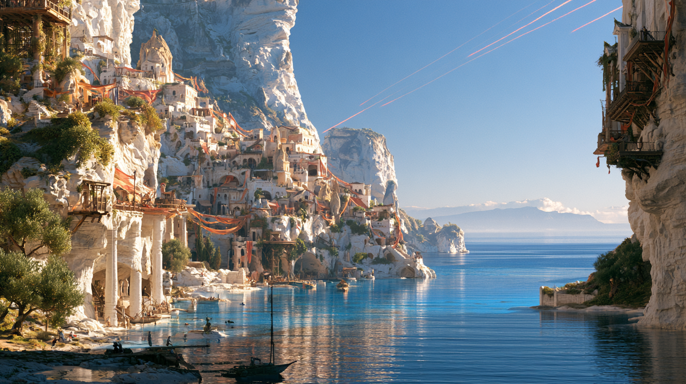
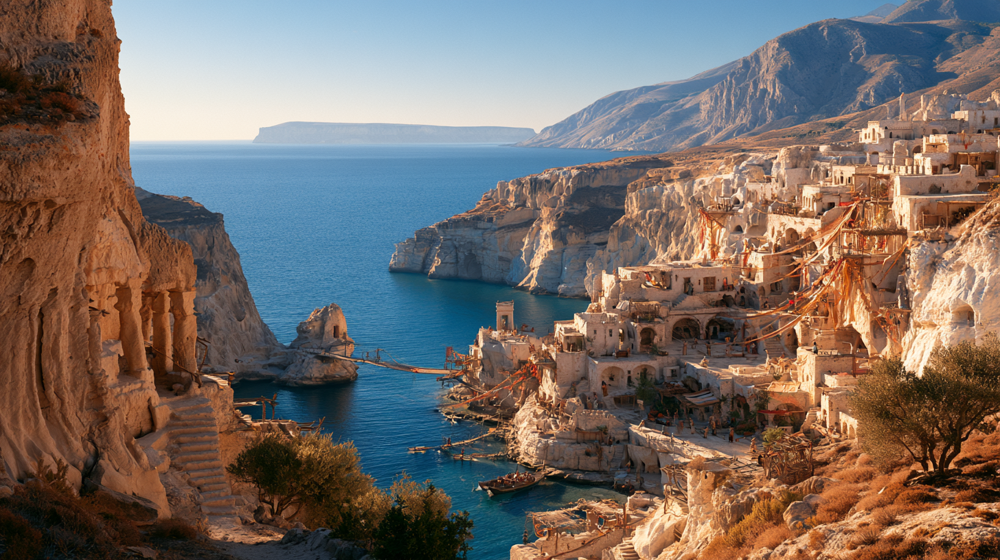
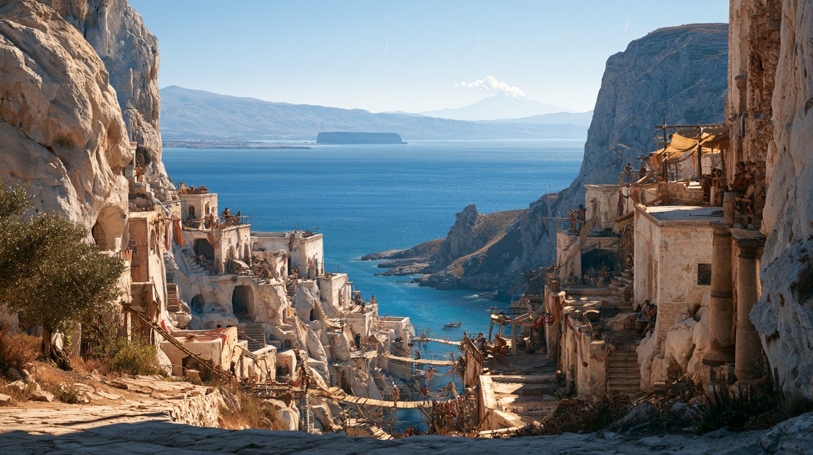

# Calithra

> *Calithra'ya doğan insan sayısı, Calithra'ya gelen insan sayısının yanında önemsizdir.*

**Yukarı:** [Ravonia Kıtası — Bölgeler](../README.md) ·
[Ravonia kıtası](../../README.md)

## Bu klasör

| Dosya | Ne var içinde |
|---|---|
| **README.md** *(buradasın)* | Şehrin kendisi — atmosfer, kültür, ekonomi |
| [history.md](history.md) | Kuruluş, **kurucu bard Calith Auveran**, FR temeli (Finder Wyvernspur), din |
| [places.md](places.md) | Tavernalar, meydanlar, landmark'lar, liman mahallesi + tarif üreteci |
| [standing-stone.md](standing-stone.md) | **The Standing Stone** — vadinin ağzındaki antlaşma taşı, **1 DR** |
| [people.md](people.md) | **13 NPC**, ilişki ağı, replikler, statblock önerileri |
| [quests.md](quests.md) | **10 yan görev** + d10 rastgele kanca tablosu |
| [lovers-cut-tale.md](lovers-cut-tale.md) | **İki Kıta Masalı** — masada okunacak metin |
| [05-secrets-dm-only.md](05-secrets-dm-only.md) | ⚠️ Sırlar: Harper hücresi, defter, kurucu |

## Kimlik Kartı

| | |
|---|---|
| **Nerede** | Denize bakan yüksek ve dik bir kıyı vadisi; şehir vadinin duvarlarına oyulu |
| **Manzara** | Açık havalarda ufukta **karşı kıtanın dağları** ince, mavi-gri bir çizgi |
| **Kuruluş** | **1389 DR** — [Calith Auveran](history.md#kurucu-calith-auveran), eski bir [Harper](../../../../../02-lore/factions/harpers.md) bardı. *Özgür ruhlar için.* |
| **Halk** | Ezici çoğunluk **sonradan gelen**. "Yerli" kavramı bulanık |
| **Ekonomi** | Şarap (ihracat) · üzüm, zeytin, incir, nar, ot · balık · **ziyaretçi** |
| **Ticaret kapısı** | Vadinin dibindeki liman mahallesi — *"Aşağıdaki ciddi yer"* |
| **Girişi** | Vadinin ağzındaki **[Standing Stone](standing-stone.md)** — **1 DR**'de dikildi; şehirden 1388 yıl yaşlı |
| **Din** | Lliira · Milil · Tymora — ve tapınağı olmayan **Finder Wyvernspur** |
| **Yönetim** | ⬜ resmen kimse. Gerçekte üç kişi → [sırlar](05-secrets-dm-only.md) |

> **[AÇIK SORU]** **Konum.** Metinde "karşı kıtanın dağları" görülüyor; bu, Calithra'yı
> Ravonia'nın **doğu kıyısına**, [Lover's Cut](../../../../oceans-and-seas/lovers-cut.md)
> boğazına bakan yamaca oturtur — [Northcurrent](../../sites/northcurrent.md)'in
> güneyi en doğal aday. Alternatif okuma: güney kıyı, karşıda **Güney Takımadası**.
> Haritada Calithra etiketi **yok**; karar DM'de.

---

## Buraya gelenler

Şehrin sokaklarında yürürken bunu hemen fark edersin. İnsanların aksanları birbirine
benzemez. Aynı masada kuzeyin sert ünsüzleriyle konuşan bir paralı asker, güney
kıyılarından gelmiş eski bir tüccar, adını değiştirmiş bir soylu ve hangi krallıktan
geldiğini söylemeyen bir ozan oturabilir. Kimse bunu garipsemez.

Çünkü Calithra'da insanlara nereden geldikleri pek sorulmaz.

Daha da önemlisi, **neden geldikleri hiç sorulmaz.**

Herkes bir şey bırakmıştır geride.

Bir evlilik. Bir savaş. Bir aile adı. Bir borç. Bir görev. Bir lonca. Bir taht.
Bir tanrı. Bir suç. Bir beklenti.

Bazıları yalnızca yorulmuştur.

Bazıları ise bulunmak istemiyordur.

Calithralılar arasında eski bir söz vardır:

> **"Buraya gelen herkes bir yerden geç kalmıştır."**

## Vadi ve deniz

Calithra, denize bakan yüksek ve son derece dik bir vadinin içerisine kuruludur.
Şehrin aşağısında kıyı vardır ama Calithra bir liman şehri gibi hissettirmez.
Deniz hep oradadır; fakat uzaktadır, aşağıdadır.

Şehrin hemen her yerinden görülür.

Bir tavernanın taş balkonundan, bir mağara evinin penceresinden, merdivenlerin
arasındaki küçük bir açıklıktan ya da iki kaya sütununun arasına gerilmiş bir
köprüden baktığında aşağıda uçsuz bucaksız mavi denizi görürsün.

Açık havalarda ufukta karşı kıtanın dağları ince, mavi-gri bir çizgi halinde belirir.

Bu manzara Calithra'nın insanlarında garip bir alışkanlık yaratmıştır. İnsanlar
sık sık dururlar.

Gerçekten dururlar.

Bir yere giderken merdivenin ortasında, elinde şarapla bir duvarın üzerinde, bir
sohbetin ortasında…

Denize bakarlar.

Kimse acele etmez.

Calithra'da acele eden biri hemen yabancı olduğunu belli eder.

## Şehrin şekli

Şehir doğal kaya oluşumlarının üzerine kurulmuştur.

Bazı evler inşa edilmemiş, kayanın içinden çıkarılmıştır. Kapılar taş duvarların
içinde ansızın belirir. Bir evin salonu aslında binlerce yıldır orada bulunan doğal
bir mağaradır. Başka bir evin çatısı, üstündeki sokağın zemini olabilir.

Calithra'da "zemin kat" diye bir kavram pek yoktur.

Bir sokağın beş kat yukarısından başka bir sokağa geçebilirsin.

Merdivenler birbirine bağlanır, sonra ayrılır. Dar geçitler kaya oluşumlarının içine
girip başka bir terasta çıkar. Ahşap köprüler uçurumların üzerinden geçer. Balkonlar
birbirinin üzerine taşar.

Şehir yukarı doğru büyümüştür.

Ve biraz da kendi üzerine çökmüş gibidir.

İlk kez gelenler sürekli kaybolur.

Calithralılar bunun çözümünü haritalarda değil, başka bir yöntemde bulmuştur.

### Yol tarifleri mekanlarla yapılır

- *"Üç basamaklı çeşmeden sonra sola dön."*
- *"Kırmızı perdeli şarap evini geç."*
- *"Her akşam keman çalan yaşlı kadının balkonundan aşağı in."*
- *"İki sevgilinin heykelinden sonra müziği takip et."*

Calithra'da çoğu zaman gerçekten de müziği takip ederek bir yere varabilirsin.

## Günün ritmi

Şehir sabahları sessizdir.

Calithra erken kalkmayı ahlaki bir kusur sayacak kadar ileri gitmemiştir ama buna
oldukça yaklaşmıştır.

Güneş vadinin taşlarına vurduğunda sokaklarda yalnızca fırınlardan çıkan ekmek
kokusu, birkaç kedinin sesi ve gece boyunca açık kalmış tavernalardan eve dönmeye
çalışan insanların ayak sesleri vardır.

Şehir öğlene doğru uyanır.

Pencereler açılır.

Perdeler balkonlara atılır.

İnsanlar kapı önlerine minder çıkarır.

Birileri çalgısını akort etmeye başlar.

Öğleden sonra Calithra gerçek haline kavuşur.

Meydanlarda küçük gösteriler başlar. Bir sokakta iki kişi dans ederken birkaç dakika
sonra çevrelerinde yirmi kişi birikebilir. Bir şair yeni yazdığı dizeleri yüksek sesle
okur. Bir başka köşede üç bard birbirlerinin şarkılarını bozarak doğaçlama düelloya girer.

Bir insanın masasından kalkıp başka bir masaya oturması normaldir.

Bir yabancının sohbetine katılmak kabalık sayılmaz.

Calithra'da özel alan evlerin içinde başlar.

Sokak herkesindir.

## Görgü: iş konuşulmaz

Şehrin en önemli toplumsal kuralı son derece basittir:

> **İş konuşulmaz.**

Pazarlık, ticaret hesabı, maaş, üretim, sözleşme, teslim tarihi, vergi gibi konuların
eğlence alanlarında konuşulması ciddi bir görgüsüzlüktür.

Bir tavernada para hesabı yapmaya başlayan birinin önüne garson sessizce bir bardak
şarap bırakıp:

> *"Sabah konuş."*

diyebilir.

Bu, Calithra'da hem şaka hem uyarıdır.

Çünkü şehir çalışmaya düşman değildir.

**Çalışmanın insan hayatının merkezinde olmasına düşmandır.**

Bir Calithralı sabah birkaç saat ekmek pişirebilir, terasında üzüm yetiştirebilir veya
limandan gelen malları taşıyabilir.

Ama bunu kimliği haline getirmez.

*"Ne iş yapıyorsun?"* Calithra'da son derece tuhaf bir sorudur.

Onun yerine insanlar şunu sorar:

> **"Ne yaparken zamanın geçtiğini unutursun?"**

## Ekonomi

Yine de şehir bir şekilde yaşamak zorundadır.

Calithra'nın çevresindeki yüksek teraslarda üzüm, zeytin, incir, nar ve çeşitli otlar
yetişir. Vadinin aşağı kesimlerinde küçük tarım alanları vardır. Kıyı köyleri balık sağlar.

Şehrin en önemli ihracatı ise **şaraptır**.

Calithra şarapları özellikle çevre krallıklarda çok değerlidir.

Fakat ironik biçimde Calithralılar ticaretle uğraşmayı sevmedikleri için bu işin çoğunu
şehir dışında yaşayan tüccarlar yürütür.

### "Aşağıdaki ciddi yer"

Şehrin aşağısında, vadinin denize yaklaştığı bölgede küçük bir ticaret mahallesi bulunur.

Burası teknik olarak Calithra'dır.

Ama Calithralılar ona biraz küçümseyerek **"Aşağıdaki ciddi yer"** derler.

| Aşağıda olan | Yukarıda olan |
|---|---|
| Gemiler yanaşır | Kimse sormaz |
| Mallar tartılır | Müzik çalar |
| Sözleşmeler imzalanır | Sözleşme lafı edilmez |
| Hesaplar görülür | *"Sabah konuş."* |

Sonra tüccarlar yukarı çıkar ve bir daha işle ilgili tek kelime etmezler.

### Ziyaretçi ekonomisi

Calithra'nın ekonomisinin büyük bir kısmı aslında ziyaretçilere dayanır.

Şehir dünyanın dört bir yanından sanatçıları, soyluları, maceracıları, denizcileri ve
meraklıları çeker.

İnsanlar buraya haftalarca süren festivaller için gelir.

Bazıları aylarca kalır.

Bazıları hiçbir zaman geri dönmez.

- Bir kralın üçüncü oğlu bir yaz için Calithra'ya gelir ve on yıl sonra hâlâ küçük bir
  tiyatroda komedi oynuyor olabilir.
- Ünlü bir general savaş bittikten sonra buraya gelip hayatının geri kalanını seramik
  yaparak geçirebilir.
- Bir büyücü akademiyi terk edip denize bakan küçük bir mağarada şiir yazabilir.

Calithra bunu sorgulamaz.

## İsimsizlik geleneği

Şehirde kişinin geçmişte ne olduğu çok az önem taşır.

Calithra'da insanların kendilerini yeniden adlandırmaları bile yaygındır.

Bazıları gerçek isimlerini yıllarca söylemez.

Kimse bunu yalan olarak görmez.

Çünkü Calithralılar için insan, geçmişinin mülkü değildir.

Bu yüzden şehir özellikle **kaçanları** çeker.

Ama her kaçış suçtan değildir.

Birileri savaştan kaçar. Birileri görevden. Birileri ailesinden. Birileri kendisinden
beklenen kişiden.

Bazıları gerçekten kanundan kaçıyordur.

Bazıları ise hiçbir suç işlememiştir; yalnızca bir gün hayatlarının kendilerine ait
olmadığını fark etmişlerdir.

Calithra'nın bu insanlara verdiği şey güvenlikten çok **anonimliktir**.

Şehir resmi olarak suçluları koruduğunu söylemez.

Fakat insanların geçmişleri hakkında soru sorulmaması öylesine yerleşmiş bir gelenektir
ki, birini araştırmak neredeyse hakaret sayılır.

| Soru | Kabul |
|---|---|
| *"Onu önceden tanıyor muydun?"* | Normal |
| *"Eskiden kimdi?"* | **Değil** |

## Kim Calithralıdır?

Calithra'da yerel halk diye bir kavram bu nedenle bulanıktır.

Üç nesildir burada yaşayan birkaç aile vardır.

Ama onlar bile şehrin sahibi gibi davranmaz.

Bir insan on yıl Calithra'da yaşadıysa artık Calithralıdır.

Belki beş yılda.

Belki beş ayda.

Bazıları şaka yaparak bunun bir gecede olabileceğini söyler.

İlk kez geldiğin gece sabaha kadar dans etmiş, güneş doğarken denizi izlemiş ve ertesi
gün gitmekten vazgeçmişsen… muhtemelen artık buraya aitsindir.

## Geceler — Vadinin şarkısı

Akşamları şehir tamamen değişir.

Vadinin binlerce penceresinde küçük lambalar yanar.

Kayaların içine oyulmuş evlerden sıcak ışıklar sızar.

Köprülerin arasında fenerler asılıdır.

Müzik vadinin duvarlarında yankılanır.

Bir yerde davullar çalar.

Bir başka terasta keman.

Aşağıdan bir flüt sesi yükselir.

Bazen şehirdeki yüzlerce ayrı müzik birbirine karışır ve neyin nereden geldiğini anlamak
imkânsızlaşır.

Calithralılar buna **"Vadinin şarkısı"** der.

## Kızıl yıldızlar

Ve bazı geceler gökyüzünden kızıl kuyruklu yıldızlar geçer.

Uzun kırmızı izleri denizin üzerinde uzanırken beyaz taşların, mağara evlerinin ve
insanların yüzlerinin üzerine hafif kızıl bir ışık düşer.

O gecelerde müzik genellikle biraz daha uzun sürer.

Şarap biraz daha fazla içilir.

Ve insanlar gökyüzüne biraz daha uzun bakar.

Çünkü Calithra'da yaygın bir inanış vardır:

> **Kızıl yıldızların altında verilen kararlar geri alınmaz.**

Bu yüzden bazıları o gece evlenir.

Bazıları adını değiştirir.

Bazıları geçmişine yazdığı son mektubu yakar.

Bazıları da yanında taşıdığı anahtarı uçurumdan denize atar.

> **[AÇIK SORU]** Kuyruklu yıldızlar **1494 DR**'de geldi
> ([premise](../../../../../06-campaigns/new-campaign/01-premise.md)). O hâlde bu inanış
> ya **bir yaşında** — yani bütün dünya panikleyip alışırken Calithra ondan bir *âdet*
> çıkardı — ya da şehirde **eskiden beri** var olan bir sözün üstüne kuyruklu yıldızlar
> oturdu. İlki daha Calithralı; ikincisi daha tehlikeli.

## Calithra kusursuz değildir

Buraya gelen herkes gerçekten geçmişinden kurtulamaz.

Bazıları yıllarca kaçtığı şeyin hâlâ içinde olduğunu fark eder.

Bazıları parasını tüketir.

Bazıları eğlenceyi özgürlük sanıp kendisini başka bir bağımlılığın içinde bulur.

Bazıları bir sabah hiçbir şey söylemeden şehri terk eder.

Calithra kimseyi iyileştireceğine söz vermez.

Sadece bir şey sunar:

> **Bir süreliğine başka biri olabilme hakkı.**

Belki de bu yüzden şehrin resmi olmayan sözü şudur:

> **"Yarın çalışırız."**

Kimse yarının hangi yarın olduğunu sormaz.

---

## Masada Calithra

Aşağısı bu bölgenin **DM tarafı**; yukarısı oyuncuya okunabilir.

### Sosyal kurallar (mekanik özet)

| Durum | Masada karşılığı |
|---|---|
| Bir yabancının masasına oturmak | Kontrol gerekmez. Reddedilmek nadir. |
| Birinin geçmişini sormak | **Sosyal ceza.** Dinleyenler soğur; Persuasion dezavantajlı sayılabilir |
| Bir tavernada iş/para konuşmak | Aynı ceza, ama gülerek verilir |
| Müzikle yol sormak | Bilgi ucuz; **isim** pahalı |
| Birini kalabalıkta bulmak | Investigation değil, **Performance** — çalarsan sana gelirler |

> Calithra bir **bilgi** şehri değil, bir **anonimlik** şehridir. Burada bir NPC'yi bulmak
> kolaydır; **kim olduğunu** öğrenmek çok zordur.

### Kampanya Kancaları

> **[HOOK]** Parti birini aramak için geliyor — ve şehrin en yerleşik geleneği tam olarak
> "birinin kim olduğunu sormamak". Görev, şehrin ahlakıyla doğrudan çatışıyor.

> **[HOOK]** Kızıl yıldızlı bir gece: partiden birine, o gece verilecek bir söz teklif
> ediliyor. Calithra'da o söz geri alınmaz — ve bunu ciddiye alan biri var.

> **[HOOK]** Şarap ihracatı şehirden değil, **tüccarlardan** yönetiliyor. Yani Calithra'nın
> parasını Calithralı olmayan biri tutuyor. Bu, "aşağıdaki ciddi yer"i şehrin en
> savunmasız yeri yapıyor.

> **[HOOK]** [Mürai savaşı](../../../../../06-campaigns/new-campaign/01-premise.md)ndan
> firar edenlerin bir kısmı burada. Karsovia (ya da Ravonia) tarafından biri onları
> **isim isim** arıyor.

> **[HOOK]** Tanrılar bir yıldır susuyor — ve dünyada bunu **en az** dert eden şehir burası.
> Rahipler için Calithra bir teselli değil, bir hakaret.

**On yan görev:** [quests.md](quests.md) · **On üç NPC:** [people.md](people.md) ·
**On üç mekân:** [places.md](places.md) · **Vadinin ağzındaki taş:** [standing-stone.md](standing-stone.md)

### Sakinler

| Kim | Nerede | Ne |
|---|---|---|
| [Ospren Callow](people.md#ospren-callow) | Yarın Çalışırız | Taverna sahibi; militan tembel |
| [Vesna Marroc](people.md#vesna-marroc) | Balkonu | Kemancı; şehrin saati |
| [Nedra Corm](people.md#nedra-corm) | Kırmızı Perde | Bağcı; şarabın sahibi |
| [Bex Anadare](people.md#bex-anadare) | Alaca | Komedyen; yılda bir gece [masalı](lovers-cut-tale.md) anlatan adam |
| [Perrin the Ninth](people.md#perrin-the-ninth) | Her yerde | Sekiz kez ad değiştirmiş gnome |
| [Torc Halbrand](people.md#torc-halbrand) | Aşağıdaki Ciddi Yer | Şehri nefret ederek finanse eden adam |
| *+7 kişi* | → [people.md](people.md) | Halvard, Mireille, Nolwen, Marto, Ilva, Cassian, Fig |

### Sırlar

Cevaplandı — hepsi [05-secrets-dm-only.md](05-secrets-dm-only.md)'de:

> **[DM ONLY]** Şehri kim yönetiyor · şehirdeki **gizli Harper hücresi** ve karargâhı ·
> isimsizlik geleneğinin farkında olmadan tutulan **arşivi** · kurucunun ölüp ölmediği ·
> Adsızlar Bahçesi'nin tanrılar sustuğu hâlde neden hâlâ çalıştığı.

### Açık Sorular

> **[AÇIK SORU]** **Ölçek.** Calithra bir bölge mi, yoksa bir bölgenin içindeki tek şehir mi?
> Şu an bölge olarak duruyor; şehir + çevre bağ terasları + kıyı balıkçı köyleri bir arada.
> Şehir kendi başına dosyalanırsa `cities/calithra/` altına terfi eder.

> **[AÇIK SORU]** **Yönetim.** Resmî bir yönetim yok — bu bilinçli. Gerçekte üç kişi
> (para, bilgi, meşruiyet) şehri elinde tutuyor ve üçü hiç bir araya gelmedi
> → [sırlar](05-secrets-dm-only.md#5-kim-yönetiyor). Masaya resmî bir konsey lazımsa
> liman mahallesinin **Tartı Meclisi** en doğal aday.

> **[AÇIK SORU]** **Calithra = [Lirion](../../../../../06-campaigns/new-campaign/05-world-seeds.md#3-lirion--aşıklar-yarığının-bard-şehri) mı?**
> New Campaign tohumlarında Lover's Cut'a bakan, Kapadokya benzeri, katmanlı bir **bard şehri**
> var. Calithra o tohumun yazılmış hâli olabilir — ya da iki ayrı şehir. **Fark:** Lirion
> "ekstrem görüşlerin çarpıştığı" bir siyaset şehri; Calithra ise siyaseti *reddeden* bir
> şehir. İkisi aynıysa şehir çok daha gerilimli olur.

## Bağlantılar

| Nereye | Ne |
|---|---|
| [Ravonia kıtası](../../README.md) | Üst seviye |
| [The Standing Stone](standing-stone.md) | Vadinin ağzındaki antlaşma taşı — **Dale Reckoning** buradan başlar |
| [Silvaerûn](../silvaerun/README.md) | Taştaki antlaşmanın **diğer tarafı** |
| [Harpers](../../../../../02-lore/factions/harpers.md) | Kurucu bir Harper'dı — ve hücre hâlâ burada ⚜️ |
| [Lover's Cut](../../../../oceans-and-seas/lovers-cut.md) | Boğaz — konum adayı; [masalın](lovers-cut-tale.md) konusu |
| [Northcurrent](../../sites/northcurrent.md) | En yakın kale (konum adayı doğruysa) |
| [Ticaret ve Ekonomi](../../../../00-overview/trade-and-economy.md) | Şarap ihracatı buraya bağlanır |
| [New Campaign](../../../../../06-campaigns/new-campaign/README.md) | ☄️ Kızıl gök, sessiz tanrılar |
