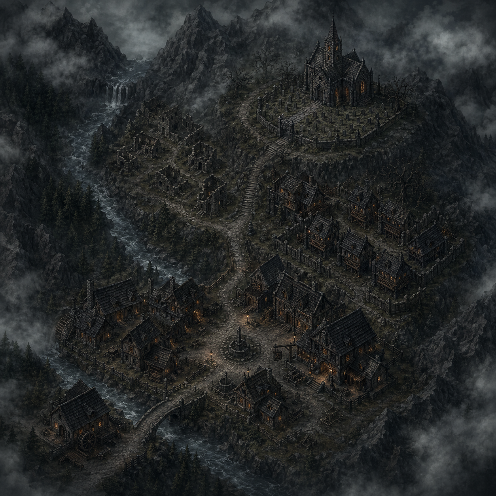
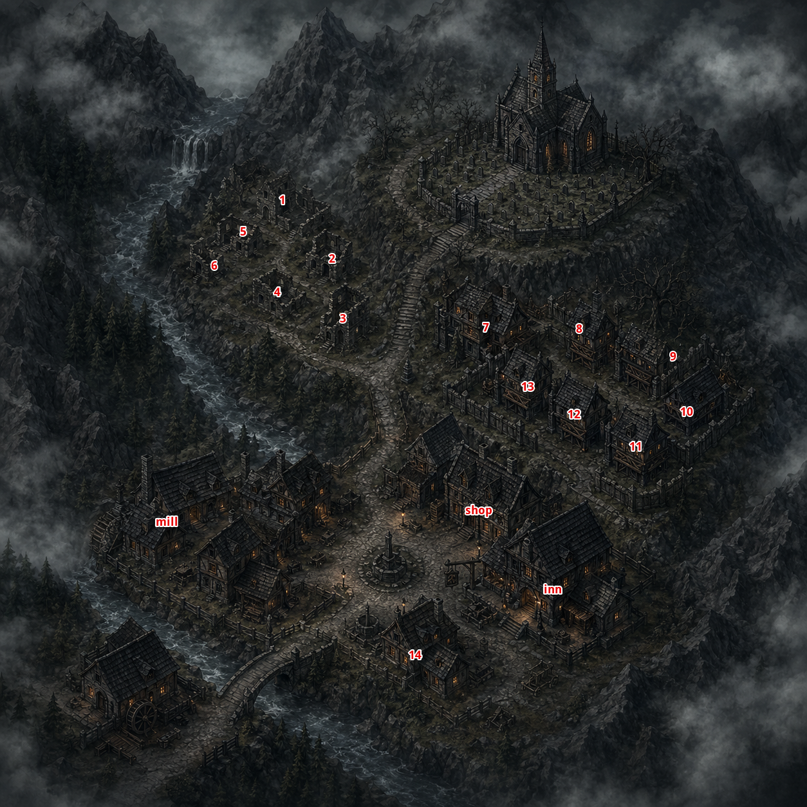
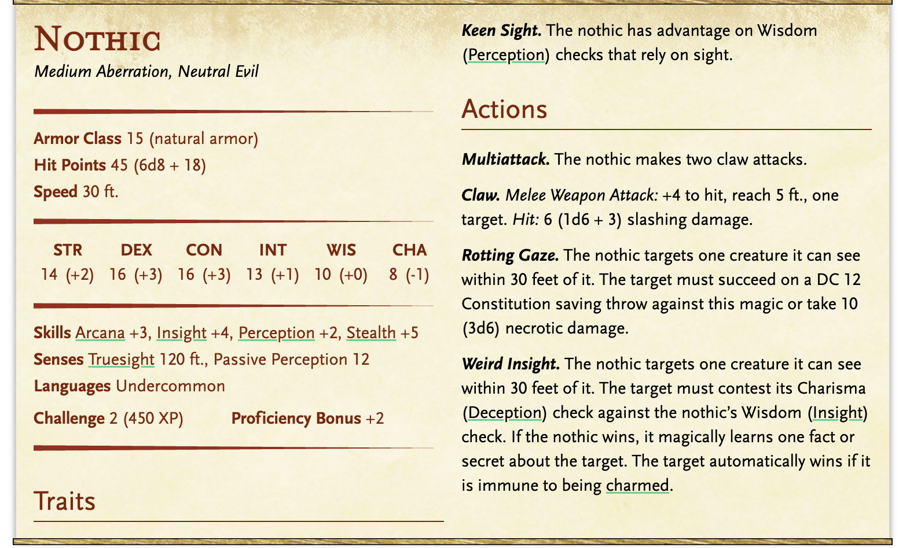
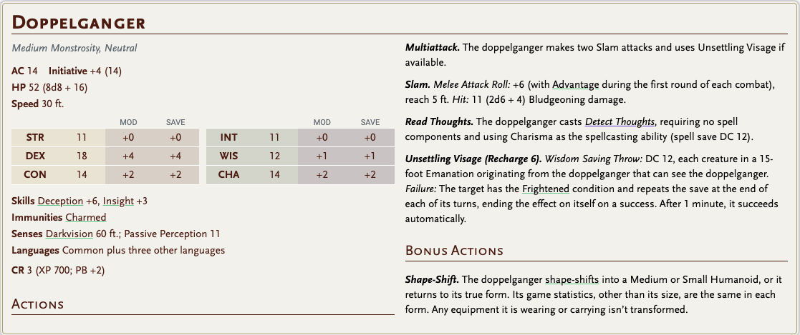
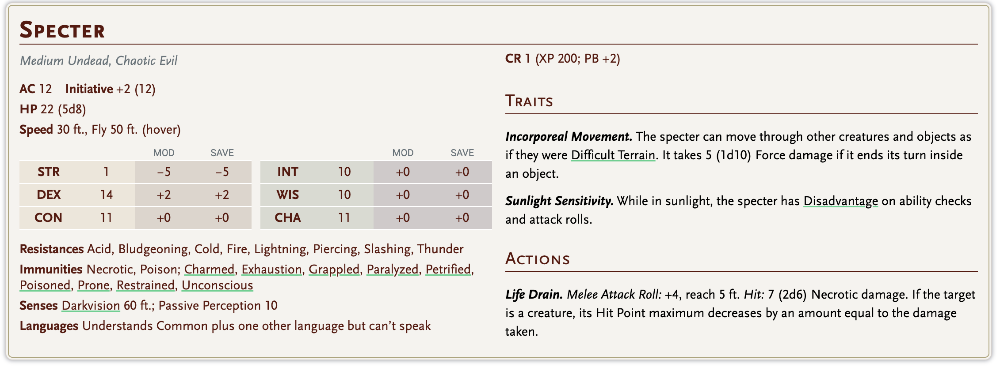
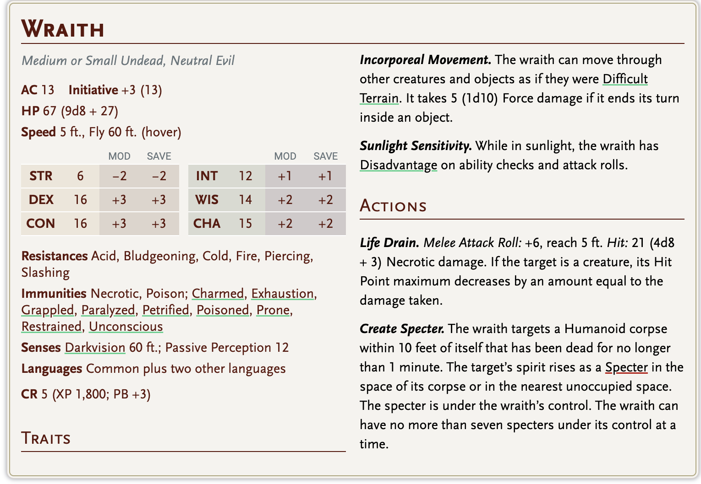
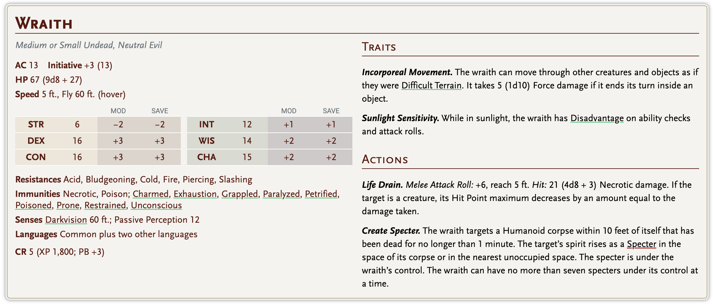

# 🌫️ NETHRYN

*“Burada yaşayanlar, çoktan gitmiş sayılır.”*

kısa lore: zamanında bir false hydra buraya musallat olmuş, zariel melek halindeyken gelip bu köyü kurtarmış o yüzden kurtarıcı olarak biliniyor. daha sonra başı boş olan köye bir elder oblex yerleşmiş ve bir lanet yaymış. 

---

**Ruins**

[Church](church.md)

ilk ruin temizlendikten sonra saldırılar ağırlaşır.

han - 

wraith 3- 2

max - 

ea basr - 

aysif- 

## wraith / nothic / shapeshifter / zombie

lanet leveli x3 monster gece saldırır

lanet leveli: 3 

1d4 saldırı düzenlenir

1. evlerden biri
2. kilise
3. livestock
4. oyuncular

kilise saldırı zorluğu monster sayısı x2

evler auto fail

livestock auto fail

ea basr 21 - 

ayzif 19

max 15

han 5

## 🗺️ GENEL ATMOSFER

- Wheatrest’in güneyinde, **ana yolların dışında**
- Küçük dağlar ve vadiler arasında
- **Sürekli sis**
- Güneş asla tam yükselmiyor
- Sesler boğuk, yankı yanlış geliyor

### Halk:

- Yabancılarla **ilgilenmiyor**
- Yardım etmiyor, engel de olmuyor
- Cümleleri rahatsız edici derecede sakin:
    
    > “Buraya kadar gelmişsiniz…
    > 
    > 
    > demek ki sıra sizde.”
    > 

---

## 🧿 KORUYUCU GLYPH

- Tebeşir / kül / kanla çizilen **koruyucu glyph**
- Kapının üstüne veya yere asılır
- **Gece boyunca aktif**

---

# 👁️‍🗨️ GECE NETHRYN’DE NE OLUR?

- Sokaklarda **insan gibi görünen siluetler**
- Evlerin önünde fısıltılar
- Sevdiklerinin sesi
- Tanıdık yüzler

Glyph olan evlere:

- Giremezler
    
    Ama… Konuşurlar. Yalvarırlar. Suçlarlar.
    

---

## wraith / nothic / shapeshifter / zombie

---

## 🧍‍♂️ HALKIN DURUMU (BAŞLANGIÇ)

- Umutsuz
- Duygusal olarak kapalı
- Yardım istemezler
- Ama **engellemezler**

# 🏠 EV TÜRLERİ & ENCOUNTER YAPISI

Her ev **lanetin bir parçasıdır**.

Ev temizlendikçe:

- Sis azalır
- Sesler normale döner
- Halk biraz daha konuşkan olur

---

# 🧠 LANETİN MEKANİĞİ (DM İÇİN)

Şehirde her temizlenen ev → **Lanet Seviyesi düşer**

### Lanet Seviyesi 3 (Başlangıç)

- Sis çok yoğun
- Gece her sokakta yaratık var
- Halk konuşmaz

### Lanet Seviyesi 2

- Sis aralıklı
- Gece sadece bazı sokaklar tehlikeli

- Halk kısa sohbetlere girer

### Lanet Seviyesi 1

- Gündüz sis dağılır
- Çocuklar görünür
- Geceler hâlâ tehlikeli ama **kontrollü**

### Lanet Seviyesi 0

- Şehir “nefes alır”
- Eski Tapınak Tepesi görünür olur
- Dungeon girişi açığa çıkar

---

---

## 🎭 UNUTULMAZ DETAYLAR

- Temizlenen evlerin kapısına halk **koruyucu işaretler** çizer
- Kuş sesi duyulur (ilk kez)

---

### 🗺️ KASABA

**Nethryn (Yaklaşırken)** — Sisin içinden güçlükle seçilebilen gri çatılar, ölmeyi yarıda bırakmış bir şey gibi vadiye sinmiş.

**Sokaklar** — Yağmur yağmadığı halde ıslak taş döşemeler ve çıkardığınız her sesin yankılanarak duyulduğu bir yer

**Sis** — Sürünmez, sürüklenmez; durur — kapı aralıklarında ve sokaklarda daha da yoğunlaşır, sanki sizi gitmemeniz gereken yere doğru kılavuzluyor.

---

### 🏠 MEKÂNLAR

**Sessiz Ev** — Kapı zaten açık, içerinin kokusu tanıdık birine benziyor ve hiçbir şey kıpırdamıyor — ama her köşeden izleniyormuşsunuz gibi hissediyorsunuz.

---

---

### 🪨 HARAPLİKLER

**Çökmüş Ev** — İçeriden dışa doğru çökmüş; molozlar aşağıya değil *dışarıya* fırlamış, sanki içinde bir şey aniden çok büyüdü.

**Temel Taşları** — Her köşe taşına oyulmuş koruyucu glyph'lerin çoğu kazınmış, biri hâlâ soluk bir morlukla titreşerek parlıyor.

---

### 👤 NPC'LER

**Maret** *(yaşlı kadın, her zaman verandada)* — Günün her saati tahta sandalyesinde sallanır; yukarı bakmadan, sizden önce kaç kişinin geldiğini ve kaçının gittiğini tam olarak söyler.

**Dessen** *(değirmenci, iri eller, sessiz gözler)* — İki sezondur hasat olmadığı ve kimse sormadığı halde her sabah alışkanlıkla buğday öğütmeye devam ediyor.

**Lira** *(genç kadın, koruyucu glyph'leri çizen)* — Alacakaranlıkta iki eliyle tebeşir sıkıştırmış kasabayı dolaşır, ışık sökmeden ulaşabildiği her kapıyı işaretler; hiçbir şey açıklamaz, hiç durmaz.

astrolog

**Aldric** *(hancı, hiç para almadan içki servis eder)* — Cümleleri yarıda kesilir — unuttuğu için değil, sonlarının bir önemi kaldığına inanmayı bıraktığı için.

**Tovxen** *(çocuk, gündüzleri görünen tek çocuk)* — Bir kapı basamağında oturur, toprakta daireler çizer ve oyunculara çok sakin bir sesle annesinin dün gece geri döndüğünü ama kapıyı açmadığını anlatır.

**Lira'ya Benzeyen Figür** *(sadece gece, sokakta)* — Glyph'in erişebildiği sınırın hemen dışında durur, Lira'nın sesiyle konuşur ve yalnızca Lira'nın sorabileceği soruları sorar.

toni coni moni - zariel paladinleri

**Papaz Aldovar — Kilise Cemaati Önderi**

## Shadar-Kai Zariel Paladini — Görünüm

---

### ⚔️ Toni *(lider)*

Kül rengi tenin üzerinde, yıllar önce alınmış bir yanık izi — sol yanak kemiğinden çeneye kadar. Gümüş saçlarını ensesinde sıkı bağlıyor, tek bir tel bile yüzüne düşmüyor. Gözleri soluk sarı; neredeyse renksiz.

Zırhı siyah çelik, omuzlarda melek kanadı motifi kabartma — ama kanatlar kırık. Göğsünde Zariel'in mührü: alev içinde bir kılıç. Pelerini yok. Soğuğu umursamıyor.

Her zaman ayakta. Oturduğunu kimse görmemiştir.

---

### 🗡️ Coni *(kapı bekçisi)*

Diğerlerinden daha uzun, daha dar omuzlu — ama kılıcı herkesten önce çıkar. Saçları beyaz, kısa kesilmiş, neredeyse kazınmış gibi. Sol kulağında Zariel sembolü küpe: küçük, dövme demir, alev şeklinde.

Zırhı daha hafif, hareket için tasarlanmış. Sağ elinin sırtında dövme var — eski bir and metni, Infernal dilinde. Parmakları her zaman kılıcının kabzasına yakın.

Konuşmadan önce sizi bir kez baştan aşağı süzer. Sonra ya konuşur ya da konuşmaz.

---

### 🕯️ Moni *(en genç)*

Henüz yirmi küsur. Shadar-kai solukluğu onda daha az yerleşmiş — ya da henüz yerleşmemiş. Gözleri gri, ama içlerinde hâlâ bir şey kıpırdıyor; merak mı, korku mu, belli değil.

Zırhı diğerlerinden daha az yıpranmış. Omzunda küçük bir kırık var — onarılmış, ama izi belli. Boynunda zincire asılı bir kanat kemiği parçası: gerçek mi, sembolik mi, sorulmamış.

Yabancıları fark ettiğinde gözleri bir an Varek'e kayar. Her zaman.

---