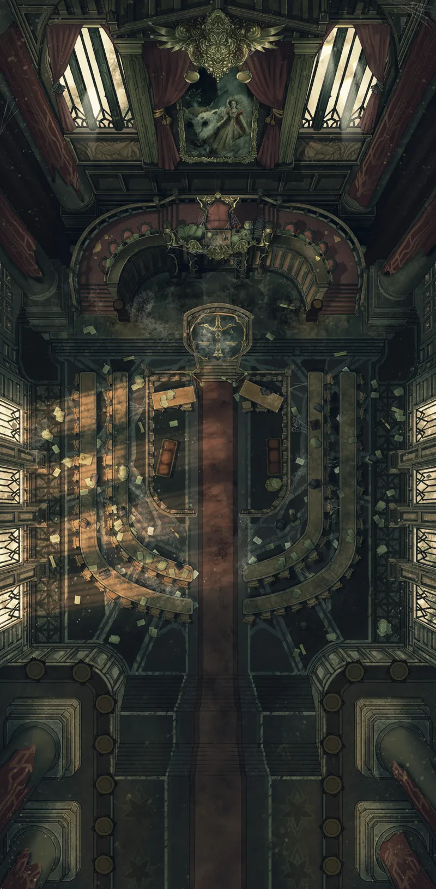
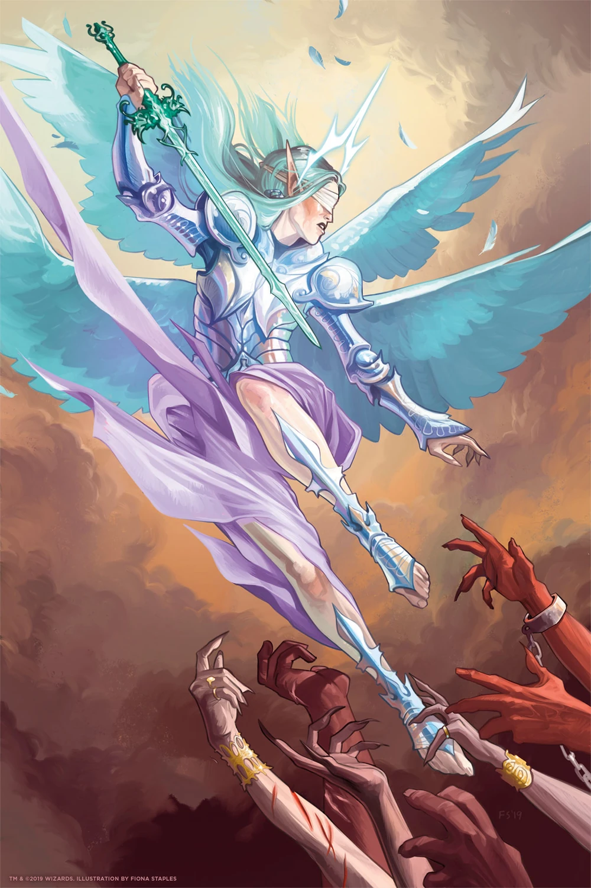
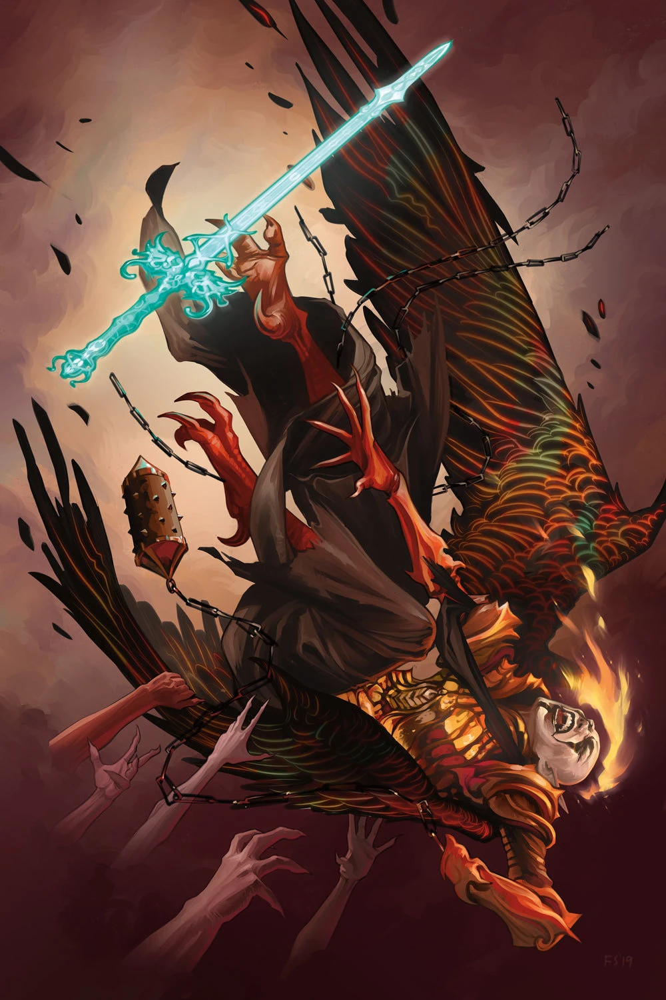
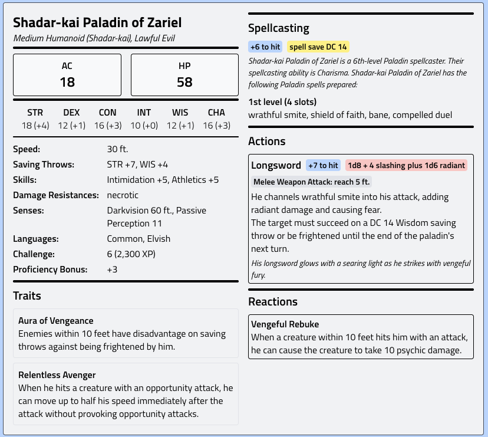

# Church

Portrait on the front: 

## Papaz Aldovar — Kilise Cemaati Önderi

**Kısa NPC Tanımı:** Altmışlarında, ince kemikli, gözleri hâlâ yanıyor — ama ateş değil, kor gibi; uzun süredir yanıyor ve söndürülmeyi reddediyor.

---

## 🕯️ AKŞAM SEROMONİSİ

*Her gece güneş batmadan önce yapılır. Cemaat kilise içinde toplanır. Shadar-kai paladin üçlüsü arka sıralarda ayakta durur. Varek hiç oturmaz.*

---

### ORTAM

Papaz sunak önüne geçer. Elinde kitap yok. Ezberden konuşur — ama ezberin ötesinde, sanki bizzat gördü.

Cemaatin önünde tek bir mum yanar. Dışarıdaki sis camları sisler.

---

### KONUŞMA

> *"Başlarınızı kaldırın."*
> 
> 
> *"Bugün de hayattasınız. Bu küçük bir şey değil."*
> 

*(Sessizlik. Bekleniyor.)*

> *"Zariel'i ilk gördüklerinde — atalarımız — gözlerini kapamışlar. Güneşe bakar gibi. Çünkü o buydu: yeryüzüne inmiş bir sabah. Kanatları açıldığında gölge düşürmedi; ışık düşürdü."*
> 

> *"Bu şehir o zaman da lanet altındaydı. O zaman da sesler vardı geceleri. O zaman da insanlar kapılarını açmak istedi — açmaması gerekenleri."*
> 

> *"Ve o geldi."*
> 

*(Dur. Muma bak.)*

> *"Hiç sormadı. Ne istiyorsunuz, neden hak ediyorsunuz, bana ne vereceğiniz — hiçbirini. Sadece indi. Kılıcını çekti. Ve bu şehrin üzerine öyle bir ışık döktü ki, o gece yaratıklar gölgelerini kaybetti."*
> 

> *"Zariel güçlüydü. Ama gücü silahında değildi.""Gücü — gelmesindeydi."*
> 

*(Cemaate bak. Tek tek.)*

> *"Şimdi sis var. Yine. Sesler var. Yine.Kapılar titriyor. Yine."*
> 

> *"Ve siz buradासınız. Yine."*
> 

> *"Zariel'in bize bıraktığı şey ne biliyor musunuz? Hafıza değil. Örnek.""Gelindi. Savaşıldı. Işık tutuldu."*
> 

> *"Biz de tutacağız."*
> 

*(Mumu alır. Cemaate uzatır. Bir kişiden diğerine geçer.)*

> *"Bugün glyph'lerinizi çizin. Yarın da. Sonra da.Çünkü Zariel bir gün dönmeyebilir.Ama ışık — ışık burada. Sizde."*
> 

---

### SEROMONİNİN SONU

Mum en son Dhovran'a gelir. Shadar-kai genç, bir an durur. Sonra alır.

Varek izler. Hiçbir şey söylemez.

1 ahır tarlalar

2 ahır tarlalar-

3 içerdeki ajan

4 kilise

ea basr

max

peder 

han

ayzif