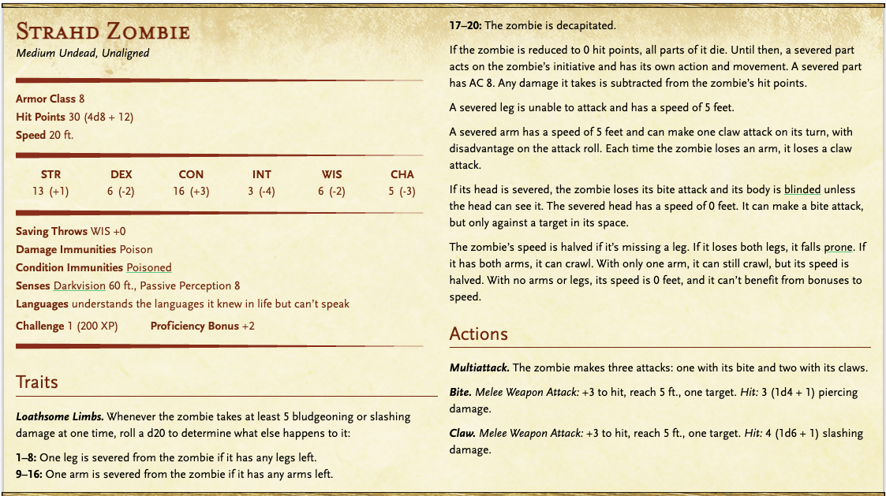
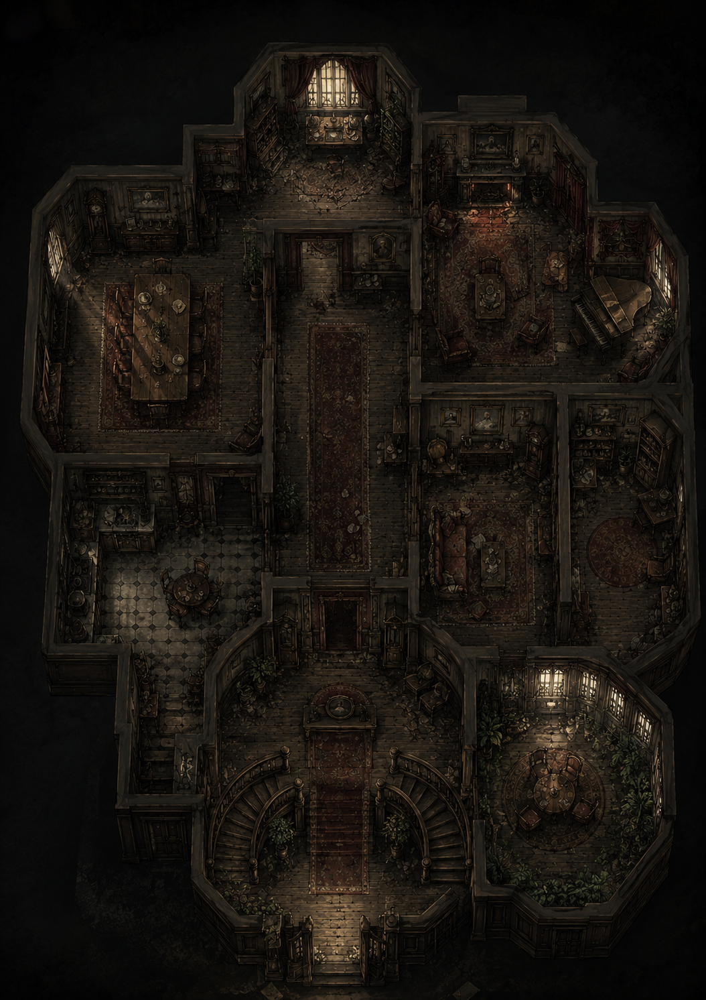
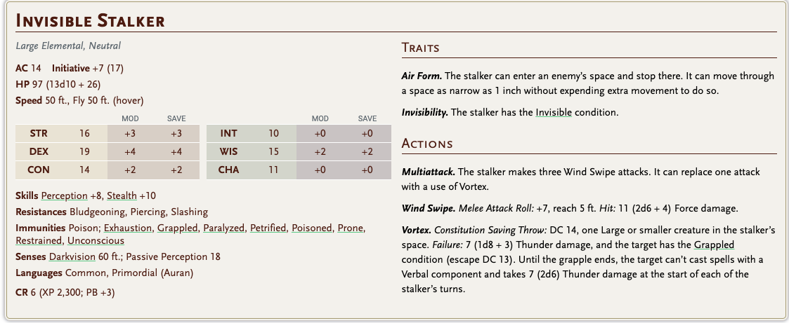
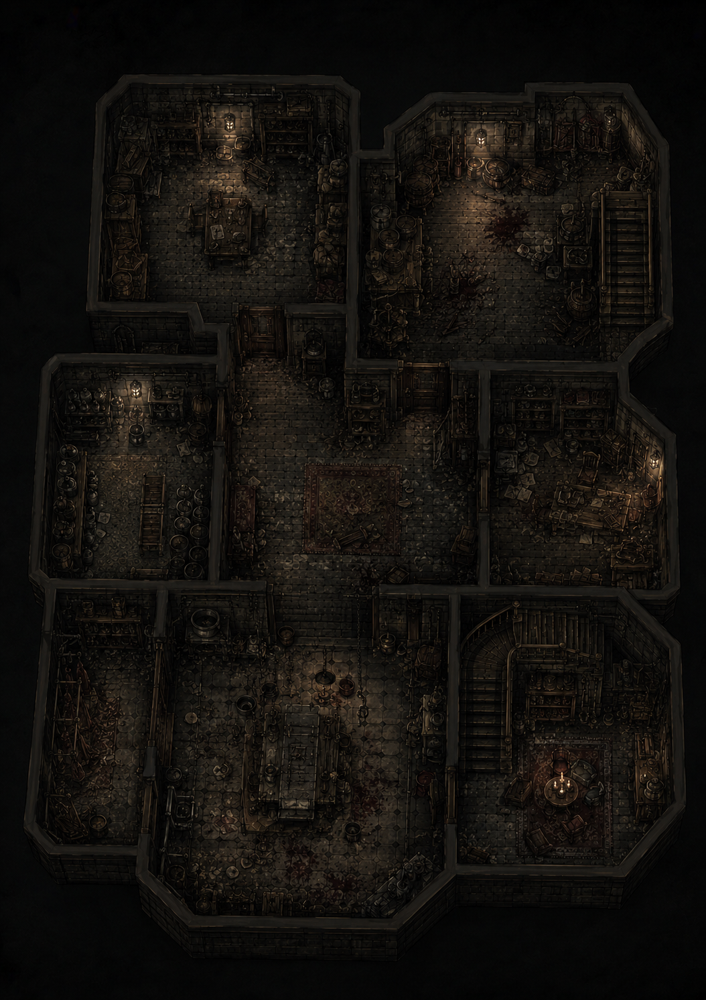
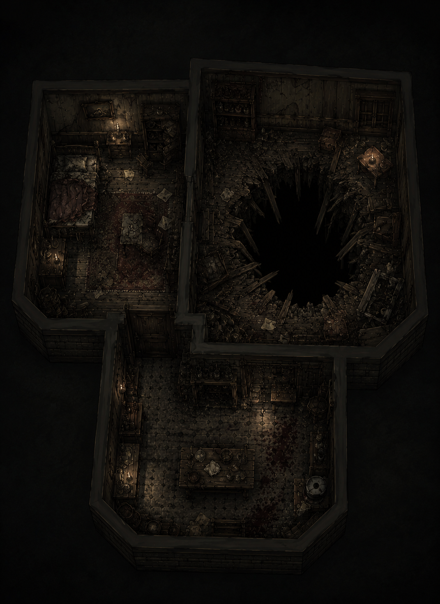
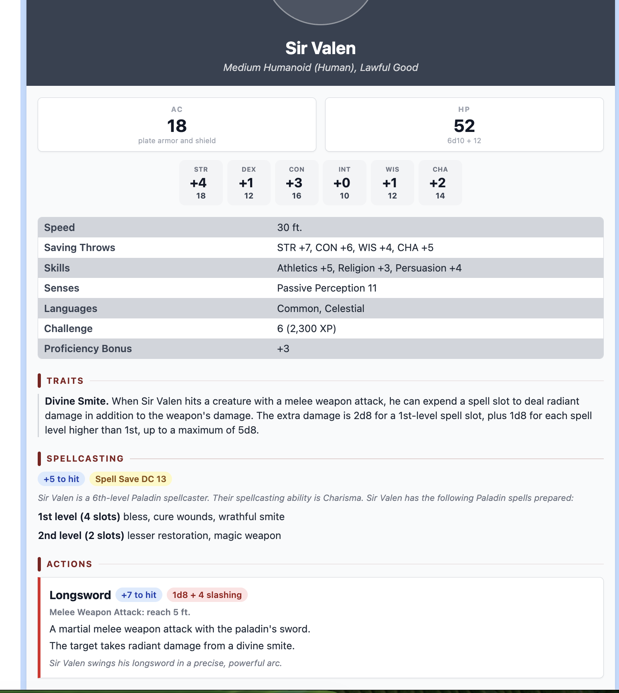

# Ruins

1. 12 tane stradh zombie

max 23

ea basr 17

ayzif 14

han 11

zombi 3 5 

kol 1 

bacak 1

zombi 3 1

zombi 6 11

zombi 7 8

zombi 9 30

zombi 11 30

zombi 12 7

*

loot: yok

1. doppelganger 5 ve 1 paladin

max 23

ea basr 21

aysif 21

han

1. 2 invisible stalker

ea basr 22

han 21

max 19

aysif 18

toni 13 

coni 13

moni 13 

kapı 194

5.

**Storm Silverhand**

The Bard of Shadowdale — Seven Sisters’tan biri, Chosen of Mystra

**Bard / Chosen of Mystra**

**Shadowdale, the Dalelands**

**Active ~900 DR – 1489 DR**

Mystra’nın yedi kızından biri olan Storm, Shadowdale’e yerleşmeden önce yüzyıllar boyunca Faerûn’da maceralara atıldı. Shadowdale, Dalelands’te bulunan sakin bir çiftçi köyüdür. Storm burada rustik bir çiftlik evinde yaşar; healer, midwife, herbalist ve Harpers için gizli bir den-mother olarak hizmet eder. Köy halkı ona hayrandır; ama çok az kişi gücünün gerçek derinliğini bilir. Çiftlik evinin mutfağı, sıcak içeceğe ve dürüst bir öğüde ihtiyacı olan herkese açıktır. Kapısını nadiren kilitler — buna ihtiyacı yoktur.

**Bu sword neden onda olurdu**

Storm, yüzyıllar boyunca Zhentarim’e ve başka kötülüklere karşı sayısız savaşta yer aldı. Nine Lives Stealer büyük ihtimalle mağlup edilmiş bir düşmandan alınmış bir tr,ophy idi — muhtemelen bir Zhentarim assassin ya da Harper-hunter’dan. Storm bu sword’u yok edilemeyecek kadar tehlikeli, ama dünyada serbest bırakılmayacak kadar da değerli görmüş olabilir. Onu yanında taşımak yerine çiftlik evinde sakladı; evil aura’sının kendi çatısı altında bastırılacağına güvendi. Onu asla kullanmadı. Ona güvenmedi.

**Secret compartment ve nasıl bulunacağı**

Storm’un odasındaki büyük meşe masanın altında, Harper cipher lock ile mühürlenmiş bir compartment vardır — üzerinde notalar oyulmuş yedi döner ring bulunur. Storm bir bard’dı; kombinasyon bir şarkıdır.

**Puzzle — party’nin köyde bulması gerekenler**

**1**

A – A – B – D – B – D – E

At the inn, on wall   A - A - B

at house 1 - D - B - D

at house 2: E

han 19

ayzif 13 

max 11

ea basr 9

paladins 7 5