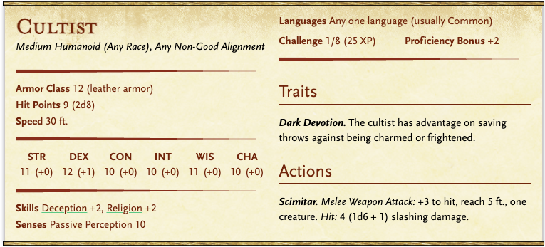
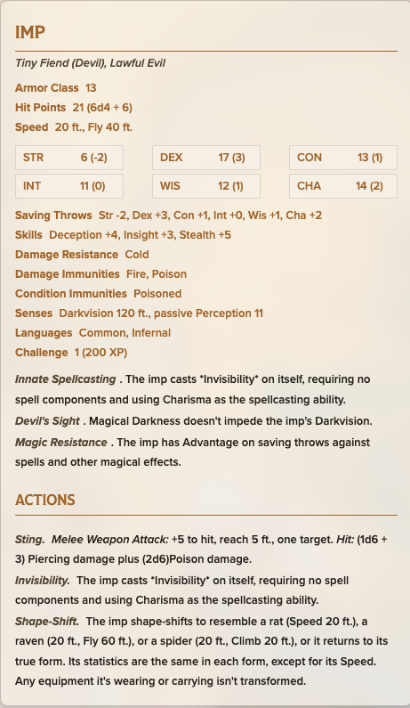

# Wheatrest

kafaları kesip yanlarına aldılar. 

Alabildiğine uzun buğday tarlaları, 3 tane gözcü kulesi, güvenlik yoğun, fakir bir köy

Wheatrest, ufkun ötesine kadar uzanan **altın rengi buğday tarlalarıyla** çevrili, rüzgârın hiç dinmediği bir köydür. Tarlalar öylesine geniştir ki, köy adeta buğday denizinin ortasında küçük bir ada gibi kalır.

Köyün çevresinde, stratejik noktalara yerleştirilmiş **üç adet gözcü kulesi** bulunur. Kulelerde her zaman nöbetçiler vardır; bu da köyün **olağanüstü derecede temkinli** olduğunu gösterir. Güvenlik sıkıdır, yabancılar dikkatle süzülür.

Halkın çoğu **fakir çiftçilerden** oluşur. Evler bakımsız ama işlevseldir; lükse yer yoktur. İnsanlar kanaatkâr, konuşurken ölçülü ve temkinlidir. Açıkça bir şeylerin onları **uzun süredir tedirgin ettiği** hissedilir.

Köyün idari sorumluluğunu, orta yaşlı, sert bakışlı ama pratik zekâlı **Muhtar Sipsi Illenum** yürütmektedir. Köyde düzeni sağlamak onun için bir görevden çok bir zorunluluktur.

Köyün en dikkat çeken yapılarından biri, ironik ismiyle bilinen **“Smith Sarayı”** adlı demirci dükkânıdır. Gerçekte bir saraydan çok uzakta olsa da, köyün tek **blacksmith’i** burada çalışır ve tarım aletlerinden silahlara kadar her türlü metal işini üstlenir. Demirci, köyün hayatta kalmasında kilit bir figürdür.

Bunun dışında Wheatrest’te birkaç **bakkal ve küçük dükkân** bulunur. Hepsi temel ihtiyaçlara yöneliktir; nadir eşyalar ya da lüks mallar neredeyse hiç yoktur. Köy, hayatta kalmaya odaklıdır — fazlasına değil.

## 🏡 Aile 1

- **Baba:** **Edric Cole**
- **Anne:** **Mara Cole**

---

## 🏡 Aile 2

- **Baba:** **Tomas Brevin**
- **Anne:** **Ellyn Brevin**
- Kardeş: Tomas jr. Brevin - intimidation 15, persuasion 13 - askerlikten ve pactten bahseder

---

## 🏡 Aile 3

- **Baba:** **Roran Kest**
- **Anne:** **Lysa Kest**

Soren Fenwill - Gnome

## 💍 **Ring of Mutable Form**

*Ring, rare (requires attunement)*

İnce, sıvı metal gibi dalgalanan bir yüzük. Bakıldığında yüzeyinde kısa süreliğine farklı yüzler belirir.

Cast alter self once a day.

## **Elira Fenwill**

**Irk:** İnsan

**Yaş:** 16

**Sınıf Eğilimi:** Wild Magic Sorcerer (doğuştan)

**Durum:** Ağır bir **arcane curse** altında, aklını **yavaş ve geri dönülmez şekilde** kaybediyor

---

Elira zayıf, solgun ve sürekli yorgun görünür. Gözleri bazen odaklanır, bazen **boşluğa bakar gibi donar**. Konuşurken cümleleri yarım bırakır; bazen kelimeleri karıştırır, bazen bir şeyler fısıldar ama ne dediğini kendisi bile hatırlamaz.

Yakınındayken:

- Mumlar kendiliğinden titrer
- Metal eşyalar hafifçe ısınır
- Zaman zaman **kontrolsüz wild magic patlamaları** olur (küçük, zararsız… şimdilik)
- değişik gülümseyen bir oyuncağı var, arkasında Smile with Smiley yazıyor.

---

[Alchemist](wheatrest-alchemist.md)

[Blacksmith](wheatrest-blacksmith.md)

Quest: dungeon

[Bel](../../../../05-characters/npcs/major/bel/README.md)

# 🕳️ DUNGEON: “Bel’in Recruitment Mağarası”

Doğal oluşmuş, derin bir kireçtaşı mağarası.

İçeride kükürt kokusu ve hafif kızıl ışık yansımaları var.

Bu mağara:

- Gezegenler arası ticaret portalının yanındaki gizli recruitment noktası
- Gezginlere “koruma sözleşmesi” imzalatılıyor
- İmzalayanlar possession için işaretleniyor

---

# 🚪 ODA 1 — Sözleşme Masası (Giriş Alanı)

### Ortam

Mağara girişinden sonra dar bir geçit.

Ortada:

- Taş bir masa
- Üzerinde açık parşömenler
- Kanla çizilmiş küçük bir sembol
    
    ### 🛡️ Görsel Tanım
    
    - **Üç dişli bir mızrak / trident**
    - Ortasında **yanan bir dişli çark**
    - Çarkın içinden geçen **kırık bir kılıç**
    - Altında **zincir halkaları**
- Mürekkep kabı (koyu kırmızı)

Duvarlarda ticaret rotası işaretleri.

---

## Encounter

- 1x Cultist
- 1x Bandit (yarı işaretlenmiş recruit)

han

ea basr

max

cult

bandit

bandit: 0

cultist 3

XP:

25 + 25 = 50

2 enemy → ×1.5

= 75 XP → Easy

---

### Rolplay

Cultist:

“Koruma sözleşmesi imzalamadan geçiş yasaktır.”

Bandit biraz huzursuz:

“Ben sadece iş için buradayım…”

Eğer savaş başlarsa:

- Bandit agresif ama kararsız
- Cultist masayı devirmeye çalışabilir (cover yaratmak için)

---

### Araştırma

DC 12 Investigation:

- Parşömenlerde küçük infernal dipnotlar var
- Sözleşmede “Askeri hizmet şartları” geçiyor

Bel adı açık yazmıyor ama imza bölümü:

“B.L.” şeklinde.

---

# 🚪 ODA 2 — Yaşam Alanı & Kütüphane

### Ortam

Daha geniş bir mağara odası.

İçeride:

- 4 basit yatak
- 1 ateş çukuru
- Duvar boyunca küçük bir taş raf (mini kütüphane)
- Haritalar, gezegen sembolleri

---

## Encounter

- 1x Cult Fanatic (450)  → 0

- 1x Cultist (25) → 0

han

cultist

cult fanatic

max

ea basr

XP:

450

= Medium

---

### Combat

Fanatic:

- Hold Person 1 kez kullanır
- Sacred Flame atar
- Kaçmaya çalışmaz

Bu fight partiyi zorlar ama öldürmez.

---

## Araştırma — Kütüphane

DC 13 Investigation:

Bir günlük bulunur.

---

### Günlükten Parça

“Bugün iki genç daha imza attı.

İşaretlenme süreci başarılı.

Bel’in 3. Lejyonu asker sayısını artırıyor.

Portal stabilitesi %62.”

Bu noktada Bel ismi açıkça geçer.

---

# 🚪 ODA 3 — Ayin Odası (Final)

Büyük, doğal kubbeli mağara.

Ortada:

- Kanla çizilmiş dev bir summoning circle
- İki ceset (yeni recruitler)
- Tavandan sarkan zincirler
- Bir taş sandık

Zemin hafif sıcak.

---

## Encounter

- 

- 1x Cultist (50)
- 2x Imp (200) (invisible başlar)

imp 1 - 0

imp 2 - 0

cultist 1 - 0

cultist 2 - 1

sıra

ea basr

max

han

cultist1

cultist2

---

### Imp Davranışı

- Görünmez başlar
- İlk tur poison sting
- Sonra uçup pozisyon alır

Ama HP düşük, fazla sürmez.

---

# 🧠 Cesetler

İki genç.

Göğüslerinde infernal işaret var.

Investigation DC 12:

- İşaret incomplete
- Possession süreci yarıda kalmış

---

# 📦 Sandık

Kilitsiz ama ağır.

İçinden:

- 75 gold
- 2 healing potion
- 1 obsidian mühür yüzük
- İmzalanmış ve imzalanmamış pactler

---

## Pact İncelemesi

DC 14 Arcana veya Religion:

Sözleşme dili Infernal.

İmzalanmış olanların alt kısmında:

“General Bel, Avernus Third Legion”

Yani artık net.

Bu recruitment operasyonu doğrudan Bel’e bağlı.

---

# Loot

# 🩸 ODA 1 – Cultist & Bandit Üzerinde

### Cultist

- 12–18 gold
- Küçük kemik tespih (infernal sembollü, değersiz ama RP)
- Kanlı sözleşme parçası (isimler listelenmiş)
- Basit hançer

---

### Bandit

- 6–10 gold
- Yıpranmış deri zırh
- Küçük bir not:
    
    > “Sözleşmeyi imzala. Geçiş ücretsiz olacak dediler.”
    > 

Bu, recruitment dolandırıcılığını gösterir.

---

# 🛏️ ODA 2 – Cult Fanatic Üzerinde

### Üzerinde:

- 35–50 gold
- Gümüş işlemeli obsidian mühür yüzük (50 gp değerinde)
- Küçük anahtar (3. odadaki sandığın anahtarı olabilir)
- İnfernal yazılı dua kitabı

DC 13 Arcana/Religion:

Kitapta şu geçer:

> “3rd Legion – Material Intake Division”
> 

Bel adı burada açık geçer.

---

# 🔥 ODA 3 – Imp Öldüğünde

Imp öldüğünde ceset kalmaz.

Yerine:

- Siyah kül
- Küçük çatlamış obsidian shard

Shard:

- 25 gp eder
- Arcana DC 14 → planar residue
- Portal ile bağlantılı olduğu anlaşılır

---

# 📦 Sandık İçeriği (Ana Loot)

Sandıkta:

- 80–120 gold
- 2x Potion of Healing
- 1x Scroll of Hellish Rebuke
- 3 adet imzalanmış pact
- 2 adet boş pact

---

## Pact İçeriği

İmzalanmışlarda:

- İsim
- “Soul Asset Registered”
- İmza:
    
    “Bel, Former Lord of Avernian Legions”
    

İmzalanmamış olanlar:

- “Military Protection Clause”
- Küçük yazıyla:
    
    “Eternal Service”
    

---

## Bel Entrance

[https://www.youtube.com/watch?v=YDlJEuLETs8](https://www.youtube.com/watch?v=YDlJEuLETs8)

> “İlginç.”
> 

*(Bakışları partinin üzerinden kayar.
Tek tek durur.
Sonunda paladine takılır.)*

> “Gerçekten ilginç…”
> 

*(Kısa bir sessizlik.)*

> “Bazı yüzler vardır,
> 
> 
> hiç karşılaşmasak bile
> 
> **tanıdık gelir.**”
> 

*(Paladine bir adım yaklaşır.)*

> “Duruşun…
> 
> 
> bir öğretiye ait.”
> 

> “Ama o öğreti
> 
> 
> artık burada değil.”
> 

*(Başını hafifçe eğer — saygı mı, alay mı belli değildir.)*

> “Hocan…
> 
> 
> iz bırakmış biri.”
> 

*(İsim söylemez.)*

---

*(Bakışlarını tekrar tüm gruba çevirir.)*

> “Bu kapıdan
> 
> 
> çok kişi geçti.”
> 

> “Çoğu,
> 
> 
> **neye dokunduğunu bilmeden.**”
> 

*(Zemindeki çatlaklara bakar.)*

> “Siz ise
> 
> 
> dokunmadan önce baktınız.”
> 

---

*(Hafif bir tebessüm.
Sıcak değildir.)*

> “Bu,
> 
> 
> nadir rastlanan bir özelliktir.”
> 

> “Ve nadir olan şeyler…
> 
> 
> **boşa harcanmaz.**”
> 

---

*(Paladine tekrar döner.)*

> “Bunu hissettin, değil mi?”
> 

> “Bazı kapılar
> 
> 
> açılmak için yapılmaz.”
> 

> “Bazıları
> 
> 
> **kimin açabileceğini görmek için** yapılır.”
> 

---

*(Bel durur.
Sonra ellerini yavaşça kaldırır.)*

*(Alev yoktur.
Duman yoktur.)*

*(Hava **katılaşıyor** gibi olur.)*

*(Boşlukta kızıl çizgiler belirir — yanmazlar, mühürlenirler.
Görünmez bir yüzey çiziliyormuş gibi.)*

*(Bir sözleşme şekil alır.
Parşömen değildir.
Deri değildir.)*

*(Kavramsaldır.)*

*(Bel onu tutmaz.
Havada durur.)*

---

**Bel sakince konuşur:**

> “Endişelenmeyin.”
> 

> “Bu…
> 
> 
> aceleyle hazırlanmış olanlardan değil.”
> 

*(Sözleşme ağır ağır süzülür ve grubun önüne düşer.
Zemine değdiğinde ses çıkarmaz.)*

---

> “Şimdi imzalamak zorunda değilsiniz.”
> 

> “Zaten çoğu insan,
> 
> 
> asla imzamı atmam dedikten sonra. atar imzasını”
> 

*(Paladine kısa bir bakış.)*

> “Bu, onlara benzemez.”
> 

---

*(Sessizlik.)*

> “Her şey bitmeden önce
> 
> 
> tekrar karşılaşacağız.”
> 

> “O an geldiğinde…”
> 

*(Sözleşmeye değil, **onlara** bakar.)*

> “Karar vermeden önce
> 
> 
> **bu anı hatırlayın.**”
> 

---

*(Ellerini indirir.
Sözleşme yerinde kalır.)*

> “Benim sunduğum şeyler
> 
> 
> kaçırılmaz.”
> 

> “Ama **zorla da verilmez.**”
> 

---

*(Bir adım geri çekilir.
Portal arkasında genişler.)*

> “Bugün burada
> 
> 
> kimse ölmek zorunda değil.”
> 

---

*(Son söz, sakin ama kaçınılmazdır.)*

> “Bazı anlaşmalar
> 
> 
> imzadan önce yapılır.”
> 

> “Ben sadece
> 
> 
> **kimin nereye ait olduğunu**
> 
> not alırım.”
> 

---

*(Portal kapanır.
Isı yoktur.
Koku yoktur.)*

*(Ama sözleşme hâlâ oradadır.)*

*(Ve odada kalan şey…
baskıdır.)*

belin kendisiyle karşılaştık anlaşma yapabileceğimiz bir scroll verdi. yardıma ihtiyacımız var.

lydia ve noxus