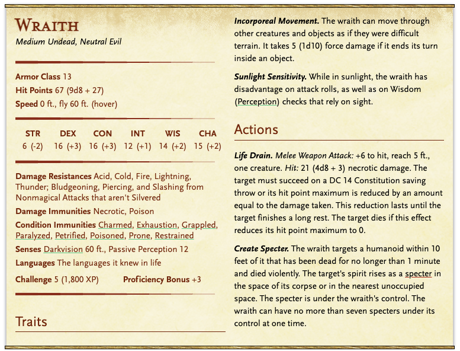
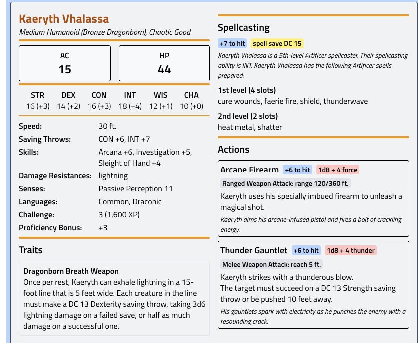

# Kırık Rüyalar

### Yer

**Aurel Meydanı**

Öğleden sonra.

Meydanda kalabalık var ama insanların dikkatini çeken başka bir şey:

Bir wyvern.

Ama savaş wyverni değil.

Deri kayışlarla değil **ince metal zırh parçaları ve mekanik dizginlerle** donatılmış.

Kanat eklemlerinde küçük **artificer modülleri** var.

Wyvern sakin.

Ama gözleri dikkatli.

Üzerinde bir dragonborn kadın.

---

# NPC

## **Kaeryth Vhalassa**

- **Irk:** Bronze Dragonborn
- **Sınıf:** Artificer
- **Alignment:** Chaotic Good

### Görünüm

- bronz pullar
- kısa kesilmiş boynuzlar
- deri pilot ceketi
- kemerinde aletler

Wyvern'in adı:

### **Brasswing**

Evcilleştirilmiş değil.

**Bağ kurulmuş.**

Wyvern'in kanat köklerinde küçük runik plakalar var.

Bu plakalar uçuş sırasında kasları stabilize ediyor.

---

# İLK KARŞILAŞMA

Kaeryth meydanda birileriyle konuşur.

Ama konuşma **satın alma değil**.

Sorular sorar.

Birinin adı.

Bir hastalık.

Bir lanet.

Oyuncular yaklaştığında Kaeryth doğrudan konuşur.

> “Sorcerer mısınız?”
> 

Durur.

> “Ya da böyle biri tanıyor musunuz?”
> 

---

# HİKAYESİ

Kaeryth'in eşi:

## **Rhaegor**

- genç bir dragonborn
- doğal sorcerer
- son aylarda değişmeye başlamış

Belirtiler:

- uyku sırasında çığlık
- kabuslar
- sabah uyandığında **büyü kontrolü zayıf**
- pullarda kararma

Bu durumun **lanet olduğunu** öğrenmiş.

---

# NEDEN KARSOVIA'DA

Kaeryth şehirde şu bilgiyi bulmuş:

Başka biri de lanetlenmiş.

Genç bir kız.

Sorcerer.

Bu kız:

**Akademide okuyan bir öğrenci.**

---

# PLAN

Kaeryth bir **oneiromancer** bulmuş.

Rüyalar aracılığıyla:

- lanetin kaynağını görmek
- laneti koyan varlığı tanımak
- sebebini öğrenmek

Ama rüyaya girmek **tehlikeli**.

O yüzden yardıma ihtiyacı var.

---

# ONEIROMANCER

## **Seraphine Ael**

- yaşlı firbolg
- rüya büyüsü uzmanı
- akademi dışında çalışıyor

Rüya ritüeli için:

- en az üç kişi gerekiyor
- biri rüyayı tutacak
- biri zihinsel saldırılara karşı koruyacak
- biri rüyada hareket edecek

---

# RÜYA SAHNESİ

Rüya başladığında oyuncular bir **orman içinde** belirir.

Bu yer:

**Mourn Wood**

Ama rüyada.

Orman hasta görünür.

Ağaçlar:

- eğri
- kabukları siyah
- yapraklar çürük

Sis var.

[https://excalidraw.com/#room=57d1330039607f9be3d4,tstyclkDbP2AJoMaA04jQg](https://excalidraw.com/#room=57d1330039607f9be3d4,tstyclkDbP2AJoMaA04jQg)

---

# NIGHT HAG

## **Mother Ulkryssa**

Bir Night Hag.

Ama normal bir cadı gibi saldırmaz.

Rüyada:

- oyuncularla konuşabilir
- manipüle eder
- korku yaratır

---

# HAGİN AMACI

Ulkryssa özellikle:

**genç sorcererları lanetliyor.**

Sebep:

Onların büyüsü **ham ve kontrolsüz**.

Night hag bu büyüyü:

- kabus enerjisine
- rüya yakıtına

çeviriyor.

Sorcererların kabuslarından **besleniyor**.

---

# LANETİN MEKANİĞİ

Lanet:

- sorcerer büyüsü her kullanıldığında
- kabuslar güçleniyor

Sonunda:

- kurban tamamen kırılıyor
- ruhu rüya düzlemine bağlanıyor

---

# RÜYA KARŞILAŞMASI

Oyuncular rüyada hag ile konuşabilir.

Hag onları görür.

Ama hemen saldırmaz.

Sadece şunu sorar:

> “Kaç büyü kullanırsanız bir ruh kırılır?”
> 

---

# RÜYA İPUÇLARI

Rüyada oyuncular öğrenir:

- lanet **Mourn Wood’daki eski bir kulübede**
- lanet bir **rüya idolü** üzerinden çalışıyor
- idol yok edilirse lanet kırılabilir

Ama hag ölmez.

Sadece geri çekilir.

---

# GÖREV SONUCU

Oyuncular döndüğünde:

Kaeryth onlara minnettar.

Wyvern'in yanında durur.

> “Ben o ormana gideceğim.”
> 

Durur.

> “Ama önce onun nefes alabilmesini sağlamam lazım.”
> 

---

# ÖDÜL

Kaeryth oyunculara:

- artificer yapımı bir eşya
- veya wyvern yardımı

sunabilir.

Örnek:

**Skyhook Grapple**

küçük mekanik tırmanma aparatı.

---

# BU GÖREVİN TONU

Bu görev:

- şehir entrikalarından farklı
- daha **karanlık folklor**
- Night Hag tehdidi

ve oyunculara şu hissi verir:

**“Büyü bazen bir lanetle başlar.”**

han

kaerthy

asif

max

ea basr

wraith 14

# RÜYA RİTÜELİ

## “Kabus Kapısı”

Yer: Oneiromancer’ın küçük ritüel odası.

Oda karanlık.

Yerde **kireç, tuz ve gümüş tozundan yapılmış bir çember** var.

Ortada:

Lanetlenmiş kız yatıyor.

Başının altında:

- küçük bir taş idol
- rüya odak noktası

---

## RİTÜEL KURALI

Sadece **bir kişi rüyaya girer**.

Diğerleri:

- ritüel çemberini korur
- bedeni sabit tutar
- dış dünyadaki tehditle uğraşır

Oneiromancer açıklama yapar:

> “Rüyada gördüklerin onun korkuları olacak.
> 
> 
> Ama korkuların içinde gerçek bir şey saklı.”
> 

---

# RÜYA BAŞLANGICI

Rüyaya giren oyuncu bir anda **ormanda** belirir.

Ama bu normal bir orman değildir.

Yer:

- toprağa benzer ama bazen sıvı gibi dalgalanır
- gökyüzü sürekli renk değiştirir
- ağaçlar yer değiştirebilir

Buradaki fizik sabit değildir.

Bu yüzden ortam **Limbo plane’ini andırır.**

---

# ORMAN TASVİRİ (LIMBO ESİNTİLİ)

Ağaçlar:

- bazıları baş aşağı büyür
- bazıları köklerinden yukarı doğru yüzer
- kabukları rüya gibi eriyip yeniden oluşur

Gökyüzü:

- gri
- mor
- sonra bir anda turuncu

Sanki biri **gerçekliği sürekli yeniden yazıyor.**

Sesler:

- rüzgar yok
- ama fısıltılar var

Toprak bazen:

- çamur
- bazen cam gibi sert

---

# RÜYA YARATIKLARI

Ormanda dolaşan yaratıklar gerçek değildir.

Ama saldırabilirler.

### 1. **Twitching Deer**

Geyik gibi ama:

- bacakları fazla uzun
- gözleri çok fazla

Oyuncuya yaklaşırlar ama koşmazlar.

Sadece izlerler.

---

### 2. **Paper Wolves**

Kurt gibi.

Ama derileri:

- ince
- yırtık
- sanki kağıt

Koştuklarında parçalanıp yeniden oluşurlar.

---

### 3. **Root Children**

Ağaç köklerinden çıkan küçük figürler.

Çocuk gibi görünürler.

Ama yüzleri yoktur.

Oyuncuya yaklaşırlar.

Sadece şunu sorarlar:

> “Onu neden uyandırıyorsun?”
> 

---

# LANETLENEN KIZ

Ormanın ortasında küçük bir açıklık vardır.

Burada:

küçük bir kulübe.

Kulübenin önünde **lanetlenen kızın çocuk hali** durur.

Yani:

- yetişkin değil
- 8 yaşındaki hali

Bu, lanetin başladığı zamandır.

---

# ROLPLAY SAHNESİ

Çocuk versiyonu korkmuş.

Şunu söyler:

> “Ormana girmemeliydim.”
> 

Oyuncu burada onu ikna etmelidir.

Ama çocuk sürekli şunu tekrar eder:

> “Uyursam o geliyor.”
> 

---

# İKNA KOŞULU

Oyuncu şu üç şeyi yapmalı:

- korkunun gerçek olmadığını anlatmak
- onun yalnız olmadığını göstermek
- kulübeye girmesini sağlamak

Başarılı olursa:

Orman titrer.

Ağaçlar çürümeye başlar.

---

# DIŞ DÜNYADA OLANLAR

Tam bu anda ritüel odasında:

Bir şey belirir.

Soğuk bir rüzgar.

Sonra gölgelerden **bir WRAITH çıkar.**

---

# WRAITH

Bu yaratık:

- rüya ile gerçek dünya arasındaki bağın bekçisi
- Night Hag’in gönderdiği bir varlık

Amaç:

Rüyayı **kırmak.**

---

## WRAITH ÖZELLİĞİ

Bu wraith normalden güçlü.

Ama:

Oyuncuların onu yenmesi **beklenmez.**

Her tur:

- daha da güçlenir
- odadaki ışıklar söner

Oneiromancer bağırır:

> “Onu oyalayın!”
> 

---

# RÜYA ÇÖKÜŞÜ

Rüyadaki oyuncu kızın elini tuttuğu an:

Orman çözülmeye başlar.

Ağaçlar erir.

Gökyüzü parçalanır.

Toprak sıvıya dönüşür.

Bu sahne Limbo gibi kaotik olur.

---

# KAÇIŞ MEKANİĞİ

Rüyadaki oyuncu **3 tur içinde çıkmak zorunda.**

Her tur:

- gerçeklik parçalanır
- yaratıklar agresifleşir

Oyuncu şu şeyleri yapabilir:

- koşmak
- uçan taşlara zıplamak
- çöken ağaçların üzerinden geçmek

Amaç:

ritüel çemberine ulaşmak.

---

# SON AN

Oyuncu çembere ulaştığında:

Oneiromancer bağırır:

> “Şimdi!”
> 

Oyuncu uyanır.

---

# FİNAL

Tam o anda:

Wraith saldırmak üzereyken

**aniden yok olur.**

Sanki hiçbir zaman orada olmamış gibi.

Odada sadece:

- soğuk hava
- tükenen mumlar

---

# LANET HAKKINDA ÖĞRENİLENLER

Rüyadan şu bilgi çıkar:

- lanet **Mourn Wood’da başladı**
- Night Hag **genç sorcererları hedef alıyor**
- onların büyü potansiyeli **rüya enerjisine dönüşüyor**

ödül: 

# **Skyhook Grappler**

Bir kol mekanizması.

İçinde küçük bir yay ve çelik halat vardır.

### Mekanik

**Bonus Action:**

30 ft içindeki bir noktaya kanca fırlatılır.

Oyuncu:

- kendini o noktaya çekebilir
- ya da küçük bir objeyi çekebilir

**Uses:** 3 / long rest

### Combat kullanımı

- yükseğe çıkmak
- düşmekten kurtulmak
- düşmanı dengesiz yapmak (DM takdiri)

### Görünüm

Pirinç ve çelik parçalar.

Kullanırken küçük bir **tık sesi** çıkar.