# Turnuva

## Monsters

1.  Violet Fungus Necrohulk + 2  **Myconid Spore Servant**

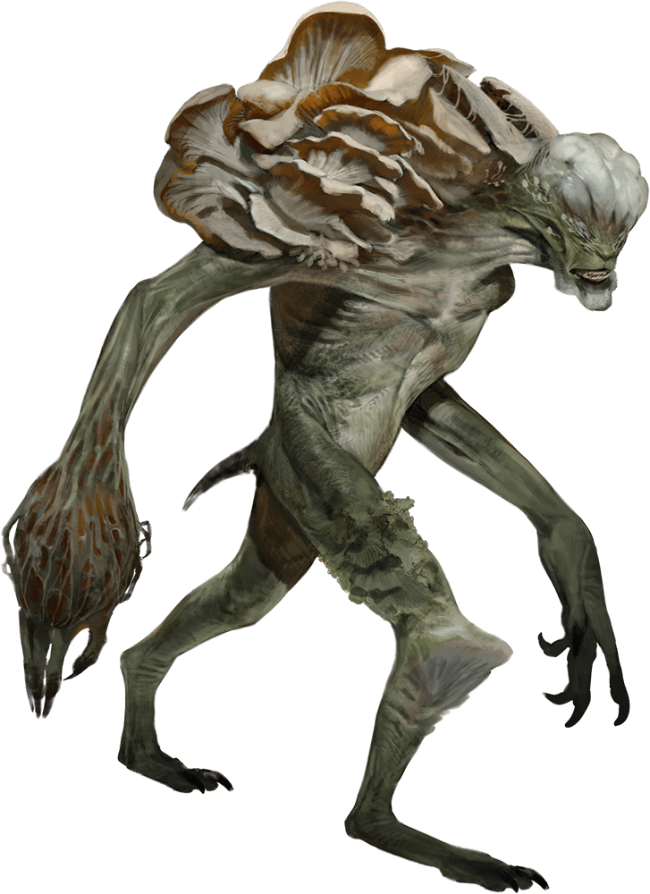

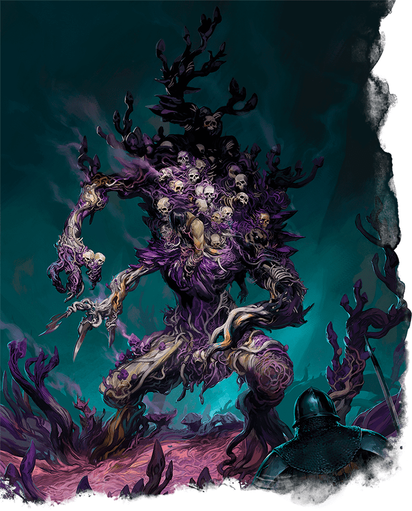

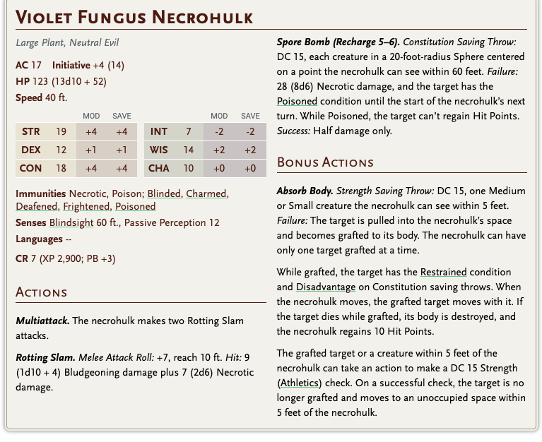

ea basr

han

asif

max

kurt

violet - 3

serv1 -3

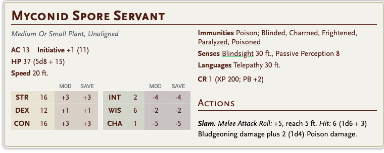

 2. Brazen Gorgon

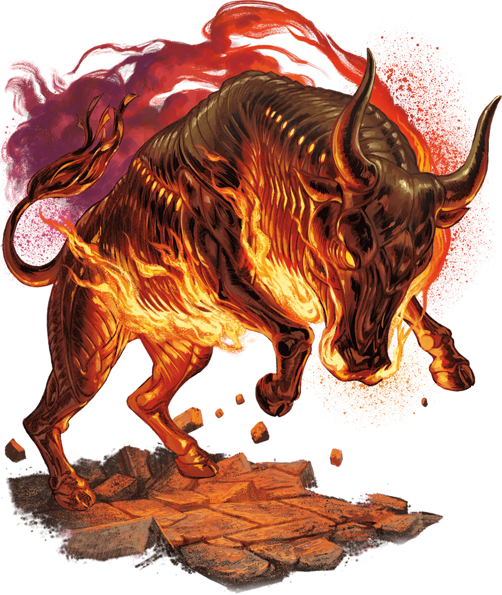

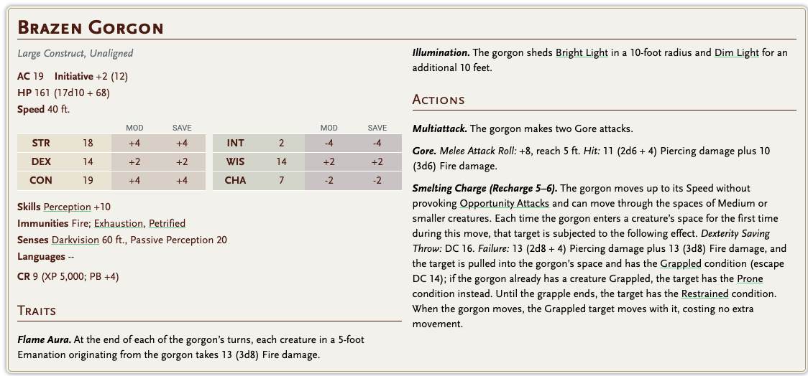

gorgon 3 -  poisoned, hexxed int, 

max

han

ea basr

aysif

1. **Young Blue Dragon** 

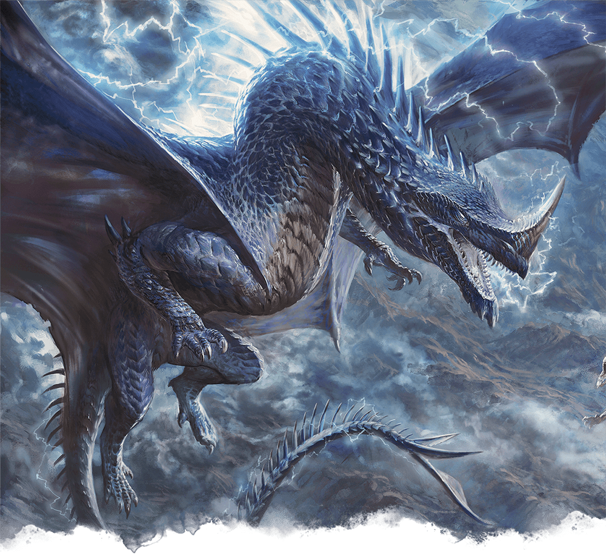

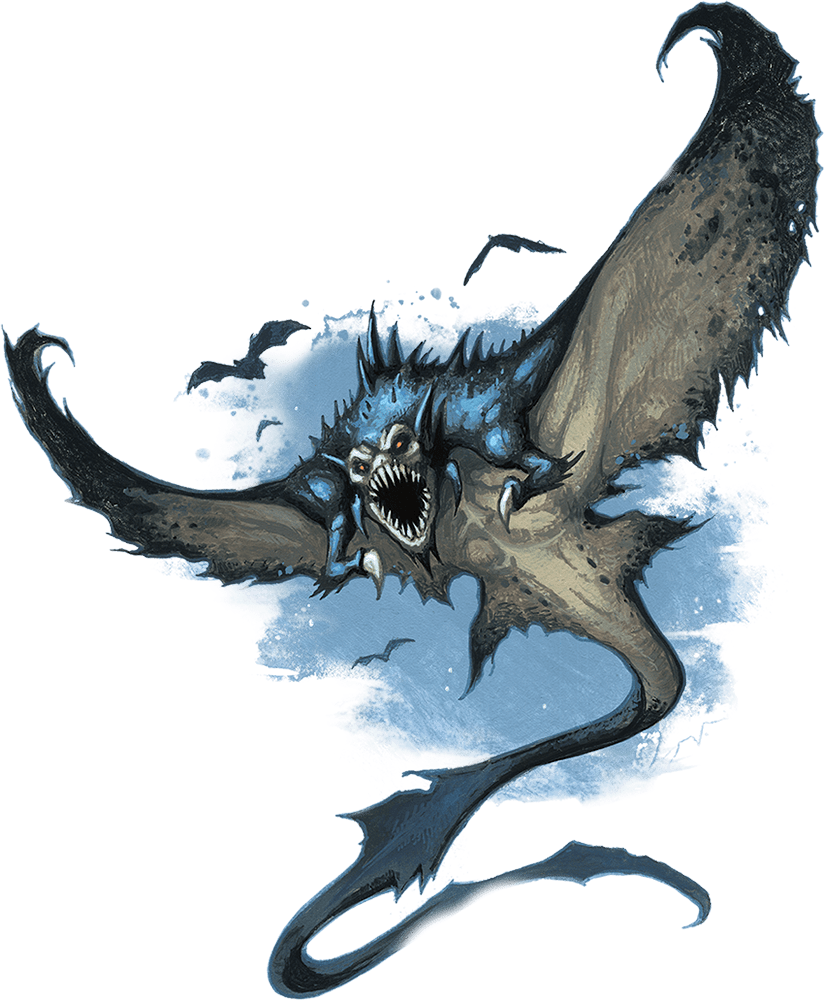

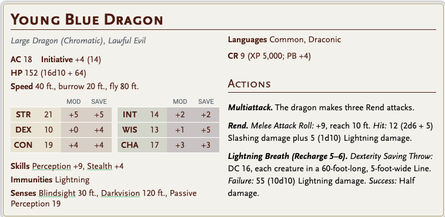

1. Cloaker

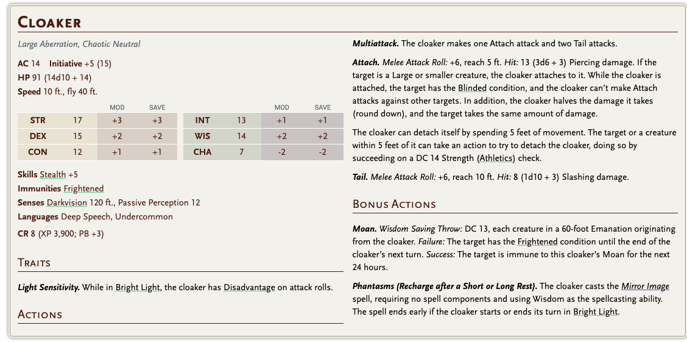

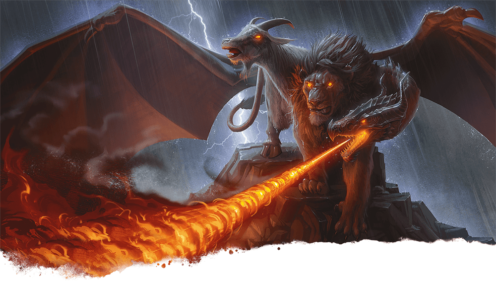

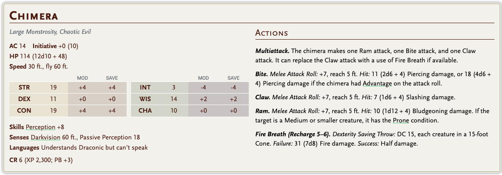

other monsters:

Gray Slaad

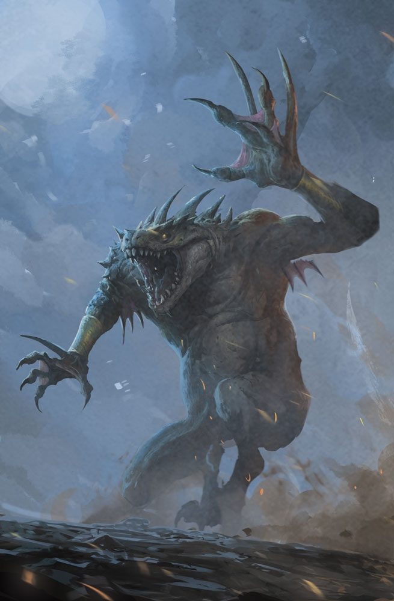

Giant Ape

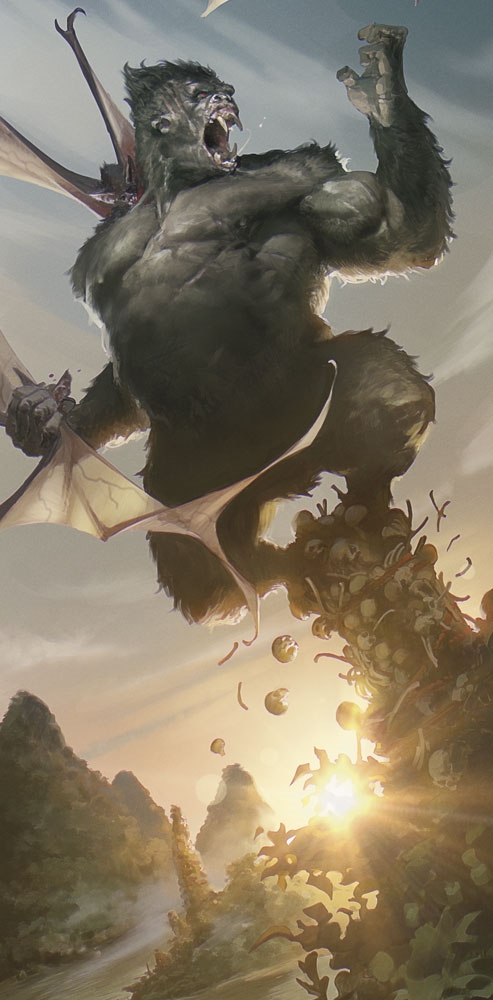

Grick Ancient

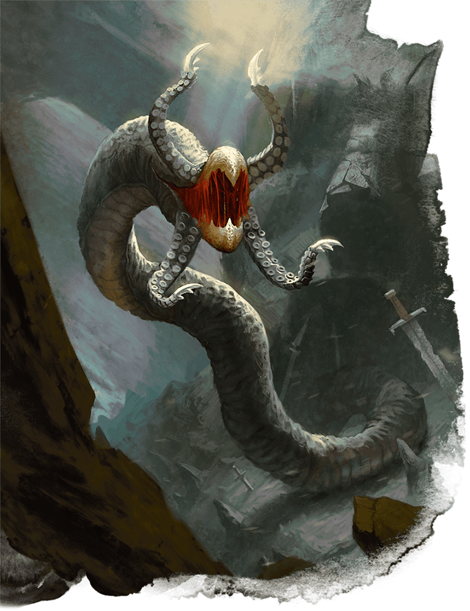

Primeveal owlbear

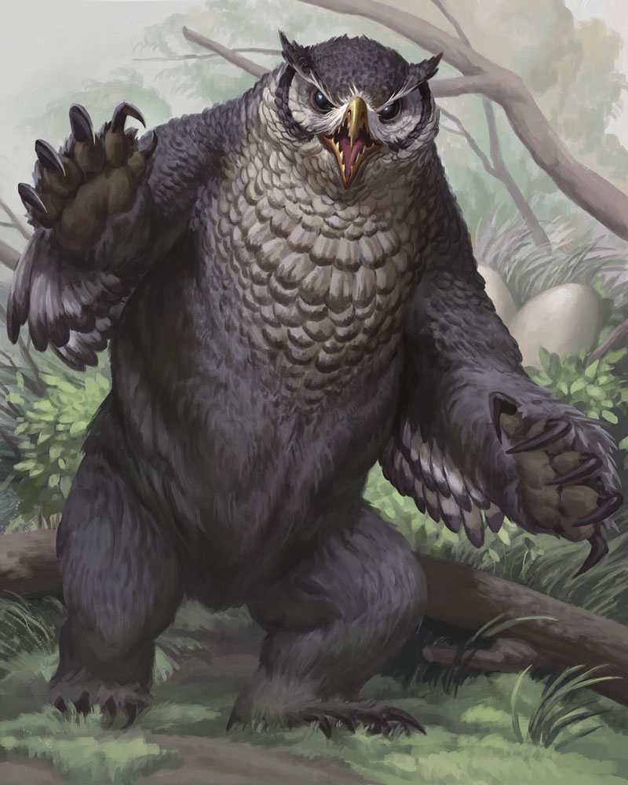

Hydra

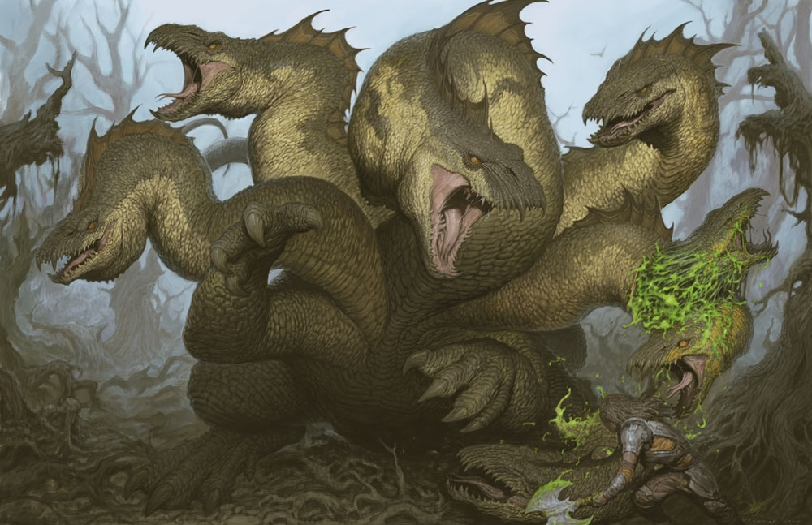