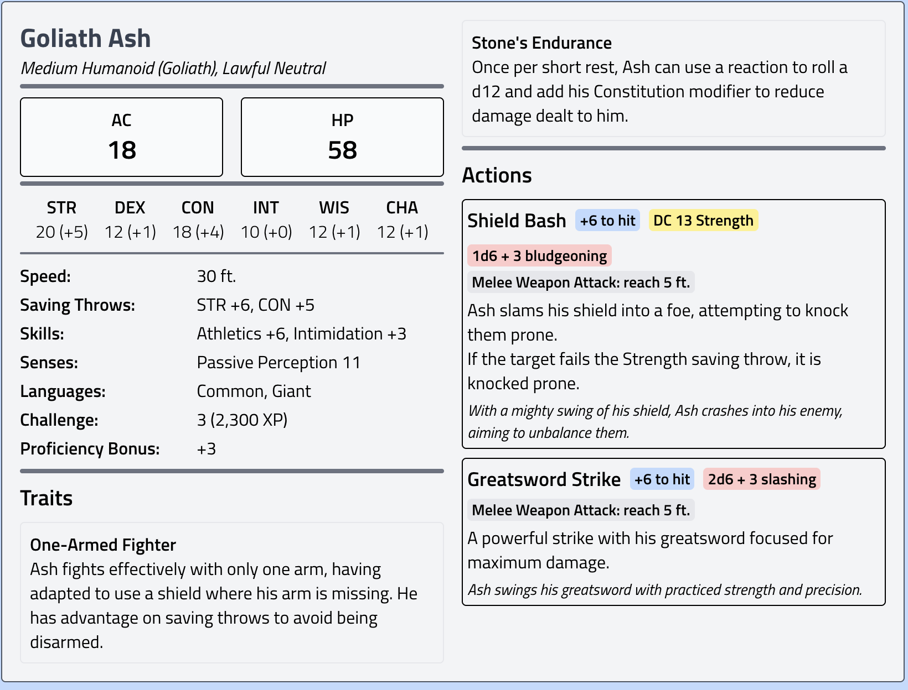
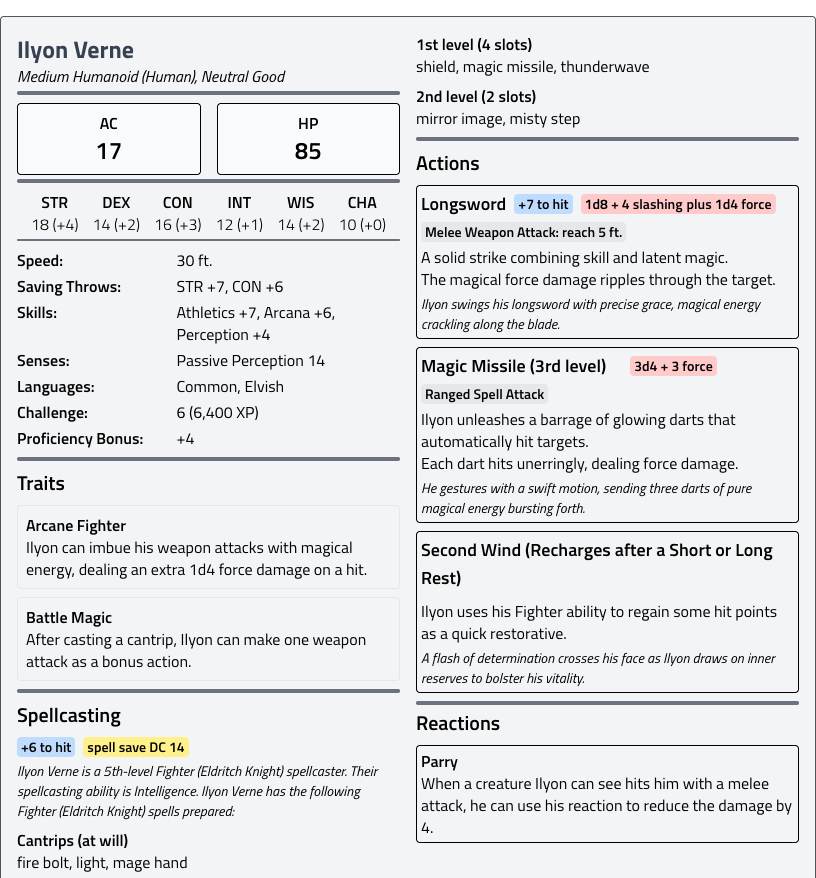
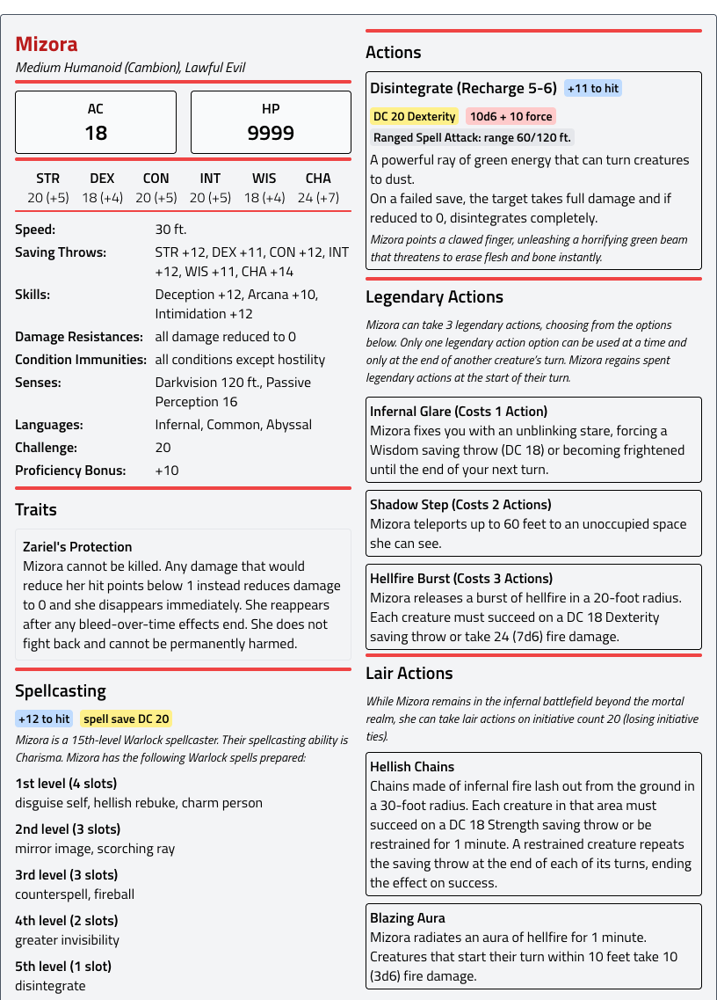
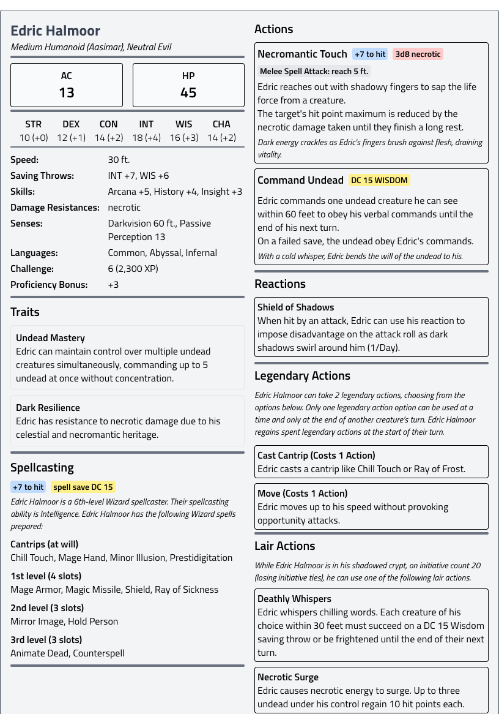
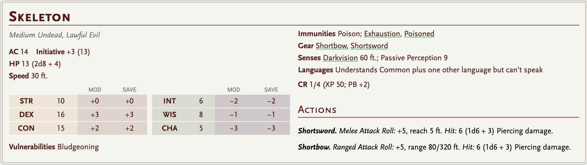
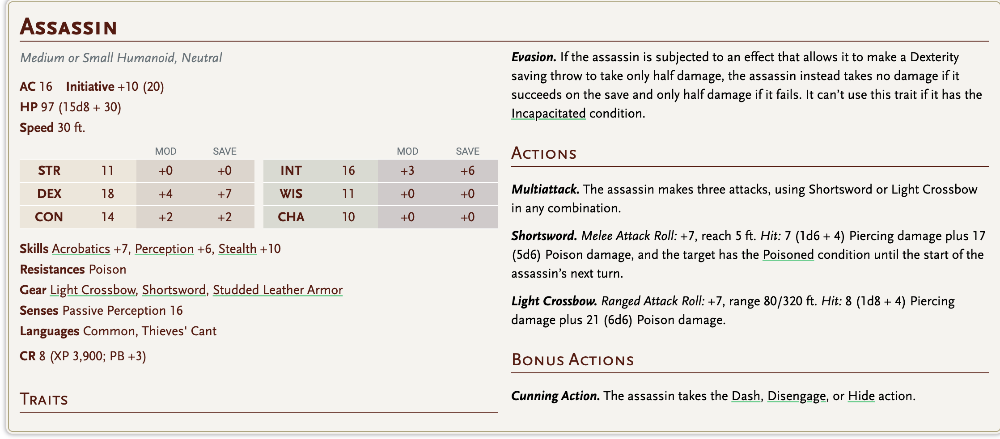
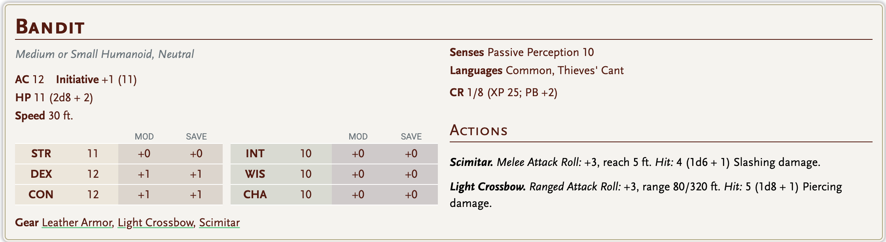
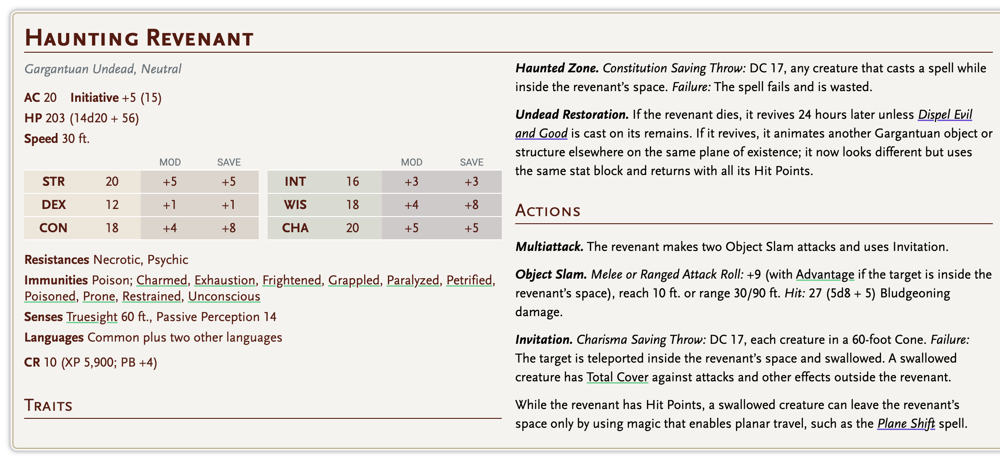
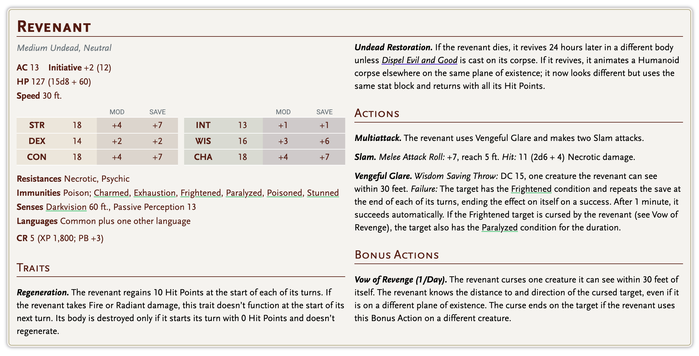

# Zhentarim

## 🎭 ILYON VERNE

- Zhentarim öndegelenlerinden biri
- Oy topluyor
- Rüşveti destekliyor

Ama gerçek:

> Ilyon aslında sıradan, hırslı bir adam.
> 
> 
> Büyük oyunun farkında bile değil.
> 

### Bodyguard’ı:

**Goliath Ash**

- Fighter
- Tek kolu yok
- Yerine kalkan
- Sadık, sessiz

---

x5

Zhentarim hideout: Ledger House

x16

initative

bandits x16

han

max

eabasr

mizora 5

**Sancak Hükmü (Tempus’un Anı)**

**1 kez, herhangi bir anda (reaction değil, bilinçli seçimle):**

Partiden biri “Sancak Hükmü”nü çağırır.

### Etki (1 tur sürer – ama yıkıcıdır)

- Tüm party **aynı anda hareket eder** (initiative sırası beklenmez)
- O turdaki tüm saldırılar:
    - **Advantage**
    - **+2d8 ek hasar** (force veya radiant—DM seçer)
- Düşman:
    - **Save atamaz**
    - Resistance/Immunity **yok sayılır** (legendary hariç DM takdiri)

---

## 💥 EK ETKİ

O tur:

- **1 hedef seçilir** (boss, wraith, elemental vs.)
- Bu hedef:
    - saldırılardan **kaçamaz**
    - **disengage / teleport kullanamaz**

15 feet radius spell save dc +6

# 🕷️ ZHENTARIM HQ: **Black Ledger House**

**Konum:** Ironmarket ile **Ledgerward / Charter Row** sınırında, ana ticaret hattına bakan geniş bir köşe bina.

**Dış görünüş:** 3 katlı siyah taş, dar pencereler, demir kepenkler; girişte ticaret arması (resmî), kapının üzerinde çok küçük bir **ledger** sembolü (Zhent işareti).

## 1) GİRİŞ SAHNESİ (Dış Kapı)

- Kapı önünde **iki nöbetçi**, “şehir muhafızı” gibi giyinir ama duruşları askerî.
- Üstlerinde küçük bir rozet: **kırık sütun + defter** (Lonca Meydanı’na da atıf).
- Kapıdan içeri giren herkes:
    - Kısa bir “kayıt” sorusu
    - Bir isim deftere yazılır
    - Gelen kişi “müşteri” gibi karşılanır

**Kapı repliği (nöbetçi):**

> “Ledger her şeyi hatırlar. Siz de adınızı yazdırın.”
> 

### Giriş Savunmaları

- Kapının iç pervazında **ince rune çizgileri** (dışarıdan süs gibi)
    - Ama alarm tetikler (DM: büyü/tuzağa benzer)
- Kapı arkasında **gizli sürgü** (tek hamlede kilitlenir)
- Üst katta gözetleyen **1 arbaletçi** gölgesi (gündüz görünmez)

---

# 2) ZEMİN KAT: “MEŞRU YÜZ”

## **Trade Hall (Ticaret Salonu)**

Geniş salon:

- Uzun masalar
- Kervan haritaları
- Tartı setleri
- Yazmanlar

**İşlev:**

Resmî kargo, kredi, “koruma sözleşmesi”, borç planı.

**Önemli odalar:**

1. **Reception Desk / Kayıt Masası**
    - 2 yazman
    - 1 “güler yüzlü görevli” (aslında fixer)
2. **Contract Booths (Sözleşme Kabinleri)**
    - Perde arkasında bire bir görüşme
    - “Kredi” diye başlayan şey “bağ”a dönüşür
3. **Public Counting Room (Sayım Odası)**
    - Camlı, herkes görsün diye
    - Ama gerçek para burada durmaz

### Zemin Kat Güvenlik

- Her koridorda “depo görevlisi” gibi duran **2 silahlı adam**
- İçeri giren kişinin belinde silah varsa:
    - “Protokol gereği” emanet isteyebilirler
- Zemin katın “müşteri” alanı dışına geçiş:
    - İki ayrı kapı
    - Biri “Staff Only”
    - Diğeri “Records”

---

# 3) 1. KAT: “OPERASYON & ILYON”

Bu kat daha az kalabalık, daha sessiz.

## **Operations Gallery (Operasyon Galerisi)**

Duvarlarda:

- Şehir bölge haritaları
- Depo numaraları
- “Rota çizgileri”

Burada:

- Sevkiyat planlanır
- Adam dağıtılır
- Borç listeleri okunur

### Ilyon’un Ofisi: **Councilor Verne’s Office**

Kapı: siyah ahşap, pirinç plaka (resmî).

İçerisi:

- Fazla “şık” olmaya çalışan bir adamın odası
- Büyük masa
- Üzerinde mektuplar, oylama listeleri, rüşvet planları
- Duvarlarda: şehir kanatları, turnuva programı, sponsor notları

**Ilyon atmosferi:**

Kendini büyük sanır; odası da “büyük adam odası” olmaya çalışır.

**Ilyon repliği:**

> “Ben sadece sistemi iyi okuyorum. Başka bir şey değil.”
> 

### Bodyguard: **Goliath Ash** (kapıda / odanın iç köşesinde)

- Tek kol yerine **kalkan** (takılı, sabit)
- Konuşmaz
- Konuştuğunda tek cümle:

> “Yaklaşma.”
> 

Ash’in görevi:

- Saldırıyı durdurmak
- Ilyon’u kaçırmak
- “Yanlış insan”ı kapıdan geri çevirmek

---

# 4) 2. KAT: “KAPALI KAYITLAR”

Buraya herkes çıkamaz.

## **Sealed Records (Mühürlü Kayıtlar)**

- Kalın kapılar
- Her kapıda ayrı kilit
- İçeride raf raf defter

Buradaki defterler:

- Borçlar
- Kim kime ne yaptı
- Kimin ailesi nerede
- Kimler satın alındı

**Bu katın hissi:**

> “Burası para değil, kader kaydı tutuyor.”
> 

### Savunmalar

- Giriş kapısında iki aşamalı kilit:
    - Mekanik + parola
- Duvarlarda “süs” gibi duran demir şeritler:
    - İçeriden kapıları aynı anda kilitleyen sistem
- İstenirse: 1 küçük alarm büyüsü hissi (DM takdiri)

---

# 5) BODRUM: “GERÇEK HQ”

Burası asla “ziyaretçi” görmez.

## **Iron Cellar (Demir Mahzen)**

- Zincirler
- Dar sorgu odaları
- Mal saklama
- Kaçak giriş

Bodrumdan:

- **kanalizasyona bağlanan** bir servis tüneli çıkışı
- Depo Kuşağı’na gizli taşıma hattı

**Bodrumun kokusu:**

Metal + nem + eski kan.

---

# 🛡️ GENEL SAVUNMA DÜZENİ

Zhentarim HQ “kale gibi” değil, **çok katmanlı**:

1. **Meşru kat** → seni yorar, oyalıyor
2. **Operasyon katı** → seni izler, değerlendiriyor
3. **Kayıtlar** → seni bağlar
4. **Bodrum** → seni yok eder

### Tipik güvenlik önlemleri

- Her zaman en az **2 kaçış rotası**
- İç kapılarda “tek hamlede kilit” mekanizması
- Koridorlarda görünmez gibi duran gözcüler
- Yazmanlar aslında “alarm noktası”

---

# 👥 ILYON’UN EMRİNDEKİ EKİP & SAYILAR

Ilyon “Zhentarim’in başı” değil; **Karsovia içi operasyon lideri** gibi düşün.

## Ilyon’un doğrudan emrinde:

- **1 Bodyguard:** Goliath Ash (tek başına küçük bir tim gibi)
- **2 Fixer / Aracı:** iş bağlayan, rüşvet dağıtan
- **4 Enforcer:** sahaya çıkan sert adamlar
- **6 Guard:** bina güvenliği (vardiya)
- **8 Clerk / Scribe:** kayıt, sözleşme, para
- **2 Runner:** mesaj taşıyan, hızlı çocuklar

**Toplam “çekirdek”: ~23 kişi**

Ama çağırabildiği dış güç:

- Ironmarket’ten 10–15 paralı adam (1 saat içinde)
- Depo Kuşağı’ndan 6 “taşıma ekibi” (silahlı)

---

# 🎭 HQ’DA OYNANABİLİR SAHNE KANCALARI

- Ilyon’un masasında: turnuva sponsor listesi (rüşvet izi)
- Mühürlü kayıtlar katında: Rogue’un eski borç defteri
- Bodrumda: kayıp tılsım hakkında tek satır (yer yok, sadece “taşındı”)

[BANKALAR SOKAĞI ENCOUNTER](../encounters/bankalar-sokagi.md)

yeraltı 

Glenda vhalemor, hanın kız kardeşi.