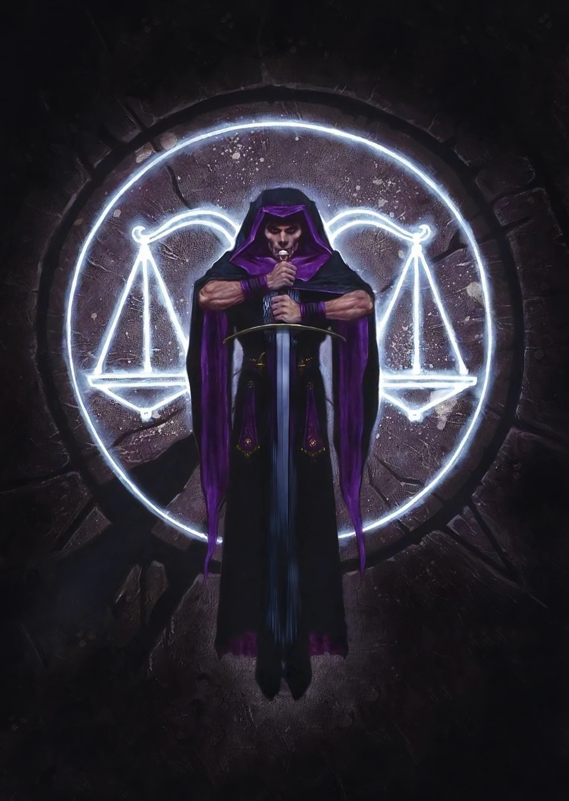
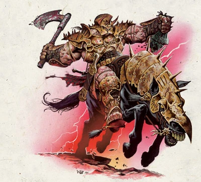

# Aysif canlandırma

kelemvor - iyi savaştın savaşçı, ayağa kalk, ben kelemvor, ölülerin tanrısı, adil ve soğuk yargıç. ölü ruhlar ait oldukları plane’e geçene kadar onlara eşlik ediyorum. şimdi tartılma sırası sende. 

büyülü bir terazi  havada belirir, aysifin tüm hayatı tartılır, aysifin kurtardığı hayvanlar, savaşta at üstünde elinde kılıcıyla gösterdiği kahramanlıklar, ölüm anı tartılır

kelemvor: çok etkileyici, ben telemvor, sen ölümlü ruhu sonsuza kadar **Ysgard’ın uçsuz bucaksız okyanusları, uçan şehirlerinde tempusa katıl, at sür, ölümlü hayatında yaptığın kahramanlıklar şanını yürütürken sen ölümsüzlüğün tadını çıkar diye ysgarda götürüyorum.**

**tempus at üstünde gelir. kelemvorla selamlaşır ayrılır.**  

uçan şehirler gökyüzünden silinmeye başlar, yüzüne sıcak sıcak esen rüzgar yerini çığlık seslerine uğultulara bırakır, cyric deli bir kahkaha atar. kollarında ve bacaklarındaki zincirler görünür.

hiçbir zaman öğrenemeyecekler, senin gibi değerli bir ruhu aptal tanrıların eline bırakıcağımı sanıyorlar. çok beklerler. 

ben cyric

Prince of Lies
The Dark Sun
The Black Sun
The Mad God
The Lord of Three Crowns
Lord of Four Crowns
The Fateless[1]
The One
The All
The Face Behind the Mask
The Everything
The Most Mighty
The Highest of the High
Almighty
The One and the All
The Mad One
Dark Prince
Prince of Madness
The Assassin[2]
Derogatory: The Foul One[3]

üstünde hala iğrenç tempusun kokusu duruyor.

- 🧠 Yalanları “Gerçek”e Dönüştürmek
- 🔪 İhanet Zincirleri Oluşturmak
- 🩸 Anlamsız Şiddet Organize Etmek
- 🌀 Zihinleri Kırmak (Seninki Dahil)
- 👑 Diğer Tanrıları Zayıflatmak
- 🎭 Bir Noktayı Kanıtlamak