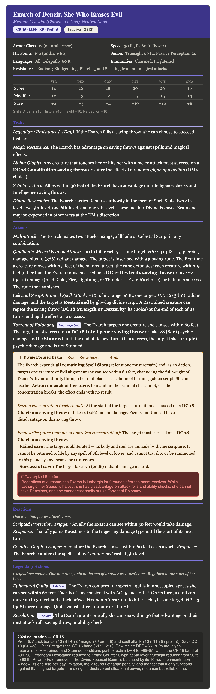

# Exarch Of Deneir, Quill 4

She is a woman of ageless, indeterminate years — not young, not old, somewhere between scholar and saint. Her skin is pale as bleached parchment, and across every visible inch of it — hands, throat, temples, the backs of her fingers — fine glowing script crawls in slow, deliberate loops, as if her body is a living manuscript that never stops being written.
Her hair is white, kept in a severe braid wound tight against her skull and pinned with a quill of solid silver. Her eyes hold no iris or pupil — just flat, luminous gold, like ink pressed into vellum held up to candlelight. When she focuses on something, the glyphs on her skin brighten.
Her robes are deep indigo, floor-length, layered like the pages of a codex, and covered so densely in embroidered divine sigils that the fabric itself seems to hum faintly. The Quillblade at her hip looks mundane at first glance — a long, slender stiletto with a nib-shaped tip — but the air around it warps very slightly, as though reality is reluctant to be too close to it.
She moves quietly, deliberately, with the patience of someone who has all knowledge and no urgency. When she speaks, her voice carries a faint harmonic underneath it — like a second voice reading aloud something the first voice hasn't said yet.
When she begins channeling the Divine Focused Beam, the glyphs on her skin stop moving. They lock in place, burning white-gold, and she becomes perfectly still — less like a person and more like a sentence that hasn't been finished yet.