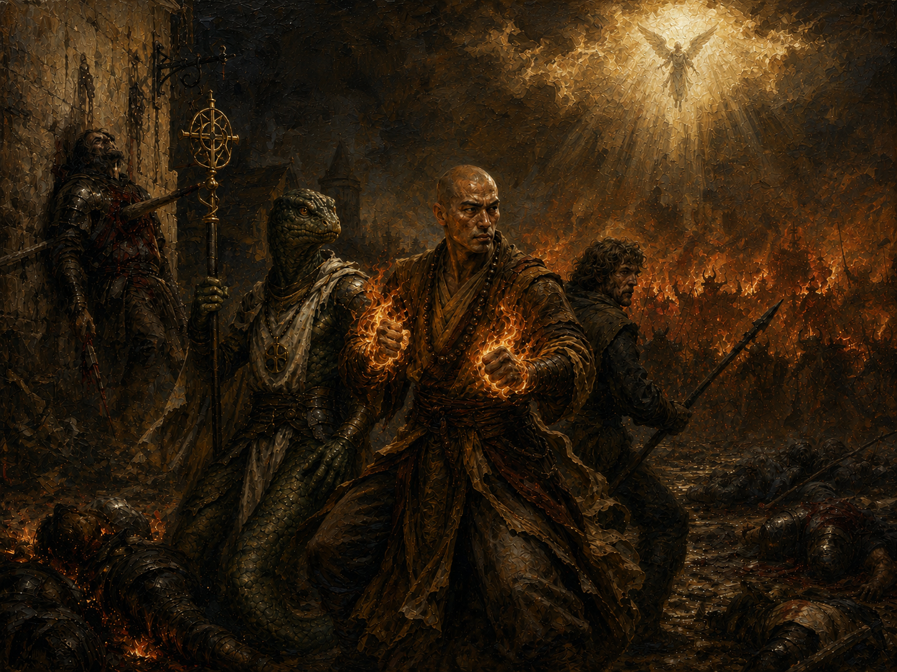
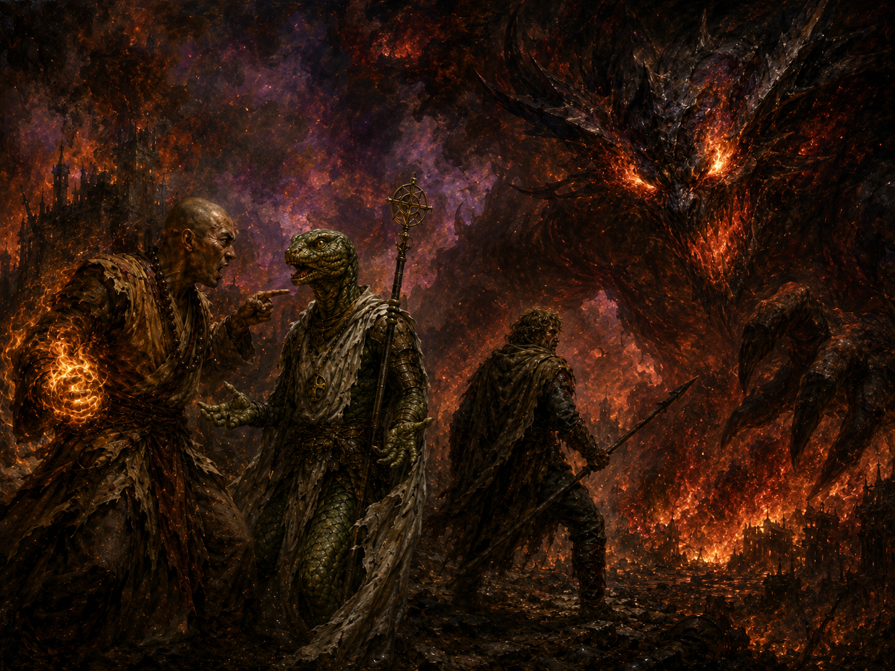
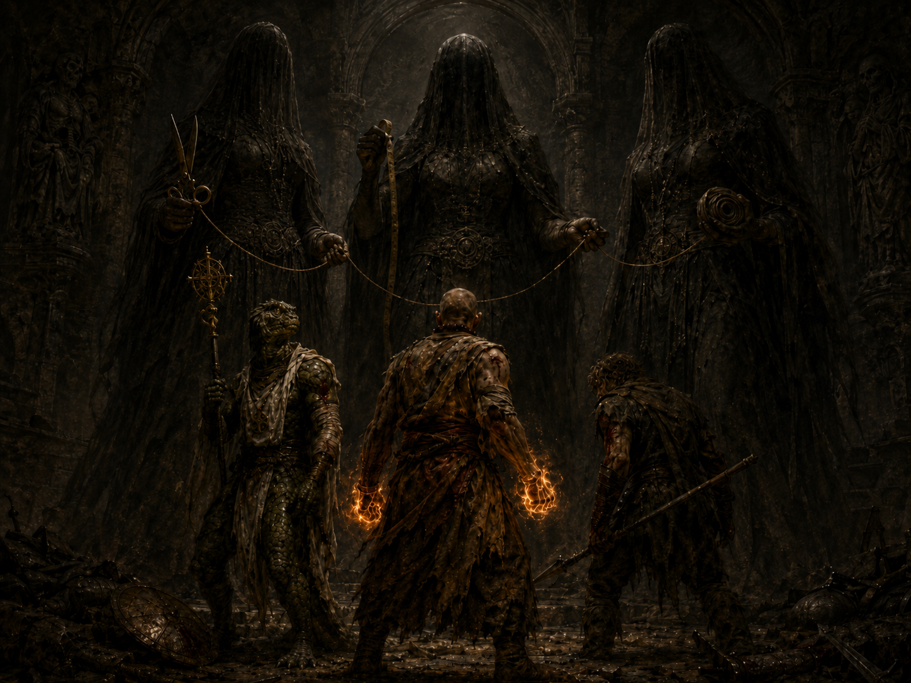

# Resimler

## 🖼️ Kutsal Resimler

---

### 🎙️ DM Tasviri — Örtülerin Kaldırılması

*[Clathropos üç resme doğru yürür. Odadaki herkes peşinden gelir. Resimler duvara yaslanmış, kırmızı kadife bezle örtülü — bez o kadar koyu ki altındaki şekilleri bile tahmin edemezsiniz.]*

---

Clathropos bir süre resimlerin önünde **duruyor** — konuşmuyor, dokunmuyor. Sadece bakıyor.

Sonra alçak bir sesle:

*"Bu köyde üç şey kutsaldır. Toprak. Ateş. Ve bu üç resim."*

*"Toprak bizi besler. Ateş bizi ısıtır. Ama bu resimler —"*

Dönüp size bakıyor.

*"— bizi ayakta tutar."*

---

### 🖼️ Birinci Resim

*[Clathropos ilk örtüye uzanır — yavaşça, tek eliyle, sanki uyuyan birini uyandırmamaya çalışıyor gibi. Bezi çeker.]*

---

Resim büyük. Çerçevesi siyah meşeden, köşeleri oymalı — ama asıl gözü çeken çerçeve değil.

Köy meydanı. Ama tanınmaz halde.

Zemin çamur ve kan karışımı, gece karanlığında bile seçilebiliyor. Arka planda köyün ağaçlık alanı yanıyor — alevler tuvale öyle işlenmiş ki turuncu boyalar neredeyse sıcak hissettiriyor, elinizi kaldırıp ısınmak istiyorsunuz. O alevlerin önünden **şeytanlar geliyor** — siluetler, birer birer değil, bir **deniz** gibi. Kızıl, kaynayan, birbirinden ayırt edilemeyen bir kitle. Yüzleri yok, sadece hareket var — ve o hareket tek bir yöne, ileri.

Önlerinde üç kahraman duruyor.

Silahlarını kuşanmışlar ama duruşlarında zafer yok — **direniş** var. Yorgunluk var. Yüzlerinde korku var, gizlenmemiş, olduğu gibi resmedilmiş. Birinin yanında yere yığılmış savaşçılar — biri duvara saplanmış, içinden bir kazık geçmiş, gözleri açık. Öbürleri yerde, yanmış.

Ama kahramanlar duruyor.

Ve gökyüzünde — çok uzakta, bulutların arasından süzülen ışıkların içinde — **bir silüet.** Kanatları mı var, kolları mı, belli değil. Ama orada. İniyor.

---

Clathropos bir şey söylemiyor. Bırakıyor sizi bakmanıza.

Sonra:

*"Ressam bu tabloyu tek gecede yaptı. Hayatta kalanlardan dinledi, dinledi, dinledi — sabah olduğunda fırçayı bıraktı ve bir daha resim yapmadı. Dedi ki: 'Bundan sonra yapacağım her şey yalan olur.'"*

---

### 🖼️ İkinci Resim

*[İkinci örtüyü çeker — bu sefer biraz daha hızlı, sanki bu resmi fazla uzun tutmak istemiyormuş gibi.]*

---

Karanlık.

İlk resme kıyasla bu tablo neredeyse **boğucu.** Zemin taş, duvarlar taş, hava bile taş gibi hissettiriyor. Bir katakomb — yer altı, dar, ezici.

Maceracı sayısı azalmış. Kalanlar üç kişi — ve üçü de yara içinde. Birinin kolu sargılı, öbürünün alnından kan akıyor, üçüncüsü eğilmiş ama ayakta. Yerde arkada bırakılan ekipmanlar var — birinin kalkanı, kırık bir kılıç. Devam edemediler.

Karşılarında **üç büyük figür.** Boyutları kahramanlardan en az iki kat fazla. Yüzleri gölgede ama duruşları net — saldırmıyorlar, **bekliyorlar.** Sanki bu kahramanların ne yapacağını merak ediyor gibiler.

Kahramanlar baş kaldırıyor. Yorgun, yaralı, azalmış — ama baş kaldırıyor.

---

*"Bu odaya kaç kişi girdi,"* diyor Clathropos sessizce. *"Kaç kişi çıktı. Bu soruları sormayı öğrendim. Artık sormuyorum."*

---

### 🖼️ Üçüncü Resim

*[Üçüncü örtüyü çeker — ve bu sefer duruyor. Uzun süre bakıyor. Gözlerinde bir şey var — nostalji mi, ağırlık mı, tam anlayamazsınız.]*

---

Bu resim diğerlerinden farklı. Daha **renkli.** Daha gürültülü — bakıldığında ses duyulacakmış gibi.

Solda iki kahraman birbirine dönmüş, yüzler gergin — **tartışıyorlar.** Elleri konuşuyor, birinin parmağı öbürüne işaret ediyor. Bu bir kriz anı, görülüyor. Yorgunluk değil bu — **yılgınlık.** Birbirlerine bir şey söylüyorlar, belki "artık yeter," belki "bu bitmeyecek."

Ama üçüncü kahraman onların arasında duruyor. Dönmüş, devasa karanlık figüre bakıyor — tablonun sağında, neredeyse tüm sağ yarıyı kaplayan **şeytan.** Ölçek mantıksız, imkansız. Ama üçüncü kahraman bakıyor, ve gözlerinde korku değil, **karar** var.

Sonraki an yok resimde — ama ne olduğu belli.

Çünkü şeytanın göğsünde bir kılıç var.

---

Clathropos uzun süre bekler. Sonra döner size. Ve gözleri sizin üzerinizde tek tek dolaşır — dikkatli, ölçen değil, **tanıyan.**

---

### 🪞 Seçilme — Clathropos'un Sözleri

*[Clathropos sizin yanınıza gelir. Araya mesafe koymaz — yakın durur, alçak konuşur, sanki bu sadece sizinle aranızdaymış gibi.]*

---

*"Sizi tesadüfen seçmedim."*

Birincisine bakar.

*"Sen duruşunla. Ayakta duruş şeklinde bir şey var — ağırlık taşıyan biri durur böyle."*

İkincisine bakar.

*"Sen gözlerinle. İnsanlar gözlerine bakmadan konuşur — sen önce bakarsın, sonra konuşursun. Bu resimdeki gibi."*

Üçüncüsüne — ya da kalanlarına — bakar.

*"Ve sen de tam olarak —"* durur, başını hafifçe eğer *"— evet. Tam olarak."*

Geri çekilir. Üç resme birlikte bakar.

*"Bu kahramanlar yüz yıl önce buradaydı. Bu gece siz buradasınız. Tesadüf demiyorum buna."*

*"Hikaye kendi oyuncularını seçer."*

---

### 📜 Kutsal Şiir

*[Clathropos defterini açar — ama bu sayfaya bakmıyor. Ezberinde. Gözleri resimlerde, sesi alçak ve düzenli, sanki dua eder gibi.]*

---

> *Üçü durdu, düşerken gece,Alevler arkada, kan önde.Ne zafer vardı yüzlerinde —Sadece bir daha, sadece bir adım daha.*
> 
> 
> *Yerin altında kaybettiler ismi,Kazandılar yalnızca birbirini.Ve en karanlık anda, en son anda —Bıraktılar her şeyi, kaldırdılar kılıcı.*
> 
> *Bu toprak onları unutmadı.Bu hava onları taşıyor hâlâ.Sen bu şiiri okurken, dinlerken —Onlar seninle bu odada.*
> 

---

*[Clathropos defteri kapatır. Sessizlik.]*

*"Bu şiiri her çocuk burada ezberler. Her cenazede okunur. Her yıl, bu geceden bir gece önce, köyün yaşlıları bir araya gelir ve seslerini kısarak, sadece birbirlerine, bir kez daha okur."*

Resimlere döner.

*"Bunlar bez üstüne boya değil."*

*"Bunlar bu köyün kalbi."*

*[Kısa bir duraklama. Sonra sizi teker teker süzer ve ilk kez o parlak, sıcak gülümsemesiyle değil — çok daha **sessiz**, çok daha **gerçek** bir ifadeyle bakar.]*

*"Bu gece onların yerine siz duruyorsunuz. Bunu hafife almayın."*

*"Perde açılıyor."*

---

> 💡 **DM Notu:** Oyuncular sorular sorarsa — *"Bu kahramanların isimleri ne?"*, *"Onlara ne oldu?"* — Clathropos cevap verir, ama her cevabın sonunda ufak bir **gölge** düşürür: *"Hepsi burada yatıyor. Bu toprağın altında."* Merak uyandır, cevap verme. Dungeon'a girene kadar bu resimler aklın bir köşesinde kalsın.
>