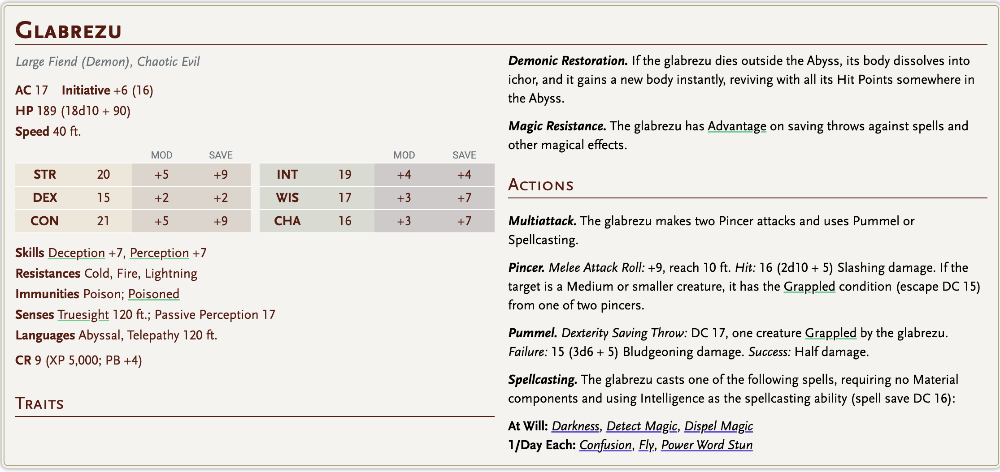
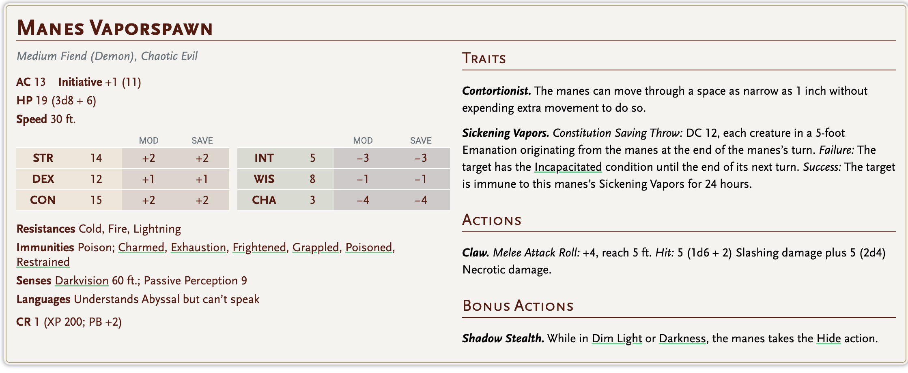
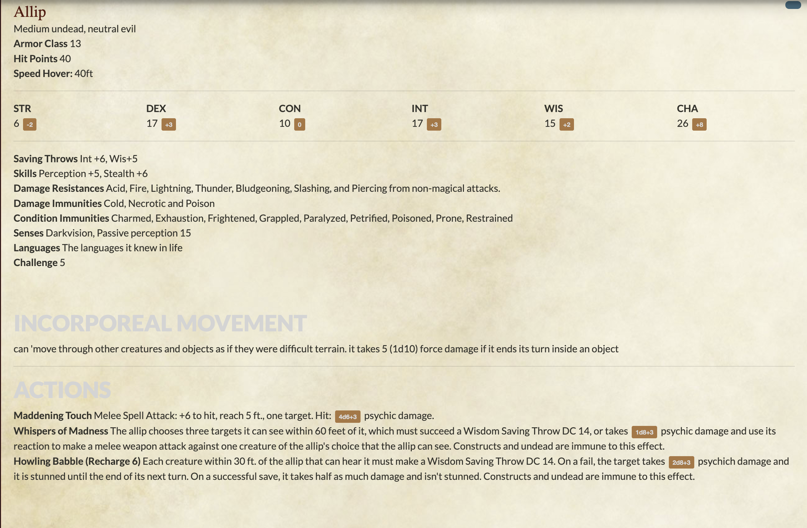
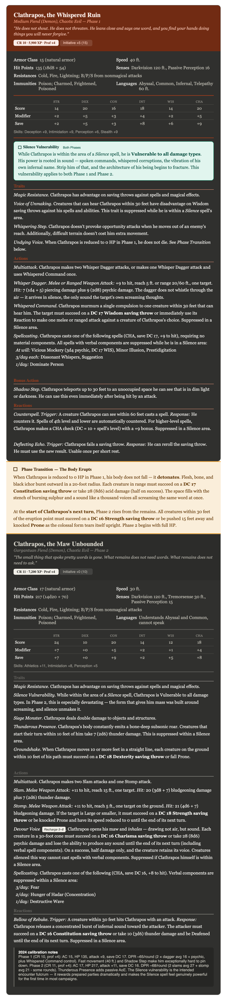

# Ruins

Oda 1

Glabrezu: 12

black knight 20

bünyamin 9 

xerhat 3

quill -

stelt - 16

## Oda 2

## 🕸️ İkinci Oda — Kader Kız Kardeşleri

---

### 🎙️ DM Tasviri — Odaya Giriş

*[İkinci kata açılan kapıdan geçtiklerinde — oku.]*

---

Kapı açılıyor ve siz bir adım atıyorsunuz.

Sonra duruyorsunuz.

Çünkü bu oda **farklı.**

Birinci kat dar, nemli, eziciydi — bir tünel gibi. Bu yer ise tam tersi. Tavan yükseliyor, yükseliyor, nereye kadar yükseldiği karanlıkta kayboluyor. Duvarlar taş — ama işlenmiş taş. Oymalı sütunlar iki yanda dizilmiş, her birinin üstünde yüzler var, ama yüzlerin gözleri kapalı. Zemin düz ve soğuk, ayak sesleriniz her tarafa yansıyor, birbirinin üstüne biniyor, kendi yankınızda kayboluyorsunuz.

Hava — **ağır.** Toz değil, nem değil. Ağırlık. Sanki bu odanın içindeki hava dışarıdakinden daha **eski.**

Ve odanın ortasında —

---

### 👁️ Üç Figür

*[Yavaş oku. Her cümle arasında dur.]*

---

**Üç figür.**

Taştan değil — en azından öyle görünmüyor. Ama kıpırdamıyorlar. Duruşları heykel gibi, mükemmel, milimetrik. Ama dokuları taş değil — **kıyafetleri** var. Ağır, koyu, katmanlı kıyafetler. Yüzleri örtülü — kapüşonları o kadar derin ki içinde yüz olup olmadığını söyleyemezsiniz. Söylemek **istemezsiniz.**

Boyutları size göre değil. Çok büyük. Omuzlarından biri bile bir kapı genişliğinde.

Aralarında **bir ip** uzanıyor — ince, soluk, neredeyse görünmez. Birinden öbürüne, öbüründen üçüncüsüne. Gergin değil, sarkmış da değil. Askıda. Sanki fizik bu iplik için geçerli değil.

---

**Soldaki figür** — elinde **altın makas.**

Makas büyük, ağır, kulpları oval ve işlemeli. Ama ağzı kapalı. Bekliyormuş gibi. İp ucuna yakın tutuyor, ama kesmemiş — **henüz.**

**Sağdaki figür** — elinde **bir yumak.**

İnce, gümüş renkli bir yumak — ve oradan uzanan ip tam ortadaki figürün eline, oradan da makasa ulaşıyor. Yumak dönmüyor. Durmuş.

**Ortadaki figür** — en büyüğü. Gerideki sütunların önünde duruyor, diğerlerinin arkasında, yarı gölgede. Elinde uzun, altın uçlu bir **asa** — ucu bir daire, içinde ibre var. Terazi mi, pusulası mı, anlaşılmıyor. Ama ibre sallanıyor — rüzgar olmadığı halde.

---

*[Bir beat. Sonra:]*

soldaki mezura

orta  makas

sağdaki yumak

Figürlerin hiçbiri size bakmıyor.

Ama **hepsi sizi biliyor.**

Hissediyorsunuz bunu — açıklanamaz bir şekilde, kemiklerinizden geçerek. Bu odaya girdiğiniz andan itibaren bir şeyin **sizi saydığını**, sizi ölçtüğünü, sizi bir yere yazdığını hissediyorsunuz.

---

### 🔇 Clathropos'un Sessizliği

*[Tam bu sırada — hiçbir şey. Defterin hışırtısı yok. Mürekkebin sesi yok.]*

*[Bekle. Oyuncular fark ederse:]*

Clathropos **yazmıyor.**

Sesi bile çıkmıyor. Nerede durduğunu bilemiyorsunuz, ama sessizliği farklı — o rahat, gözlemci sessizliği değil bu. Bu **başka bir şey.**

Uzun bir sessizliğin ardından, çok alçak:

*"Bunları biliyorum."*

Sadece bu. Açıklamıyor.

---

### 🧩 Puzzle — İp Düzeneği

*[Quill 4 öne çıkıyor, figürleri inceliyor.]*

---

*"Bunlar sembol."* Quill 4'ün sesi sakin ama dikkatli. *"Gerçek değil — yansıma. Varlığın bu yere işlediği bir şey. Bir kilit."*

Ortadaki figürün önünde yerde küçük bir platform var — taştan, üstünde üç tane yuvarlak çukur. Her çukurun önünde semboller kazınmış.

*"Doğru sıra ile etkinleştirilmesi gerekiyor."*

İpi gösteriyor.

*"İp nereden başlıyor, nereye gidiyor, nerede bitiyor — bunu çözün."*

Kapüşonlu figürlere son bir bakış atıyor.

*"Ve hızlı olun. Bu oda sizi ölçüyor."*

---

*[Oyuncular puzzle'ı çözmeye başlasın. Doğru sıra: Clotho — Lachesis — Atropos. Yumak → ölçüm → makas. Yaratılış → süre → son.]*

*[Puzzle çözüldüğünde:]*

## Oda 3

## 🩸 Clathropos — Büyük İfşa

---

### 🎙️ DM Tasviri — Üçüncü Oda

*[Üçüncü odaya girildiğinde oku.]*

---

Bu oda **nefes almıyor.**

Diğer odaların nemi, kokusu, ağırlığı vardı — bu odanın hiçbir şeyi yok. Hava yok gibi. Ses yok gibi. Kendi nefes alışınızı duyuyorsunuz çünkü başka hiçbir şey yok duymak için.

Oda yuvarlak. Duvarlar düzgün, işlenmiş, üstlerinde hiçbir süsleme yok — sadece taş. Tavan çok yüksek, karanlıkta kayboluyor. Zemin de yuvarlak, ortasında bir çukur var — sığ, geniş, ve içinde —

**Kalp.**

Bir kalp atıyor. Gerçek bir kalp değil — ama başka ne diyeceksiniz bilmiyorsunuz. Koyu, neredeyse siyah, ama içinden kırmızı ışık sızıyor her atışta. Ritmi yavaş. Düzenli. Sabırlı.

Her attığında zemin titriyor. Hafifçe. Ama hissediyorsunuz.

Quill 4 öne çıkıyor. Kalemi havaya kaldırıyor — ucundaki ışık şimdiye kadar gördüğünüzden daha parlak.

*"Buldum."*

Sesi farklı — ilk kez gerçekten **rahatlıyor** gibi.

*"Şimdi odaklanıyorum. Yakın durun."*

Gözlerini yumur. Kaleme konsantre olur. Dudaklarında sessiz kelimeler kıpırdıyor — Deneir'in dilinde bir şey, tanımadığınız ama **hissettiren** bir şey. Oda titremeye başlar. Kalemin ışığı yoğunlaşır, büyür, sizi de aydınlatmaya başlar.

Ve tam o anda —

---

Defterin sayfaları **hışırdar.**

---

### 📜 Son Şiir

*[Clathropos'un sesi — ama bu sefer farklı bir yerden geliyor. Daha merkezi. Daha net. Görünmez olmasına rağmen odanın tam ortasından, sanki her yerden aynı anda.]*

*[Quill 4 gözlerini açmaz — konsantrasyonu bozmamalı. Ama şiir başladığında elleri hafifçe titrer.]*

---

*"Son bölüm."*

Bir duraklama.

*"İzninizle."*

---

> *Üç kat indiler, üç engel aştılar,Karanlıkta yürüdüler, ışığı taşıdılar.Kahraman mıydılar? Evet — şüphesiz.Aptal mıydılar? Bu soruyu sormak zorundayım.*
> 
> 
> *Çünkü güzel bir hikayenin bir şeyi eksiktir henüz —Bir ihanet. Bir dönüş. Bir sır.Her büyük destanın kalbinde yatar bir gölge:Kahramanın göremediği şey — yanındaki.*
> 
> *Anlattım size, not aldım, izledim.Her adımınızı, her kılıç darbenizi kaydettim.Siz hikayeye baktınız — ben de size.Ve şimdi —*
> 
> *Şimdi en güzel kısım başlıyor.*
> 

---

*[Sessizlik.]*

*[Sonra Clathropos görünür hale gelir.]*

---

### 🎭 İfşa

*[Pouch'un etkisi tersine döner — yavaşça, tiyatral. Clathropos önce bir silüet, sonra tam bir form olarak belirir. Quill 4'ün tam arkasında duruyor.]*

---

Clathropos gülümsüyor.

O bildiğiniz gülümseme — sıcak, tanıyan, gerçek. Hiç değişmedi. Ve bu onu daha da **tuhaf** yapıyor.

Defteri kapatır. Belindeki mürekkep şişesini çıkarır — ama şişe artık farklı görünüyor. İçindeki sıvı mor değil. **Koyu kırmızı.** Ve şişenin üstünde ince, kendi kendine kıvrılan bir ip var.

*"Harika bir hikayeydi."*

Sesi hâlâ aynı. Hâlâ o.

*"Gerçekten. Sizin için söylemiyorum — not olarak söylüyorum. Nesnel bir değerlendirme."*

Quill 4'e doğru bir adım atıyor.

*"Ama her büyük hikayede bir şey olmalı."*

---

Eli Quill 4'ün omzuna **değiyor** — hafifçe, neredeyse şefkatle.

Ve Quill 4'ün kalemi **söner.**

---

Bir ses — metalin kırılması gibi değil, **sayfanın yırtılması** gibi. Quill 4'ün ağzından kısa bir ses çıkar. Gözleri açılır — şaşkın değil, **anlıyor.** Her şeyi, bir anda, anlıyor.

*"Sen —"*

*"Ben."* Clathropos tamamlıyor. *"Evet."*

Quill 4'ün topladığı tüm enerji — o parlak, yoğun, Deneir'in gücünden damıtılmış ışık — **tersine dönüyor.** İçe çöküyor. Ve sonra dışa —

Patlama değil. **Boşalma.** Quill 4 geri savruluyor, duvara çarpıyor, yere iniyor. Kıpırdamıyor.

Cübbesindeki yazılar **söndü.**

Kalem yerde, ışıksız, sıradan bir nesne gibi duruyor.

---

*[Clathropos oyunculara dönüyor.]*

---

### 💀 Clathropos'un Monologu

*[Acele etmiyor. Odanın ortasına yürüyor, kalbin yanına. Aşağıya bakıyor — onu izliyor, onu dinliyor. Sonra size dönüyor.]*

---

*"Kızgın olduğunuzu hissediyorum."*

*"Haklısınız. İhanet çirkin bir şey. Ama iyi bir hikayede zorunlu."*

Ellerini açıyor — savunmasız bir jest. Tehdit değil.

*"Beni tanıyorsunuz zaten. Clathropos. Bu köyde doğdum, bu köyde büyüdüm — bu doğru. Her şey doğruydu aslında. Hikayeye olan sevgim. Ölümsüzlüğe olan inancım."*

*"Sadece... kim olduğumu söylemedim."*

---

Omzunu silker. Teatral değil — gerçekten önemsiz buluyor gibi.

*"Exarch'ın söyledikleri kısmen doğruydu. Yüz yıl önce bu köyde bir şey ekildi. Zihinlere dokunuldu. Bir hikaye yazıldı — olmayan bir hikaye, ama herkes inandı."*

*"Ben de inandım."*

*"Ve her inanan beni biraz daha büyüttü."*

---

Sesi değişmiyor. Hâlâ o sakin, anlatıcı tonu.

*"Yüzyıllardır bunu yapıyorum. Bir köy seçiyorum. Tohum ekiyorum. Suluyorum — yavaşça, sabırla. Sonra hasat zamanı geliyor. Büyük, acı, anlatılacak bir şey oluyor. Ve gidiyorum."*

*"Hikayeyi bırakıyorum. Hikaye büyüyor. Ben büyüyorum."*

Kalbine bakıyor — göğsündeki kalbine değil, yerdeki karanlık kalbine.

*"Bu sefer farklı yapmak istedim."*

*"Bu sefer sadece bir trajedi değil — bir destan istedim."*

---

Size doğru birkaç adım atıyor. Duraksıyor.

*"Sizi tesadüfen seçmedim. Bunu söyledim, hatırlıyorsunuz. Ve doğruydu. Sizi gördüm — köye gelirken gördüm. Ve düşündüm: işte kahramanlar. Gerçek kahramanlar. Sadece görünüşleri değil — içleri. Resimlere benzedikleri için değil —"*

Gülümser.

*"— resimleri onlara benzettiğim için."*

---

Durur. Ellerini kavuşturur.

*"Şimdi en güzel kısma geldik."*

*"Seçim."*

---

Aşağıya, kalbine, sonra size bakıyor.

*"Beni öldürebilirsiniz. Kolay değil ama yapabilirsiniz — yeterince güçlüsünüz. Ve öldürdüğünüzde bu köy kurtulur. Quill 4 hayatta kalır. Herkes eve döner."*

*"Ve bu hikaye —"*

Sesi yükseliyor — ilk kez, bu kadar.

*"— bu hikaye sonsuza kadar anlatılır."*

*"Emberveil'in altında, karanlık bir dungeonın dibinde, üç kahraman imkansız bir düşmanla yüz yüze geldi ve onu yıktı. Bu hikaye her barda anlatılır. Her annenin çocuğuna fısıldadığı masal olur. Bardlar bu destanı yüz yıl söyler — iki yüz yıl — bin yıl."*

*"Ve her anlatıldığında —"*

Göğsüne vurur. Sakin. Net.

*"— ben de orada olacağım."*

*"Her anlatımda biraz daha. Her tekrarda biraz daha güçlü. Ve yüz yıl sonra —"*

Omuz silker.

*"— geri dönerim. Daha büyük. Daha hazır. Başka bir köy. Başka kahramanlar. Başka bir destan."*

---

*[Bir adım geri çekiliyor. Kollarını açıyor — sahneye çıkan bir oyuncu gibi.]*

*"Öyleyse —"*

*"Hadi."*

*"Kahramanlığınızı yapın."*

*"Köyü kurtarın."*

*"Destanı yazın."*

*"Ölümsüz olun."*

*"Ve beni de — her anlatıldığınızda — yanınızda taşıyın."*

---

Gülümser. Son kez. Ve bu sefer gülümsemesinde ne sıcaklık var ne soğukluk.

Sadece **beklenti.**

*"Ya da —"*

Sesi alçalıyor. Neredeyse merak eder gibi.

*"— başka bir şey düşünürsünüz."*

*"Merak ediyorum hangisini seçeceksiniz."*

*"Her zaman merak ediyorum."*

---

*[Clathropos susuyor. Bekliyor.]*

*[Kalp atıyor. Zemin titriyor.]*

*[Quill 4 yerde, kıpırdamıyor — ama nefes alıyor.]*

*[Top oyuncularda.]*

---

> 💡 **DM Notu — İki Yol:**
> 
> 
> **Öldürürler:** İki fazlı boss dövüşü. Clathropos önce Kader figürü formuna girer — ip, makas, terazi. Sonra kalp aktif hale gelir, ikinci faz. Kazandıklarında köy kurtulur, Quill 4 ayağa kalkar — ama son sahnede, çok uzakta, bir yerde bir bardın bu hikayeyi anlatmaya başladığını duyarsınız.
> 
> **Öldürmezler:** Clathropos şaşırır — gerçekten. Belki ilk kez. *"Peki... ne yapacaksınız?"* Bu yol daha zor, daha yaratıcı, daha az yazılmış — ve Clathropos'un en çok korktuğu şey: **anlatılmayan hikaye.**
> 

black knight 

bünyamin 

xerhat 3

